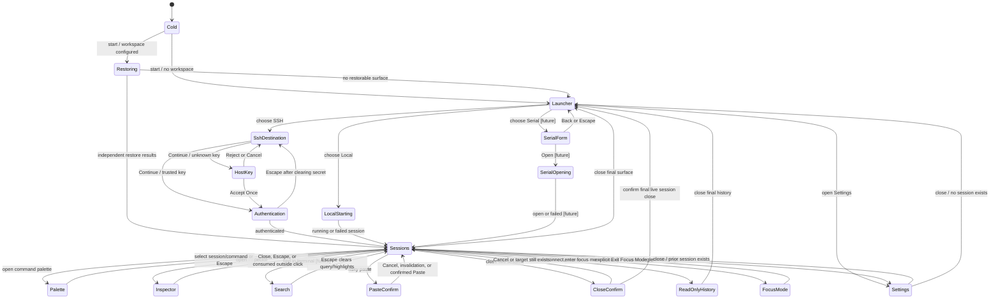

# GUI Exploration and Test Action Graph

**Status:** Normative test-navigation companion to
[`gui-design.md`](gui-design.md)

**Scope:** Every user-observable workflow and state described by the GUI design,
including implemented, partially implemented, deferred, failure, cancellation,
undo, and return-to-known-state paths.

This document turns the GUI design into a traversable action graph. It does not
replace the product rules in `gui-design.md`, the evidence inventory in
`manual-validation.md`, or the test tiers in `ui-test-plan.md`. When wording or
behavior conflicts, `gui-design.md` is authoritative. This graph supplies the
route through those requirements and the recovery path after each probe.

## How to use the graph

Each test run starts at a named checkpoint, follows one or more edges, asserts
the edge oracle, and returns through the named recovery edge. Never depend on
the state left by an unrelated test. A driver may skip an edge only when its
capability guard is false; it records **not run: capability unavailable**, not
pass.

Edge records use this shape:

| Field | Meaning |
| --- | --- |
| ID | Stable identifier for automation, evidence, and defect reports. |
| From → To | Source and expected destination nodes. |
| Action / guard | User action and required capability or state. |
| Oracle | User-visible, semantic, terminal-grid, transport, privacy, or persistence result. |
| Return | Explicit cancel, undo, close, reset, or checkpoint-rebuild edge. |
| Layer | `P` pure/state, `H` headless UI, `V` visual, `N` native desktop, `U` human usability. |

Run an edge through every applicable invocation route. For example, “Close
session” is one semantic edge exercised from the chip close control, chip
context menu, shortcut, command palette, native menu, and failure overlay. A
route must not grow its own policy.

## Known-state checkpoints

Fixtures use repository-owned identities and content. They contain no personal
clipboard data, shell profile, credentials, host, path, or terminal history.

| Node | Known state and construction | Required cleanup |
| --- | --- | --- |
| `K0 Cold` | No fesTerm process; isolated empty configuration and workspace. | Remove disposable configuration and evidence directory. |
| `K1 LauncherOnly` | One focused Launcher chip, no session, empty footer content, default preferences. | Close extra surfaces; if necessary restart from `K0`. |
| `K2 LiveLocal` | One controlled local test-child session, running, focused, at live bottom, no selection/modal/overlay. | Bounded shutdown, then return to `K1`. |
| `K3 MultiSurface` | Live local A active, live local B inactive, singleton Launcher and Settings present, single-row chips. | Close Settings/Launcher immediately; confirm-close B then A; reach `K1`. |
| `K4 MouseTui` | Controlled live session with alternate screen and terminal mouse reporting active. | Send fixture exit sequence; verify primary buffer; return `K2`. |
| `K5 HistoryLive` | Controlled live session with bounded retained primary-screen history, viewport at bottom. | `Ctrl+End`, clear selection/search, then bounded close to `K1`. |
| `K6 HistoryReadOnly` | Exited/disconnected session with retained history and no accepted input. | Close immediately; return to `K1`. |
| `K7 SshUnknownHost` | Disposable SSH fixture waiting on an unknown host-key decision. | Reject/cancel; clear fixture trust state; return to destination or `K1`. |
| `K8 SshAuth` | Fixture host accepted for this attempt; password authentication surface focused and empty. | Clear password, cancel attempt, return to destination then `K1`. |
| `K9 LiveSsh` | Connected disposable SSH fixture with known non-secret inspector facts. | Disconnect preserving history, then close to `K1`. |
| `K10 RestoreMixed` | Workspace recipe with one successful local definition, one SSH auth-required definition, and one invalid/missing definition. | Close restored surfaces and remove disposable workspace; return `K1`. |
| `K11 Narrow` | Any applicable checkpoint at `360 × 516` logical px and recorded scale. | Restore `752 × 516` baseline. |
| `K12 Modal` | A specified close/paste/trust/destructive dialog open with Cancel focused. | Take its safe Cancel/Escape edge, verify zero unintended bytes/effects. |
| `K13 Serial` | Future virtual loopback or representative adapter fixture. | Close/release port, remove loopback, return `K1`. |

Every unexpected state has a bounded recovery ladder:

```text
cancel transient field/menu/overlay
  -> close non-session surfaces
  -> stop/disconnect live transport while preserving history when supported
  -> confirm-close remaining sessions
  -> LauncherOnly
  -> bounded app shutdown
  -> Cold
```

If a step cannot complete within its watchdog, capture sanitized state and use
bounded backend/application shutdown. Do not continue the graph from an
uncertain state.

## Global state graph



## A. Root, Launcher, and surface lifecycle

| ID | From → To | Action / guard | Oracle | Return | Layer |
| --- | --- | --- | --- | --- | --- |
| `ROOT-01` | `K0 → K1` | Start with no workspace. | Exactly one ordinary Launcher; no wizard, promotion, telemetry prompt, disabled future transport, or blank root. Local is initially highlighted; footer footprint is stable and empty. | `ROOT-02` or quit to `K0`. | H,V,N,U |
| `ROOT-02` | `K1 → K1` | Try to close the only Launcher. | Window remains defined as Launcher; no empty content and no accidental process exit. | Already `K1`. | P,H,N |
| `ROOT-03` | `K2 → K3` | New Session by chrome, shortcut, palette, and native menu where applicable. | One singleton Launcher is created/focused at row end; active terminal remains alive and unchanged. Repeating does not duplicate it. | `ROOT-04`. | P,H,N |
| `ROOT-04` | `K3 → K2` | Escape or close the Launcher opened beside a session. | Launcher closes immediately and focus returns to the prior terminal; no terminal Escape byte. | Reopen with `ROOT-03`. | H,N |
| `ROOT-05` | `K1 → K2` | Choose Local Shell by click and by keyboard. | Launcher chip converts in place to Starting then Running; same position/identity, no spent Launcher. Output may appear immediately. | `CLOSE-01` then `CLOSE-04`. | P,H,N |
| `ROOT-06` | `K2 → K3` | Start Local Shell directly from palette while a terminal is active. | A new session chip is added; active session is not replaced. Command is absent from default global bindings. | Close new session through `CLOSE-01`. | P,H,N |
| `ROOT-07` | Any nonempty state → same root class | Close the final session while Settings remains. | Settings survives and is active; no forced Launcher duplicate. | Close Settings to reach `K1`. | P,H |
| `ROOT-08` | Any last surface → `K1` | Close final Settings, Launcher, failed, exited, or disconnected surface. | Window returns to Launcher rather than blank or quit. | Already `K1`. | P,H,N |
| `ROOT-09` | Two independent processes | Launch second fesTerm instance. | Separate windows own independent sessions; no detach, cross-window drag, migration, or shared live lifecycle. Fixed native title is `fesTerm`. | Close second instance, verify first unchanged. | N,U |

## B. Launcher choices and connection forms

| ID | From → To | Action / guard | Oracle | Return | Layer |
| --- | --- | --- | --- | --- | --- |
| `LAUNCH-01` | `K1 → K1` | Up/Down through implemented choices. | Highlight follows one compact column in logical order; semantic icon, primary label, and one factual secondary line remain aligned. | Return highlight to Local with Up/Home or rebuild `K1`. | H,N,U |
| `LAUNCH-02` | `K1 → SshDestination` | Activate SSH. | Same Launcher chip shows focused host/port/username only; port defaults to 22; no dimensions, TERM, password, or unsupported auth controls. | `LAUNCH-03`. | H,V,N,U |
| `LAUNCH-03` | `SshDestination → K1` | Back or Escape before connect. | No session is created; non-secret draft fields are discarded only when Launcher lifetime ends. | `LAUNCH-02`. | H,N |
| `LAUNCH-04` | `SshDestination → same` | Continue with missing/invalid host, username, or port. | Validation stays beside exact field; no network attempt or modal error. | Correct field or `LAUNCH-03`. | P,H,N |
| `LAUNCH-05` | `SshDestination → K7/K8` | Continue with valid fixture destination. | Work is asynchronous; unknown key goes to Host Key before credentials, known key goes to Authentication. | Reject/cancel through `TRUST-02` or `AUTH-03`. | P,H,N |
| `LAUNCH-06` | `K1 → SerialForm` | Activate Serial when implemented. | Same Launcher chip shows device and supported line settings with 115200/8/N/1/no-flow defaults; exact identifier remains visible. | `SERIAL-02`. | H,V,N,U; deferred |
| `LAUNCH-07` | `K1 → PopulatedLauncher` | Provide real saved profiles/recent workspaces. | Only nonempty sourced groups appear; selection launches a validated snapshot. Duplicate visible names receive no fabricated suffix. | Close or launch, then rebuild `K1`. | P,H,V,U; partial |

## C. Local session lifecycle

| ID | From → To | Action / guard | Oracle | Return | Layer |
| --- | --- | --- | --- | --- | --- |
| `LOCAL-01` | `K1 → LocalStarting` | Launch controlled local fixture with delayed startup. | Chip/viewport exist immediately in Starting; after threshold a restrained cancelable message may appear; early output renders; switching chips does not cancel. | Cancel through `LOCAL-02` or allow `LOCAL-03`. | P,H,N |
| `LOCAL-02` | `LocalStarting → ReadOnly/Launcher` | Activate startup Cancel. | Bounded backend stop; no hang, stray process, or input acceptance. Result follows current retained-history capability. | Close result to `K1`. | P,N |
| `LOCAL-03` | `LocalStarting → K2` | Fixture reports Running. | Stable identity remains primary; status says Running; terminal immediately owns focus and input. | `CLOSE-01`. | P,H,N |
| `LOCAL-04` | `LocalStarting → Failed` | Use nonexistent/denied fixture. | Stable chip remains Failed; concise message excludes raw path; Details opens diagnostics; Close available; no false Exited. | Close immediately to `K1`; relaunch only if real definition exists. | P,H,V,N |
| `LOCAL-05` | `K2 → K6` | Controlled child exits with zero and nonzero codes. | State is Exited, known code may appear, no fesTerm Failure claim, no auto-close, history is read-only. | Close immediately to `K1`; future Relaunch creates fresh generation. | P,H,N |

## D. SSH trust, authentication, and connection lifecycle

| ID | From → To | Action / guard | Oracle | Return | Layer |
| --- | --- | --- | --- | --- | --- |
| `TRUST-01` | `K7 → K7` | Inspect unknown-host prompt. | Canonical host:port, algorithm, full selectable SHA-256 fingerprint; safe Reject focused; no claim host is safe and no password retained. | `TRUST-02` or `TRUST-03`. | H,V,N,U |
| `TRUST-02` | `K7 → SshDestination` | Reject, Cancel, or close pending chip. | Attempt stops; destination retains only non-secret fields; no trust record. Closing removes chip under close rules. | Retry with `LAUNCH-05` or Back to `K1`. | P,H,N |
| `TRUST-03` | `K7 → K8` | Deliberately Accept Once. | Acceptance applies only to this attempt; authentication starts afterward; no persistence claim. | `AUTH-03`. | P,H,N,U |
| `TRUST-04` | `ChangedKey → ChangedKey/SshDestination` | Fixture presents a changed trusted key. | Both expected/presented fingerprints; high severity; Cancel Connection and review path only—no ordinary Accept Once. | Cancel to destination; reset fixture trust store. | P,H,V,N,U; target |
| `AUTH-01` | `K8 → K8` | Type password; toggle explicit Remember only for eligible saved profile/store. | Masked transient secret; Connect disabled empty; no diagnostics/config/workspace/log retention. | Escape once clears secret. | P,H,N,privacy |
| `AUTH-02` | `K8 → K9/K8` | Enter/Connect once. | Duplicate submits blocked; field clears after success or failure; failure stays with concise correction; success creates Connected terminal. | Failure: retry/cancel. Success: `SSH-02`. | P,H,N |
| `AUTH-03` | `K8 → SshDestination` | Escape with empty field, or Cancel attempt. | First Escape clears nonempty secret only; subsequent Escape returns to destination; zero auth bytes after cancel. | Back to `K1` or retry. | H,N |
| `AUTH-04` | StoredPassword states | Exercise available, missing, locked, unsupported, and backend-failed native store. | Only opaque reference persists; actionable non-secret feedback; one-off form never offers persistence. | Clear disposable store and return to `K1`. | P,H,N,U,privacy |
| `SSH-01` | `K9 → K9` | Inspect normal remote session. | Generic remote icon; Connected and Remote language; destination details absent from permanent chrome but sourced in Inspector. Rename never changes destination. | Close Inspector, restore terminal focus. | H,V,N |
| `SSH-02` | `K9 → K6` | Disconnect via Inspector when implemented. | Transport closes, chip/history survive read-only, no Paste/typing/mouse reporting. | Reconnect if capability exists or close to `K1`. | P,H,N; partial |
| `SSH-03` | Disconnected → Reconnecting | Request real reconnect. | Same chip/identity; exact attempt/delay only if supplied; switching tabs does not stop retries; Stop Retrying stabilizes Disconnected. | Stop Retrying or allow success. | P,H,V,N,U; partial |
| `SSH-04` | Reconnecting → K9 | Fixture reconnect succeeds. | New transport generation, modes reset, old history sealed with UI-owned noncopyable/nonsearchable boundary; current input targets only new generation. | Disconnect/close; rebuild `K9`. | P,H,N; deferred boundary |
| `SSH-05` | Reconnecting → Disconnected | Retries fail or user stops. | No empty generation boundary; Details and valid actions only. | Reconnect again or close. | P,H |

## E. Serial lifecycle

All Serial edges are required target coverage but remain **not run** until the
backend and platform fixture exist.

| ID | From → To | Action / guard | Oracle | Return | Layer |
| --- | --- | --- | --- | --- | --- |
| `SERIAL-01` | SerialForm → Opening | Select discovered/exact device, edit supported line settings, Open. | Asynchronous exclusive acquisition; no probe bytes; chip says Opening. | Cancel/close releases attempt. | P,H,N,U; deferred |
| `SERIAL-02` | SerialForm → K1 | Back/Escape. | No port acquired; no chip duplication; draft discarded with Launcher. | Reenter through `LAUNCH-06`. | H,N; deferred |
| `SERIAL-03` | Opening → `K13` | Loopback opens. | Status says Open, never Connected; inspector shows exact applied settings and only reliable hardware facts. | `SERIAL-05`. | P,H,N; deferred |
| `SERIAL-04` | Opening → Failed/Edit | Busy, missing, unsupported, or permission-denied fixture. | Concise cause; Details plus Edit/Back/Close as applicable; raw OS detail bounded; no ownership leak. | Edit/retry or close to `K1`. | P,H,N,U; deferred |
| `SERIAL-05` | `K13 → K6` | Close Port via Inspector. | Device released; history read-only; reopening only if backend supports same configured identifier, without claiming same hardware. | Reopen or close to `K1`. | P,H,N; deferred |
| `SERIAL-06` | `K13 → K13` | Type, paste, search, select, resize renderer, and loop back bytes. | Common terminal contracts hold; no peer-grid resize claim or implicit echo/newline translation. | Clear transient UI; retain/close session. | P,H,N; deferred |

## F. Chips, identity, switching, overflow, and rename

| ID | From → To | Action / guard | Oracle | Return | Layer |
| --- | --- | --- | --- | --- | --- |
| `CHIP-01` | `K3 → K3` | Activate chips by click and Next/Previous. | One active chip, active surface focused, state persists per session; logical order is predictable independent of wrap. | Reactivate A. | P,H,N |
| `CHIP-02` | `K3 → K3` | Emit changing/untrusted OSC titles. | Stable primary identity never changes; sanitized bounded one-line secondary follows precedence and coalescing; OS title remains `fesTerm`. | Restore fixture title or restart. | P,H,V,security |
| `CHIP-03` | `K3 → Rename` | Double-click session primary label; also open Rename via inactive-chip context menu. | Double-click activates target first; inline field does not resize chip; current user name selected; no maximize/terminal gesture. | `CHIP-04` or `CHIP-05`. | H,N |
| `CHIP-04` | Rename → `K3` | Enter or valid focus loss. | Sanitized nonempty bounded stable name commits; profile and dynamic title unchanged; target terminal regains focus. | Rename back to fixture name. | P,H,N |
| `CHIP-05` | Rename → `K3` | Escape, whitespace-only commit, or invalid focus loss. | Prior name restored; Escape never reaches terminal; inactive target is not spuriously activated by context-menu route. | Reenter Rename. | H,N |
| `CHIP-06` | `K3 → K3` | Drag reorder and Move left/right menu actions. | Same session objects/state; live sibling preview; edge-inapplicable menu items absent; background title drag not triggered. | Apply inverse move/reorder to canonical A,B,Launcher,Settings order. | P,H,N,U |
| `CHIP-07` | ManySessions → same | Overflow single row by width/count; wheel/trackpad row; activate hidden chip. | Active chip scrolls fully into view; trailing controls never overlap; palette—not overflow—is searchable switcher. | Close extras; return `K3`. | H,V,N,U |
| `CHIP-08` | `K3 → Wrapped` | Settings: Wrap to multiple rows. | Complete 34 px rows resize terminal honestly; ordering unchanged; no overlay/fragmentation. | Select Single scrolling row. | P,H,V,N,U |
| `CHIP-09` | Long/duplicate identities | Supply long, path-like, duplicate labels/titles. | Reduction order is secondary removal, width reduction, stable ellipsis; full sanitized accessible name/hover; no numeric suffix invention. | Restore fixture names. | H,V,N,accessibility |
| `CHIP-10` | Any chip state | Inspect visual/accessibility anatomy. | 16 px type identity and separate state badge target; active close only; state conveyed beyond color; neutral chip surfaces and documented active contrast. | No mutation. | H,V,N,U |

## G. Chrome, native window, menus, and responsive layout

| ID | From → To | Action / guard | Oracle | Return | Layer |
| --- | --- | --- | --- | --- | --- |
| `WIN-01` | Baseline window → moved/maximized/restored | Drag chrome background, double-click, minimize/maximize/restore, snap/tile, Alt+Space where applicable. | Child controls win hit testing; terminal gets remaining height; native conventions/state icon accurate; no duplicate macOS controls. | Restore baseline bounds/state. | N,U |
| `WIN-02` | Baseline → multi-monitor/DPI states | Move between displays and scale factors. | Point sizes preserved; chrome/icons/modal/IME remain aligned; terminal recalculates once without blank/fragmented regions. | Return to baseline monitor/scale. | V,N,U |
| `WIN-03` | `K2/K11 → same` | Shrink progressively to minimum. | Reduction order: secondary title, chip width/ellipsis, Search+Inspector to overflow, status locality; stable identity/type/state/New/window controls persist. | Restore `752 × 516`. | H,V,N,U |
| `WIN-04` | `K2 → fullscreen → K2` | Enter/exit OS fullscreen. | Chrome and 24 px footer remain; alternate-screen output cannot change OS fullscreen. | Exit through native command. | N |
| `WIN-05` | Any → About → prior | Open About when implemented; Copy Version Information; Licenses; Close/Escape. | Exact approved content; bounded redacted support summary; no session count/path/host/settings; no update UI without capability. | Close restores prior focus/state. | H,V,N,U; deferred |
| `WIN-06` | Any → update check/result | Only after disclosed authoritative update mechanism exists. | Network behavior/config disclosed; quiet dismissible factual result; package manager respected; never blocks terminal/Launcher. | Dismiss; reset fixture endpoint. | P,H,N,U,privacy; deferred |
| `MENU-01` | macOS checkpoints | Traverse fesTerm/File/Edit/View/Window. | Native items and dynamic labels/enabled state match active surface; no empty Help; Copy/Paste responder chain obeys focus and paste safety. | Escape menus; restore prior focus. | N,U |
| `MENU-02` | Windows/Linux checkpoints | Inspect chrome/overflow/system menu. | No persistent in-window menu bar; overflow contains only applicable owned actions; terminal actions/session switching are not duplicated. | Dismiss via Escape/outside click without terminal input. | H,N,U |

## H. Command palette and global commands

| ID | From → To | Action / guard | Oracle | Return | Layer |
| --- | --- | --- | --- | --- | --- |
| `PAL-01` | Any surface → Palette | Open via icon, shortcut, native menu. | Overlay does not resize terminal; width/margins responsive; search focused; applicable implemented commands only. | Escape through `PAL-04`. | H,V,N |
| `PAL-02` | `Palette → TargetSurface` | Empty query, navigate Sessions then Commands; select each route. | Sessions in chip order with active identified; command routes converge on semantic policy; no Copy/Paste/native controls/trust/auth duplication. | Return with inverse action or checkpoint rebuild. | P,H,N |
| `PAL-03` | Palette → filtered | Search stable identity, dynamic secondary, command names, no-match. | Stable identity ranks first; empty groups disappear; result list scrolls while field/context remain; query never persists/logs. | Clear query. | P,H,V |
| `PAL-04` | Palette → prior | Escape or select no action. | Query clears; exact viable prior focus restored; no terminal Escape byte. | Reopen `PAL-01`. | H,N |
| `KEY-01` | `K2/K4` | Exercise all documented shortcuts and plain Ctrl+T/C/W in Vim/Emacs/tmux fixtures. | Reserved physical modifiers act once; plain terminal chords reach PTY; menu/palette routes exist. | Exit fixture TUI and rebuild `K2`. | P,H,N |

## I. Terminal viewport input, context menu, selection, links, and IME

| ID | From → To | Action / guard | Oracle | Return | Layer |
| --- | --- | --- | --- | --- | --- |
| `TERM-01` | `K2 → K2` | Type printable/Enter/Backspace/arrows; focus out/in. | Exact encoded bytes/order; initial/activated session types immediately; selection clears only per contract. | Fixture reset line/screen. | P,H,N |
| `TERM-02` | `K2/K4` | Drag/right-click with mouse reporting off/on; repeat with Shift. | Ordinary ownership follows mode; Shift always forces complete local selection/context gesture; never half a press/release. | Escape menu; clear selection by controlled click/type. | P,H,N |
| `TERM-03` | Selected primary/history text | Copy via shortcut, menu, native Edit. | Soft wraps join, hard breaks remain, trailing cells omitted, Unicode correct, selection persists; clipboard not logged. | Replace clipboard with empty fixture and clear selection. | P,H,N,privacy |
| `TERM-04` | Primary/history buffer | Single/double/triple/Shift-click and Alt/Option rectangular selection; edge autoscroll. | Word/logical-line/cell ownership rules; wide/combining indivisible; selection persists per session and invalidates only overwritten/evicted content. | Click safe empty cell or type fixture reset. | P,H,N,U; partial |
| `TERM-05` | Explicit OSC 8 link | Hover, modifier-click, context Open/Copy; malformed/unfamiliar schemes. | Only explicit range acts; visible text copy excludes URI; known schemes open, unfamiliar confirms, malformed/control target rejects; SSH paths never open locally. | Cancel confirmation/close fixture handler; clear clipboard. | P,H,N,security; partial |
| `TERM-06` | `K2 → IME preedit → K2` | Compose/commit representative text at center and edges. | Preedit is local overlay only; committed text enters once as typing; Escape offered to IME; no history/log/diagnostic copy. | Cancel composition or commit then reset fixture. | N,U; target |
| `TERM-07` | IME preedit → another surface/session/read-only | Switch/close/focus app field/disconnect. | Uncommitted composition cancels and never reaches wrong owner; read-only rejects composition. | Return to original checkpoint. | N; target |
| `TERM-08` | Any retained buffer | Open terminal context menu over selection/link/plain text and live/read-only state. | Exact applicable ordering: link actions, Copy, Paste, Find; unavailable entries omitted; no session/global actions or Select All. Selection survives. | Escape/outside dismiss; focus restored. | H,V,N |

## J. Paste and drop safety

| ID | From → To | Action / guard | Oracle | Return | Layer |
| --- | --- | --- | --- | --- | --- |
| `PASTE-01` | `K2 → K2` | Ordinary mode, one line below threshold, each clipboard route. | One normalized ordered write, no dialog, no retained clipboard value. | Fixture clears input buffer. | P,H,N |
| `PASTE-02` | `K2 → K12` | Ordinary mode multiline. | Exact title line count/identity, execution warning, state, exact counts, faithful bounded preview; Cancel focused. | `PASTE-05`. | P,H,V,N,U |
| `PASTE-03` | Bracketed `K2 → K2` | Ordinary multiline. | One ordered write with bracket markers, no dialog. | Disable bracketed mode/reset fixture. | P,H,N |
| `PASTE-04` | Any live mode → `K12` | Exceed character or line threshold. | Large confirmation appears even bracketed; threshold is implementation fact, not safety claim/preference. | Cancel or `PASTE-06`. | P,H,V,N,U |
| `PASTE-05` | `K12 → K2` | Immediate Enter, Escape, Cancel, outside click. | Immediate Enter activates Cancel, never Paste; Escape/Cancel zero bytes and restore focus; backdrop does not dismiss or touch terminal. | Already `K2`; reopen with risky fixture. | H,N |
| `PASTE-06` | `K12 → K2` | Deliberately focus Paste, activate once. | Captured normalized original—not preview—is one noninterleaved ordered operation; modal closes; terminal focus returns. | Fixture resets input. | P,H,N |
| `PASTE-07` | `K12 → K2/other` | Change clipboard, switch/close tab, reconnect/disconnect, stop input, or generation. | Prompt cancels; zero captured bytes; never follows another chip/fresh generation; focus returns to viable owner. | Rebuild `K2`. | P,H,N |
| `PASTE-08` | `K12/K11` | Preview CRLF/CR, trailing newline, tabs/spaces, Unicode, controls, over-limit content. | Counts and omission exact; only non-tab/newline controls escaped for display; controls not silently rewritten except line-ending normalization. | Cancel and clear clipboard fixture. | P,H,V,N |
| `DROP-01` | `LiveLocal → LiveLocal/PasteConfirm` | Drop plain text. | Same ordering/confirmation as Paste. | Cancel/reset fixture. | H,N; target |
| `DROP-02` | Live local → path preview/input | Drop one/multiple files when implemented. | Absolute client paths, known-shell quoting or explicit raw preview, no Enter/read/upload, stable order. | Cancel preview or clear input line. | H,N,U,privacy; deferred |
| `DROP-03` | SSH/read-only/app field | Drop file path/text. | SSH never inserts misleading local path; read-only rejects; app fields own targeted drops. | Cancel/clear field. | H,N; deferred |

## K. Scrollback, search, read-only history, and generations

| ID | From → To | Action / guard | Oracle | Return | Layer |
| --- | --- | --- | --- | --- | --- |
| `HIST-01` | `K5 bottom → anchored` | Wheel, Shift+PageUp, selection, scrollbar drag/track. | Follow suspends; scrollbar overlays without consuming grid; TUI ordinary wheel follows mode but Shift remains local. | `HIST-03`. | P,H,N,U |
| `HIST-02` | Anchored → anchored+unseen | Fixture emits output. | Reading position stable; compact Jump to Latest appears only after unseen output; no fabricated count; inactive chip gets no generic unread badge. | `HIST-03`. | P,H,V,N,U |
| `HIST-03` | Anchored → `K5 bottom` | Jump control or Ctrl+End. | Bottom/follow resumes, focus restored, zero PTY input. | Scroll up again. | P,H,N |
| `HIST-04` | Anchored → resized/evicted | Repeated narrow/wide resize and force bounded eviction. | Logical viewed region preserved where possible; nearest retained position on eviction; older-history notice; no stale rows/fragmentation. | Ctrl+End, baseline size. | P,H,N,performance; partial |
| `HIST-05` | Per-session anchors | Leave A in history, B at live bottom, switch repeatedly. | Each restores own offset/follow; activation does not fabricate read acknowledgment; state not persisted after close. | Ctrl+End each; close extras. | P,H,N |
| `HIST-06` | `K6` | Scroll/select/copy/find/link; attempt typing/paste/mouse report/Ctrl+C. | Read-only actions work; input actions absent/ignored; cursor no blink; no unseen-output indicator; compact overlay does not capture viewport. | Clear selection, close to `K1`. | P,H,N |
| `SEARCH-01` | `K5/K6 → Search` | Open via dedicated control, shortcut, palette/context route when implemented. | Overlay does not resize; query focus suppresses PTY; literal case-insensitive retained rendered-text search; active buffer only. | Escape via `SEARCH-04`. | P,H,V,N; deferred |
| `SEARCH-02` | Search → match navigation | Type query; Enter/Down, Shift+Enter/Up. | Subtle all-match/strong active highlight; logical wrapping/cell ownership; local scrolling; current match stable as output arrives. | Reverse navigation or clear query. | P,H,N; deferred |
| `SEARCH-03` | Search → no result | Query absent text. | `No matches`, not fabricated `0 of 0`; Copy still requires explicit selection. | Edit/clear query. | H,V; deferred |
| `SEARCH-04` | Search → terminal | Escape. | Query/highlights clear, follow remains suspended if search moved backward, terminal focus restored, no PTY Escape. | Reopen search. | H,N; deferred |
| `GEN-01` | Old history + fresh generation | Reconnect/relaunch/reopen success. | UI boundary cannot be forged/erased/searched/copied; crossing selection contributes one structural break; shared budget evicts oldest predictably. | Close/rebuild checkpoint. | P,H,N; deferred |

## L. Inspector, contextual errors, diagnostics, and attention

| ID | From → To | Action / guard | Oracle | Return | Layer |
| --- | --- | --- | --- | --- | --- |
| `INSP-01` | Session → Inspector | Open via icon/palette/overflow as applicable. | 320 px with 8 px insets, or near-full with 16 px margins ≤480; overlay/no scrim/no grid resize; fixed header focused; body scrolls. | `INSP-04`. | P,H,V,N |
| `INSP-02` | Inspector local/SSH/serial/failure | Inspect ordered sections and selectable values. | Actionable message, Session, applicable transport, Trust, Actions, collapsed Diagnostics; unknown/inapplicable rows omitted; sourced facts only. | Collapse Diagnostics and close. | H,V,N,U |
| `INSP-03` | Inspector A → Inspector B | Switch chips while open. | Panel stays open, swaps subject/facts/actions, header focus resets; no stale focus/action. Activating non-session closes Inspector. | Switch back or close. | H,N |
| `INSP-04` | Inspector → prior | Close, Escape, or first uncovered-terminal click. | Prior viable focus restored; outside click consumed; second click interacts; no selection/input/mouse side effect. | Reopen. | H,N |
| `INSP-05` | Error overlay → Inspector diagnostics | Details. | Diagnostics opens expanded with relevant event emphasized when event model exists; overlay state remains truthful; no pause/resize. | Collapse/Close. | H,N; partial |
| `DIAG-01` | Inspector diagnostics | Inspect/copy details. | Owned lifecycle/generation/timing/grid/buffer/queue/error facts; raw detail collapsed/selectable; bounded summary redacts identity/host/user/path/device/fingerprint/content/secrets. | Clear clipboard and collapse. | P,H,N,privacy |
| `ERR-01` | Fixture failures | Trigger startup/transport/config/trust/auth failures. | Answers what/which/retry/next action; concise contextual level before details; no whole-terminal telemetry footer. | Take primary recovery or close. | H,V,N,U |
| `STATUS-01` | `K2/K9/K13/K1/Settings → same` | Observe persistent footer during normal operation and switch surfaces. | Exactly 24 px when enabled; terminal shows sourced grid/locality/state with accessible label; Launcher/Settings preserve empty geometry; no clock, title, encoding, shell, command timing, byte/queue/frame metrics, or duplicate identity. | No mutation; restore original active surface. | P,H,V,N,U |
| `STATUS-02` | Normal → exceptional → normal | Trigger starting, reconnecting, auth/trust required, startup/transport failure, or diagnostic detail. | Contextual notification appears only while actionable/transitional, near affected session, with truthful primary action; resolving/cancelling removes it without leaving permanent telemetry. | Take safe/primary recovery and prove ordinary quiet state. | P,H,V,N,U |
| `BELL-01` | Active session | Emit repeated BEL. | Only badge briefly pulses/coalesces; no window flash, focus/scroll/cursor movement, session switch, sound, or OS notice. Reduced motion uses static change. | Wait bounded expiry. | P,H,V,N,U |
| `BELL-02` | Inactive session | Emit BEL then ordinary output. | Attention badge + exact secondary until activation; lifecycle state wins; ordinary output adds no unread badge/count. | Activate session; attention clears. | P,H,V,N,U |

## M. Settings, profiles, configuration, and workspace

| ID | From → To | Action / guard | Oracle | Return | Layer |
| --- | --- | --- | --- | --- | --- |
| `SET-01` | Any → Settings | Open via each route repeatedly. | Singleton chip focused; simple real sections only; terminal sessions continue; no inspector/sidebar/one-choice selectors. | Close Settings; prior session or Launcher active. | P,H,V,N |
| `SET-02` | Settings → changed → baseline | Change chip layout/status bar. | Reversible change applies immediately, no Apply/Save fiction; footer geometry/content correct across surfaces. | Choose original value; Reset only when persistence/default tracking exists. | P,H,N,U |
| `SET-03` | Settings → reload result | Reload valid/missing/invalid config. | Complete candidate swaps atomically only on success; existing transports unchanged; source status hides sensitive path. | Reload baseline valid config. | P,H,N |
| `CONF-01` | Startup → Recovery | Invalid configuration. | “Configuration needs attention”; file unchanged; concise source-owned explanation; supported Open Folder, Copy Details, primary Safe Defaults. | `CONF-02`. | H,V,N,U |
| `CONF-02` | Recovery → `K1` | Continue with Safe Defaults. | Launcher/terminal usable for run; no overwrite/repair/persistence claim. | Restart with valid disposable config. | P,H,N |
| `CONF-03` | Unsaved config error | Force atomic save failure, retry success, then close app while unsaved. | Visible Not saved truth persists; Retry clears only after success; close consequence prompt does not claim persistence. | Retry with writable fixture or discard by restart. | P,H,N; target |
| `PROF-01` | Profiles → edit | Create/edit local, SSH, Serial definitions when surface exists. | Only transport-specific non-secret launch fields; multi-field staging; validation local; running sessions unchanged. | Cancel discards draft. | P,H,V,N; deferred |
| `PROF-02` | Profile edit → saved | Save valid staged definition. | Versioned definition; future launches use snapshot; profile name seeds stable identity; no password/output/history. | Edit back/delete via confirmation. | P,H,N; deferred |
| `PROF-03` | Profile → duplicate/delete/import | Duplicate, delete referenced profile, explicit OpenSSH import. | Distinct editable name; delete reports workspace references; import one-time and no sync claim. | Cancel confirmation or delete disposable copy. | P,H,N,U; deferred |
| `WORK-01` | `K3 → saved recipe` | Explicit Save workspace. | Metadata only: order/names/focus/valid launch definitions; no terminal content, scrollback, secret, runtime state; profiles preserved. | Delete disposable workspace only. | P,H,N,privacy |
| `WORK-02` | `K0 → K10` | Start with mixed workspace. | Fresh launches, exact active progress counts only during restore; independent starting/auth/trust/failure/running results; selected/actionable precedence. | `WORK-04`. | P,H,V,N,U |
| `WORK-03` | `K10 → same` | Inspect missing/failed entries and successful siblings. | Failure never blocks siblings; missing definition remains visible, not dropped; stable order/names/focus preserved; terminal titles not promoted. | Retry valid definition or leave failed. | P,H,N |
| `WORK-04` | `K10 → K1` | Close restored surfaces and delete workspace. | Runtime closure does not delete definitions/profiles; workspace deletion does not delete referenced profiles. | Already `K1`. | P,H,N |

## N. Terminal typography, scheme, zoom, cursor, and focus mode

| ID | From → To | Action / guard | Oracle | Return | Layer |
| --- | --- | --- | --- | --- | --- |
| `TYPE-01` | Representative sessions | Render ASCII, CJK, combining, emoji/fallback, non-Latin UI, styles and ligature boundaries. | Cell ownership/cursor/selection/mouse geometry remains authoritative; application Inter/fallback independent from terminal font. | Reset fixture/baseline font. | P,V,N,U; partial |
| `ZOOM-01` | `K2 → zoomed` | Zoom in/out/reset through shortcuts/palette when implemented. | Per-session only; temporary noninteractive factual overlay; one coalesced resize; bottom/anchor preserved; chrome unchanged; profile not rewritten. | Reset Zoom. | P,H,V,N; deferred |
| `ZOOM-02` | Zoomed + DPI move | Clamp extremes and move displays. | Tested readable range; point size stable across DPI; physical pixels/grid recalc coherently. | Reset Zoom and baseline display. | P,V,N,U; deferred |
| `SCHEME-01` | Session → alternate scheme | Choose complete real scheme when implemented. | Per-session re-presentation of history, explicit protocol colors faithful, accessibility fallback, no profile rewrite/remote inference. | Restore default scheme. | P,V,N,U; deferred |
| `CURSOR-01` | `K2/K4` | Default cursor, focus loss, every DECSCUSR style, hidden/blink. | GUI default steady bar until program request; requested style exact; focused block filled with readable glyph; no core-state mutation. | Fixture reset cursor sequence. | P,V,N |
| `FOCUS-01` | `K2 → FocusMode` | Enter explicit Focus Mode when implemented. | Chrome/footer hidden; one coalesced resize; active session/zoom preserved; brief exit hint; trust/error overlays remain. | `FOCUS-02`. | P,H,V,N; deferred |
| `FOCUS-02` | FocusMode → `K2` | Explicit Exit Focus Mode shortcut/command. | Chrome/footer restored; one coherent resize; Escape/terminal sequence alone cannot exit; mode not persisted. | Reenter if needed. | P,H,N; deferred |

## O. Closing, stopping, quitting, and destructive safety

| ID | From → To | Action / guard | Oracle | Return | Layer |
| --- | --- | --- | --- | --- | --- |
| `CLOSE-01` | Starting/running local/SSH/serial → `K12` | Close via every invocation route. | One shared modal bound to typed tab/generation; exact stable identity and consequence; unsaved history warning; Cancel focused; target may be inactive without activation. | `CLOSE-02` or `CLOSE-03`. | P,H,V,N,U |
| `CLOSE-02` | `K12 → prior` | Immediate Enter, Escape, Cancel, outside click. | No destruction; backdrop does not dismiss; zero PTY/transport action; prior viable active surface focus restored. | Reopen `CLOSE-01`. | H,N |
| `CLOSE-03` | `K12 → remaining root` | Deliberately focus Close Session and activate. | Exact bound transport receives bounded shutdown once; correct inactive target removed; other sessions unchanged; final chip returns Launcher. | Recreate fixture session. | P,H,N |
| `CLOSE-04` | Failed/exited/disconnected/Launcher/Settings → root | Close through every route. | Immediate, no destructive dialog; final surface follows root rule. | Recreate checkpoint. | P,H,N |
| `CLOSE-05` | `K12 → prior/fresh generation` | Reconnect/state transition while prompt open. | Stale dialog safely cancels or updates; cannot close fresh generation; focus returns to viable owner. | Rebuild original checkpoint. | P,H,N |
| `STOP-01` | Inspector live transport → `K12` | Stop Process/Disconnect/Close Port when implemented. | Verb-specific confirmation states history becomes read-only; not confused with Close Session. | Cancel safely or confirm then reconnect/relaunch/reopen. | P,H,N,U; partial |
| `QUIT-01` | Multiple live sessions → aggregate modal | Close Window. | Exact local/SSH/serial counts, unsaved-history consequence, one modal, Cancel focused, action says Close Window. | Cancel returns exact window state. | P,H,V,N,U; deferred |
| `QUIT-02` | Multiple windows/live sessions → aggregate modal | Quit fesTerm. | Aggregate across process windows; action says Quit fesTerm; macOS lifecycle distinct from Close Window. | Cancel returns every window/session. | P,H,N,U; deferred |
| `QUIT-03` | Aggregate modal → `K0` | Deliberately confirm. | Every owned backend shuts down within bounds; no workspace-definition deletion; process exits once. | Restart from isolated fixture. | P,N; deferred |

## P. Accessibility, privacy, appearance, and non-actions

| ID | From → To | Action / guard | Oracle | Return | Layer |
| --- | --- | --- | --- | --- | --- |
| `A11Y-01` | Every major node | Traverse keyboard-only and platform accessibility tree. | Correct roles/names/selected/state; logical focus order and visible non-color focus; icon-only labels/hover; no essential hover/drag/precision dependency. | Escape/cancel to checkpoint. | H,N,U |
| `A11Y-02` | Exceptional transitions | Trigger failure/auth/trust/disconnect/bell repeatedly with screen reader. | Reliable exception announced once; ordinary output/repeated bells do not flood; terminal output cannot create app controls/announcements. | Clear state/restart fixture. | N,U |
| `A11Y-03` | High contrast/reduced motion/UI scale | Apply platform settings. | Contrast strengthens without geometry loss; pulse/fade removed without hiding state; chrome scales independently of terminal zoom; scrollbar hit area usable. | Restore platform settings. | V,N,U |
| `PRIV-01` | Screenshots/task switcher/window overview | Exercise fixed title and multiple sessions/instances. | Native title and app icon expose only fesTerm; terminal title/host/workspace/bell never leaks into OS title. | Close extra instance. | N,U |
| `PRIV-02` | Copy diagnostics/version/workspace evidence | Inspect artifact contents. | Redaction/exclusion contracts hold; literal Copy Fingerprint/terminal Copy contain only explicitly selected content. | Delete artifacts and clear clipboard. | P,N,privacy |
| `PRIV-03` | Focus mode/screenshot/accessibility | Evaluate privacy claims. | No UI calls Focus mode a privacy mode or promises to block OS capture; notifications/sound absent by default. | Exit mode/close capture. | H,N,U |
| `VIS-01` | Approved baseline states | Compare Launcher, terminal, Settings, Inspector, reconnect, disconnected, dialogs, context menus, narrow state to linked PNGs. | Blue-graphite roles, geometry, hierarchy, density, icon usage, typography, terminal dominance; prose/negotiated deviations override static image. | No mutation; rebuild checkpoint per image. | V,U |
| `NON-01` | All surfaces | Search for out-of-scope affordances. | No split panes, detach/migrate, dashboard/onboarding, disabled promises, automatic URL/path detection, Select All, transcript persistence, generic telemetry, one-option theme/font control, or invented status data. | No mutation. | H,V,U |

## Q. Post-transport Markdown-viewing decision

These edges remain capability-blocked until Local, SSH, and Serial plus their
owned UI flows are complete. `MD-01` is a product decision; `MD-02..06` become
testable only if that decision accepts a bounded viewer.

| ID | From → To | Action / guard | Oracle | Return | Layer |
| --- | --- | --- | --- | --- | --- |
| `MD-01` | `TransportComplete → Rejected/ViewerScope` | Conduct the documented product review. | Explicit decision whether viewing belongs in fesTerm; if yes, one named primary target—readability-first or bounded visual fidelity—and an accepted syntax/security/lifecycle scope. No ambiguous “accurate Markdown” promise. | Rejection leaves product unchanged; acceptance returns to design/prototype planning, not production implementation. | U,architecture; deferred |
| `MD-02` | `LocalFileSelection → Viewer/Error` | Explicitly select a repository-owned local Markdown fixture. | Supported structures match the accepted target; unsupported constructs are safe and understandable; bounded load is cancellable; binary, oversize, and encoding failures are concise. | Close/Escape restores exact prior surface; final viewer returns Launcher. | P,H,V,N,U; deferred |
| `MD-03` | `RemoteFileSelection → Viewer/Error` | Explicitly request an SSH-remote fixture while connected, then disconnect/reconnect. | Remote path never becomes local; fetch is explicit and bounded; disconnect is truthful; no silent upload, local open, persistence, or cross-generation retarget. | Cancel fetch or close viewer; restore prior SSH surface/checkpoint. | P,H,N,U,privacy; deferred |
| `MD-04` | `Viewer → Viewer` | Navigate headings, links, tables, tasks, code, Find, selection/Copy, reload, resize, scale, and accessibility traversal. | Behavior meets the chosen readability/fidelity oracle; link/resource policy is enforced; semantic navigation and scroll restoration are accurate; content stays out of logs/diagnostics. | Clear Find/selection and restore scale/scroll fixture baseline. | P,H,V,N,U,privacy; deferred |
| `MD-05` | `Viewer → SafePrompt/Error` | Exercise raw HTML, scripts, external/local/remote images, data URLs, includes, math/diagram features, malformed and huge resources. | Nothing executes or loads implicitly; unsupported/resource decisions follow accepted policy; cancellation returns to unchanged viewer; bounded failure cannot hang or navigate elsewhere. | Cancel prompt/load, clear resource fixture/cache, return to viewer baseline. | P,H,N,security; deferred |
| `MD-06` | `Viewer → Reloaded/Stale/Closed` | Modify, replace, delete, or conflict with source under the accepted freshness policy. | Manual reload or explicitly designed watching behaves truthfully; no editing/conflict claim if read-only; SSH loss and deletion preserve safe bounded state. | Restore fixture, reload baseline, then close to prior surface. | P,H,N,U; deferred |

## Coverage map to the GUI design

This index prevents a design section from becoming unreachable merely because
it has no implemented control yet.

| Design section | Graph coverage |
| --- | --- |
| Product posture and core principles | `ROOT-*`, `NON-01`, `VIS-01`, all privacy oracles |
| Root application states / viewport / window ownership | `ROOT-*`, `PRIV-01` |
| Session Launcher and lifecycle | `LAUNCH-*`, `ROOT-03..06` |
| Primary layout, chrome, context menus, platform menus, About, status | `WIN-*`, `MENU-*`, `TERM-08`, `CHIP-*`, `SET-02` |
| Tab model, identity, icons, states, overflow/wrapping | `CHIP-*`, `BELL-*`, `VIS-01`, `A11Y-01` |
| Local / SSH / Serial creation | `LOCAL-*`, `LAUNCH-*`, `TRUST-*`, `AUTH-*`, `SSH-*`, `SERIAL-*` |
| Profile editing | `PROF-*` |
| Settings / configuration recovery | `SET-*`, `CONF-*` |
| Workspace restore/failure/identity | `WORK-*` |
| Diagnostics, Inspector, errors, reconnect/history/privacy | `INSP-*`, `DIAG-*`, `ERR-*`, `SSH-03..05`, `HIST-*`, `GEN-01`, `PRIV-*` |
| Contextual notification and persistent status bar | `STATUS-*`, `SET-02` |
| Visual language, color, density, typography | `VIS-01`, `TYPE-01`, `A11Y-03`, `WIN-03` |
| Terminal typography, scheme, cursor | `TYPE-*`, `ZOOM-*`, `SCHEME-01`, `CURSOR-01` |
| Keyboard, palette, search | `KEY-01`, `PAL-*`, `SEARCH-*` |
| Clipboard, IME, paste | `TERM-03`, `TERM-06..07`, `PASTE-*` |
| Scrollback, background output, links, bell, mouse, focus | `HIST-*`, `TERM-02/05`, `BELL-*`, `CHIP-01`, `INSP-04` |
| Fullscreen/focus mode, closing/quitting, OS title | `WIN-04`, `FOCUS-*`, `CLOSE-*`, `STOP-01`, `QUIT-*`, `PRIV-01` |
| Privacy and drag/drop | `PRIV-*`, `DROP-*` |
| Accessibility and selection | `A11Y-*`, `TERM-03/04` |
| Responsive behavior | `K11`, `WIN-03`, responsive variants of `PAL-01`, `INSP-01`, `PASTE-08`, `CLOSE-01` |
| Populated Launcher | `LAUNCH-07` |
| Deferred native Markdown viewing | `MD-*` |
| Validation and iteration | The execution protocol below plus `VIS-01` |

## Exploration walks

These walks cover the graph efficiently while always returning to a known
state. A manual/native evidence run records each edge separately even when one
walk shares setup.

### Walk 1 — empty root to local terminal and back

```text
K0 --ROOT-01--> K1
   --LAUNCH-01--> K1
   --ROOT-05--> K2
   --TERM-01/02/03--> K2
   --PAL-01/03/04--> K2
   --INSP-01/02/04--> K2
   --CLOSE-01/02--> K2
   --CLOSE-01/03--> K1
```

### Walk 2 — multi-surface identity and reversible organization

```text
K2 --ROOT-03--> K3
   --ROOT-06--> MultiSurface
   --CHIP-01/03/04/05/06/07/08/09--> canonical K3
   --SET-01/02--> K3
   --ROOT-04--> K2
```

Every rename/move/layout mutation is inverted before the next probe.

### Walk 3 — risky input without accidental effects

```text
K2 --PASTE-01--> K2
   --PASTE-02/05--> K2
   --PASTE-02/06--> K2
   --PASTE-04/07--> rebuilt K2
   --TERM-06/07--> K2
```

Clear the disposable clipboard after every edge. The PTY oracle uses only
hashes/counts outside the guest.

### Walk 4 — history, attention, and terminal ownership

```text
K5 --HIST-01/02/03--> K5
   --HIST-04--> K5
   --CHIP-01/BELL-02--> K5
   --LOCAL-05--> K6
   --HIST-06--> K6
   --CLOSE-04--> K1
```

Run the mouse portion once with reporting off and once from `K4`.

### Walk 5 — SSH safety path

```text
K1 --LAUNCH-02/04/05--> K7
   --TRUST-02--> SshDestination --LAUNCH-05--> K7
   --TRUST-03--> K8
   --AUTH-01/03--> SshDestination --LAUNCH-05/TRUST-03--> K8
   --AUTH-02--> K9
   --SSH-01--> K9
   --CLOSE-01/02--> K9
   --SSH-02--> K6
   --CLOSE-04--> K1
```

### Walk 6 — restore, configuration recovery, and privacy

```text
K0 --CONF-01/02--> K1
   --WORK-02--> K10
   --WORK-03/01--> K10
   --PRIV-02--> K10
   --WORK-04--> K1
```

### Walk 7 — native window and accessibility sweep

For each platform, repeat `K1`, `K2`, `K3`, `K6`, `K7`, `K8`, `K11`, and
`K12` through `WIN-01..04`, `MENU-*`, `A11Y-*`, `PRIV-01`, and `VIS-01`.
Restore window bounds, scale, accessibility settings, and focus after each
edge.

## Execution and evidence protocol

1. Record candidate SHA, platform/desktop/display metadata, driver version,
   checkpoint, edge ID, invocation route, and capability guard.
2. Prove the checkpoint using semantic and content-free state before acting.
3. Perform one edge. Do not combine independent actions into an unobservable
   macro.
4. Assert application semantics first, transport/grid facts second, pixels
   third, and human usability judgment last.
5. Follow the declared Return edge and prove its known state. A failed return
   is a separate failure, even if the forward action passed.
6. Capture screenshots only for edges marked `V` or on failure. Sanitize them
   under the existing evidence policy.
7. Reduce reproducible failures into the lowest deterministic test layer.

Automation definitions should reference edge IDs and semantic operations,
never embed arbitrary commands. The six initial VM packages in
`ui-test-plan.md` map naturally as follows:

| VM workflow | Primary graph edges |
| --- | --- |
| `session-lifecycle` | `ROOT-*`, `LOCAL-*`, `CHIP-01`, `CLOSE-*` |
| `paste-safety` | `PASTE-*`, `TERM-03`, relevant `A11Y-01` |
| `inspector-context` | `INSP-*`, `DIAG-*`, `ERR-*` |
| `history-navigation` | `HIST-*`, `SEARCH-*`, `TERM-04/05`, `GEN-01` |
| `native-chrome` | `WIN-*`, `MENU-*`, `PRIV-01`, responsive `VIS-01` |
| `accessibility-traversal` | `A11Y-*` plus semantic checks from every package |

The manual registry remains the evidence dashboard. Its scenario groups map to
this graph as follows:

| Manual scenarios | Action-graph edges |
| --- | --- |
| `AS-01..08` | `ROOT-*`, `LAUNCH-*`, `CHIP-*`, `KEY-01`, `CLOSE-*`, `QUIT-*` |
| `TI-01..07` | `TERM-*`, `HIST-*`, `INSP-*`, `DIAG-*`, `ERR-*`, `TRUST-*`, `AUTH-*`, `SSH-*` |
| `PS-01..10` | `PASTE-*`, applicable `TERM-03/08`, `A11Y-01`, `PRIV-02` |
| `NP-01..06` | `WIN-*`, `MENU-*`, `A11Y-*`, `PRIV-*`, `VIS-01`, `TERM-06/07` |
| `CP-01..06` | `SET-*`, `CONF-*`, `PROF-*`, `WORK-*`, `AUTH-04`, `SERIAL-*`, `MD-*`, and capability-specific deferred edges |

## Completion rule

The GUI design is graph-covered when every row in the coverage map resolves to
at least one edge, every edge has a declared checkpoint and safe return, and
every applicable edge has automated evidence, qualifying native/manual
evidence, or an explicit capability-blocked result. “Control not found” is a
valid failure or deferred result; it is never permission to skip the design
branch silently.
