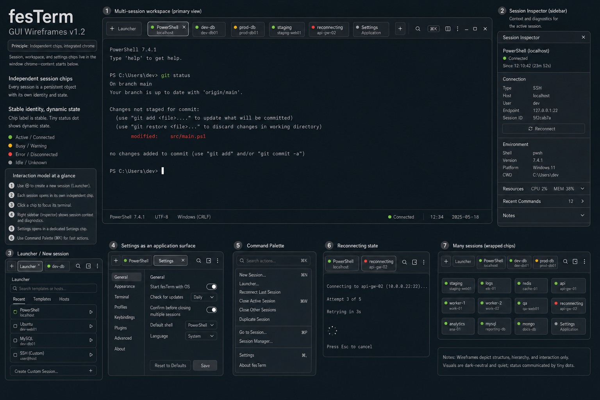

# fesTerm GUI Design

**Status:** Active design specification; the initial GUI vertical slice is
implemented and now requires usability and platform validation.

This document defines the interaction model, visual hierarchy, and product-level GUI principles for fesTerm. It complements `ARCHITECTURE.md` and `docs/ui-test-plan.md`: architecture defines ownership and dependencies, the UI test plan defines validation, and this document defines the intended user experience.

## Canonical Wireframe



The v1.2 wireframe is the current visual reference for application chrome, independent session chips, launcher and settings surfaces, the session inspector, reconnecting state, and optional wrapped chip rows. It communicates structure and interaction hierarchy rather than final colors, typography, or platform-specific window controls.

## Product Posture

fesTerm should feel like a restrained, native-feeling terminal workstation:

- denser than a consumer application;
- quieter than a developer dashboard;
- more integrated than a minimal terminal window;
- less workflow-opinionated than command-block or cloud-dependent products; and
- always centered on terminal interaction.

The terminal viewport is the primary surface. Application chrome exists to help users create, identify, switch, restore, and diagnose sessions without competing with terminal content.

## Core UX Principles

### Stable application identity, dynamic terminal content

The application should optimize for persistent identity while the terminal remains dynamic.

Stable concepts include:

- session identity;
- profile identity;
- workspace identity;
- host identity; and
- user-assigned names.

Transient concepts include:

- terminal-provided titles;
- current directory;
- foreground process;
- alternate-screen content;
- cursor state; and
- connection transport details.

Transient terminal state must not silently replace stable application identity.

### One primary action per screen

Each major screen should have one dominant purpose:

- **Launcher:** start or connect to a session.
- **Terminal tab:** interact with the terminal.
- **Settings:** configure the application.
- **Diagnostics:** inspect or troubleshoot state.

Secondary actions should remain available but visually subordinate.

### Quiet by default

Normal operation should avoid persistent telemetry, cell grids, verbose status strings, or developer instrumentation.

Diagnostics should be available through an explicit overlay, panel, or command. Errors should be concise and contextual, with details available on demand.

### Keyboard-first, mouse-friendly

All primary workflows should be efficient from the keyboard while remaining discoverable and usable with a mouse.

### Local-first

The launcher, profiles, sessions, workspace restore, and settings must work without sign-in. Optional synchronization must not change the primary interaction model.

## Root Application States

The application should never present an undefined empty state. The root state is always one of:

1. **Session launcher**
2. **One or more open sessions**
3. **Workspace restoration in progress**

When the last session closes, fesTerm returns to the launcher instead of showing a blank window or exiting unexpectedly, unless the user has explicitly configured close-last-tab behavior otherwise.

## Session Launcher

### Launch behavior

When fesTerm starts without a workspace to restore, it should open a lightweight session launcher rather than immediately launching the platform default shell.

The launcher is not a wizard, dashboard, or onboarding flow. It should be fast, compact, and usable repeatedly.

### Launcher content

The launcher may contain:

- **Local shell** — platform default and saved local profiles.
- **SSH** — connect to a host or select a saved profile.
- **Recent sessions or profiles**.
- **Recent workspaces**.
- **Settings** and limited help/documentation access.

Unavailable categories may be omitted until implemented rather than shown as disabled clutter.

The launcher's options form a single keyboard-navigable list (`app/festerm/src/screens.rs`'s `show_launcher`): Up/Down moves a highlighted selection and Enter launches whichever option is currently highlighted, without requiring the mouse. Selection state is tracked per launcher tab (keyed by `TabId`) so multiple open launcher tabs don't share a highlight.

### Launcher as a tab

The launcher should use the same tab model as sessions.

Consequences:

- Closing the final session returns to the launcher.
- The New Tab command opens a launcher tab.
- Users can keep a launcher tab open while other sessions run.
- The application does not need a separate home-window architecture.
- Starting a session *from* the active launcher tab (e.g. "Local Shell") replaces that launcher tab in place with the new session tab, keeping the same position and chip identity, rather than leaving the spent launcher behind alongside a separate new tab (`app/festerm/src/tabs.rs`'s `start_local_session`). Starting a session while some other tab is active (e.g. via a keyboard shortcut) still opens a new tab rather than replacing whatever is currently active.

### New Tab behavior

The primary New Tab action should open the launcher rather than immediately creating one predetermined session type.

A separate shortcut or configurable action may open the default local profile directly for users who prefer that workflow.

## Primary Layout

The default window has three conceptual zones:

```text
+------------------------------------------------------+
| Integrated chrome: session chips + global actions   |
+------------------------------------------------------+
|                                                      |
| Terminal viewport or launcher content                |
|                                                      |
+------------------------------------------------------+
| Contextual status only when needed                   |
+------------------------------------------------------+
```

### Tab strip

The chip row provides session switching and identity. It is part of the upper application chrome, sharing the top-of-window band with New Tab and compact global controls. The chips remain visually independent through spacing, shape, border, and elevation—not by moving them onto a separate shelf.

### Main content

The main content is either a terminal viewport, launcher, settings page, or diagnostics surface. Terminal tabs should maximize terminal area.

### Application chrome and session context

Global application actions and session-specific context are separate concerns.

- The upper application chrome owns compact global actions: New Tab/Launcher, command palette or search, session-inspector toggle, and a deliberately small overflow menu.
- Global controls are icon-only, using the canonical first-party forms in [the icon system](icon-system.md), with accessible labels and hover text carrying their meaning. Painter-drawn implementations may remain while runtime SVG integration is incremental, but their geometry should converge on the canonical sources rather than creating a second icon vocabulary.
- The session chips live inside the upper application chrome, in the same top-of-window band as New Tab and compact global controls. They are independent because each lozenge has visible space around it—not because the row is separated from the chrome.
- The right-side session inspector is normally hidden and shows context for the active session: connection state, host/profile metadata, environment, diagnostics, and relevant actions.
- Global Settings do not live in the inspector. Settings open as an application surface represented by their own chip, and remain reachable from the command palette and compact overflow menu.

The overflow menu should stay intentionally small. Growth into a general-purpose action list is a design smell; less common actions belong in the command palette or their relevant application surface.

### Contextual status region

The bottom status region should normally be absent. It may appear for actionable or transitional states such as:

- reconnecting;
- authentication required;
- host-key decision required;
- session startup failure;
- transport failure; or
- an available diagnostic detail.

It should not display continuous byte counts, queue metrics, dimensions, or frame statistics during normal use.

### Bottom status bar

Distinct from the contextual status region above, a persistent bottom status bar (`crates/festerm-ui-egui/src/statusbar.rs`) may run along the very bottom of the window, matching the reference mockup's footer: the active session's identity on the left (plus its terminal grid dimensions, e.g. `80×24`, and its locality/host platform, e.g. `Local · Windows`), and connection state (dot + accessible label) plus a local clock and date on the right. It is user-configurable on/off (`AppCommand::ToggleStatusBar`, exposed today from the Settings screen), defaulting to shown. Unlike the mockup, it never fabricates fields fesTerm does not actually track (shell version, text encoding); it only ever shows genuinely available session/tab state, real connection status, and the real local time. The locality/platform field is deliberately labeled `Local · Windows` / `Local · Unix` rather than a line-ending convention such as `Windows (CRLF)`: the host OS a session happens to run on does not reliably imply its byte stream's CRLF/LF semantics, and that framing would become actively misleading once a remote (SSH) session's host platform can differ from the client's — a future remote session reports its own remote host's platform under a `Remote ·` prefix instead.

The terminal viewport itself (`crates/festerm-ui-egui/src/view.rs`) no longer draws its own inline "fesTerm / Diagnostics" header or expandable per-frame diagnostics footer — that duplicated chrome the application already owns and only its grid-dimensions field was in regular use, which now lives in the status bar instead. `TerminalView::show` fills all available space with just the terminal grid; `TerminalView::diagnostics()` remains available for tests and future tooling that need the raw per-frame `FrameDiagnostics`.

## Tab Model

### Independent session chips

Session tabs are independent lozenges or chips, not connected browser-style or rolodex tabs. This is an interaction principle, not merely a corner-radius choice: every chip represents a persistent, independently managed session object.

Implementation requirements:

- Place the chip row inside the top window-chrome band; terminal, launcher, or settings content begins immediately below that integrated chrome.
- Preserve visible space around every chip; adjacent chips must never merge into a continuous tab strip.
- Keep chip surfaces neutral. Connection color belongs in a small status indicator, not across the whole chip.
- Indicate the active chip with a slightly brighter surface, stronger border, subtle elevation, and optionally a small height difference. Do not depend on a saturated accent fill.
- Keep stable session identity as the primary label and transient terminal state as secondary metadata.
- Make Launcher and non-session application surfaces such as Settings visually distinct while keeping them in the same switching model.
- Drag-and-drop reorders independent session objects and should preserve their identity and state.
- Design chip layout for both horizontal overflow and an optional multi-row wrapping mode. Wrapping must remain user-configurable because some users will prefer a single scrolling row.
- Preserve semantic tab roles, keyboard order, accessible names, focus indication, and close behavior even when the visual treatment is chip-like.

The wireframe in [Canonical Wireframe](#canonical-wireframe) is the visual contract for these requirements. A detached chip shelf below a separate title bar, connected browser tabs, file-folder tabs, full-chip status colors, and constantly changing primary labels are non-conforming implementations.

### Window chrome (integrated title-bar controls)

The chip row and global actions occupy one integrated top band rather than a
detached shelf. On Windows and Linux, the window disables native decorations
(`app/festerm/src/main.rs`, `ViewportBuilder::with_decorations(false)`) and
renders custom minimize/maximize/close controls in that band. On macOS,
eframe's full-size content view keeps the native close/minimize/zoom traffic
lights on the left over the integrated chip band; the application reserves
their hit-test area and does not render duplicate right-side controls.
Implementation (`crates/festerm-ui-egui/src/chrome.rs::show`):

- On Windows and Linux, the trailing icon block (right-to-left: close, maximize/restore, minimize, overflow menu, panel toggle, search) is painted in the same row as the chips. Its current painter geometry is an implementation detail; [the first-party SVG sources](icon-system.md) are the canonical visual vocabulary for future asset integration. Each window-control icon calls `ui.ctx().send_viewport_cmd(ViewportCommand::Close/Maximized/Minimized)` directly rather than going through `ChromeAction`/`AppCommand`, since these are OS-window-level actions with no application-state implications.
- The maximize/restore icon reads the viewport's real current state (`ui.input(|i| i.viewport().maximized)`) and paints a single square (maximize) or two overlapping squares (restore) accordingly, so the icon's own shape communicates state rather than a text label.
- A background drag-to-move region is registered across the row's own compact content band (not the full remaining panel height, which - before any content is laid out - would otherwise swallow pointer events meant for the terminal view painted below) *before* the chips/icons are added, so those widgets' own click handling still takes priority over this catch-all background sense wherever they visually sit on top of it. Starting a primary-button drag on that background sends `ViewportCommand::StartDrag`; double-clicking it toggles `ViewportCommand::Maximized`.
- `TRAILING_CONTROLS_RESERVED_WIDTH` accounts for platform-specific trailing icons so the chip row never overlaps them, extending the existing narrow-window overlap fix.

### Tab anatomy

A session tab conceptually contains:

```text
[session icon] [primary identity] [state indicator] [close]
```

Not every element must be visible at every density. The primary identity and active state take precedence.

### Identity precedence

The primary tab label should follow this order:

1. User-assigned tab name.
2. Profile or connection name.
3. Remote host alias for SSH.
4. Local shell name or session type.
5. Generic fallback such as `Local Shell` or `SSH Session`.

The terminal-provided dynamic title must not replace the primary identity.

### Dynamic terminal title

A terminal-provided title may appear as secondary metadata when space permits, for example:

```text
production-db — nvim server.rs
```

The stable identity remains first. In compact layouts, the secondary title should be omitted before truncating the primary identity beyond usefulness.

### Session-type identity

Icons may help distinguish local shell, SSH, launcher, settings, or other future session types. Icons should aid recognition rather than decorate every control.

The repository-owned source set and its semantic Rust names are defined in [Icon System](icon-system.md). Assets are monochrome and receive semantic color from UI code; status remains a separate accessible indicator instead of tinting the entire session icon or chip.

Remote operating-system icons may be shown when reliable metadata is available, but the UI must always use `SshRemote` as a coherent generic remote-host identity. OS detection must not be required, and branded OS logos are outside the first-party set.

### Connection states

The visual state vocabulary should include at least:

- connected or running;
- starting;
- reconnecting;
- disconnected;
- authentication required;
- failed; and
- exited.

State indicators should be compact, accessible, and not rely on color alone.

### Active and inactive tabs

The active tab must remain immediately distinguishable in both light and dark themes. Inactive tabs should be readable without competing visually with the active terminal. The application defaults to the blue-graphite semantic palette in `crates/festerm-ui-egui/src/theme.rs`, applied to egui in `app/festerm/src/app.rs`. Chrome uses those same roles explicitly rather than asking generic widget-state helpers such as `strong_text_color()` to decide static chip identity; those helpers describe momentary button interaction, not the chip hierarchy.

- `CHIP_ACTIVE_OUTLINE` maps to `border.active`; the active chip and its close control share this cool light outline.
- `CHIP_INACTIVE_OUTLINE` maps to `border.subtle`; inactive chips, the New Session control, and drag preview share it.
- `CHIP_ACTIVE_FILL` maps to `surface.tab.active`, a restrained step above the inactive chip and shared window well. The active outline remains the stronger selection cue. The same quiet fill is the hover treatment for inactive chips and New Session.
- `CHIP_INACTIVE_FILL` maps to `surface.tab.inactive`.
- `CHIP_PRIMARY_TEXT` and `CHIP_SECONDARY_TEXT` map to `text.primary` and `text.secondary`.
- `CHROME_ICON_COLOR` / `CHROME_ICON_COLOR_HOVERED` map to `text.secondary` / `text.primary`.
- `CHROME_CLOSE_HOVER` maps to `status.error`.

All chips sit on top of the terminal viewport's own near-black chrome-band
background (`crates/festerm-ui-egui/src/lib.rs`'s `DEFAULT_BACKGROUND`, mapped
to `surface.terminal`); against that shared dark surface, the
active/selected chip is indicated by both its brighter `CHIP_ACTIVE_OUTLINE`
border *and* its own lighter `CHIP_ACTIVE_FILL` fill — not by outline alone,
and not by a saturated accent color or by highlighting the label text.
Hovering an *inactive* chip, or the `+` new-chip button, previews that same
`CHIP_ACTIVE_FILL` fill without changing its outline color at all: the
outline stays fixed (`CHIP_INACTIVE_OUTLINE`) regardless of hover state, so
hover and selection read as two different, non-conflicting signals — a
consistent hover language shared by every chip-shaped control in the row
(`paint_chip`'s `hovered` parameter and `paint_new_chip_button`, both in
`crates/festerm-ui-egui/src/chrome.rs`).

The top chrome band and terminal well intentionally share this exact surface
color. There is no additional color border or separator between them. The
chrome consumes only its 8px top inset plus the 34px chip row; the terminal's
own 8px top margin is the single shared breathing space below the chips. This
coalesces what would otherwise be two adjacent 8px gaps and reduces the real
top stack from 50px to 42px without moving the terminal grid toward the chips.

Every chip, active or not, is drawn with a visible border: the active chip's border is `CHIP_ACTIVE_OUTLINE` (1.5px) and inactive chips use `CHIP_INACTIVE_OUTLINE` (1.0px), so the distinction reads clearly without color being the only cue. Each chip is two lines, left-aligned with a small reserved strip on the left for the status dot: the first line holds the status dot and the stable identity, left-aligned; the second, smaller and muted line holds optional secondary terminal-provided metadata, indented under the first line's label rather than the chip's own left edge. The close control, shown only on the active chip (never on inactive chips, even on hover), is positioned from the chip's own outer corner — evenly inset from the top and right edges — rather than flowing through the label's layout, so its position stays fixed and the label never shifts to accommodate it. Opening a new Launcher tab is done exclusively through the compact icon-only "New tab" control at the end of the chip row (`AGENTS.md`: no duplicate widget-specific copies of the same operation) — an earlier full chip-styled "+ Launcher" button duplicated this control and was removed as redundant.

Chips without a secondary line (an open Launcher-type tab, which has no secondary terminal metadata) claim the chip's full footprint (`ui.set_min_size(outer_rect.size())`) before laying out their top-down content, rather than letting the shrink-wrapped one-line content block get vertically centered by the surrounding chip-row layout; without this, a one-line chip would render with visibly larger top/bottom padding than its two-line neighbors even though both share the same `CHIP_HEIGHT`.

The chip row is scoped to its own narrower top-aligned sub-layout (`Layout::left_to_right(Align::Min)`), rather than the *whole* top-level chrome row switching to `Align::Min`: an `Align::Min` layout at the very top level was tried and reverted, because it handed the full remaining panel height down to the trailing icon controls' own nested `Align::Center` sub-layout, centering the icons roughly mid-window instead of near the top and (in the real app, where the terminal view is painted immediately after the chrome row in the same `Ui`) starving the terminal view of any remaining vertical space. Only the outermost row keeps plain `Align::Center` (`ui.horizontal`); scoping `Align::Min` to just the chip-row sub-block fixes its top-alignment without that regression (`crates/festerm-ui-egui/src/chrome.rs`'s `chrome_row_stays_a_compact_band_even_with_a_tall_available_area` test guards this).

The status dot is allocated at the primary label's own text-line height (via `Ui::text_style_height`), not just its own diameter, so the row's `Align::Center` computes one shared center line for both the dot and the label text. The primary row has a one-pixel optical downward adjustment. That pixel is taken from the gap below the primary row, so the smaller secondary line retains its existing position.

### Tab overflow and wrapping

The design must remain usable with many sessions. The implementation should support:

- compact chip width and sensible truncation;
- a single-row mode with horizontal scrolling or overflow;
- an optional multi-row wrapped-chip mode for wide displays;
- keyboard switching that follows a predictable logical order independent of visual wrapping;
- a searchable session switcher keyed primarily by stable identity; and
- graceful narrow-window collapse without merging chips into a connected strip.

Chips clip overflowing text with an ellipsis rather than growing without bound: both the primary and secondary lines truncate to a fixed chip-width range instead of forcing the whole row layout to widen to fit a long terminal-provided title (for example, a full shell executable path). Where a terminal-provided title looks path-like, the chip's secondary text shows only its final path component (e.g. `cmd.exe`) rather than the full path, so the identity-first chip stays compact; this is purely a display reduction and never mutates the underlying terminal-provided title data.

The chip row and the trailing global icon controls (search, panel toggle, overflow menu) share one horizontal row, so the chip row's own wrap/scroll width budget is capped to leave room for those icons (`TRAILING_CONTROLS_RESERVED_WIDTH` in `crates/festerm-ui-egui/src/chrome.rs`) rather than being computed as if it owned the full row width. This prevents the last wrapped or scrolled chip from rendering underneath the icons on narrow windows.


## Session Creation Workflow

### Local session

The launcher should allow users to:

- open the platform default local profile;
- choose a saved local profile; and
- access additional options without requiring them for the common path.

### SSH session

The launcher should support:

- saved SSH profiles;
- recent connections;
- a direct `Connect to host...` action; and
- clear authentication or host-key follow-up when required.

SSH is a first-class session type, not a local shell command presented as an application feature.

### Profile editing

Profile creation and editing should be separate from the immediate launch path. The common case should require one selection or a small amount of connection information, not completion of a large settings form.

## Workspace Workflow

### Restore

When workspace restore is enabled, startup should clearly indicate restoration while sessions are being recreated. Each tab should be allowed to enter a starting, reconnecting, failed, or running state independently.

### Failure handling

One failed session must not block restoration of the rest of the workspace. Failed tabs retain their stable identity and expose retry or diagnostic actions.

### Restored identity

Workspace restoration should preserve:

- tab order;
- stable tab/session names;
- selected tab;
- window dimensions and supported window state; and
- profile references or launch definitions.

Transient terminal titles should not become the restored primary identity.

## Diagnostics and Error UX

### Three levels

1. **Normal mode** — quiet terminal workstation.
2. **Contextual notification** — brief actionable state near the affected session.
3. **Diagnostics surface** — detailed lifecycle, queue, dimensions, byte counts, timing, and error information.

### Error presentation

Errors should answer:

- What failed?
- Which session is affected?
- Is retry possible?
- What is the primary next action?

Technical details should be expandable or copyable without occupying the main terminal surface permanently.

### Reconnect presentation

A reconnecting SSH session should retain its tab and stable identity. The tab may show a compact reconnecting state, while the viewport presents a restrained overlay or message that does not destroy prior terminal content unnecessarily.

Implemented today as a floating overlay (`crates/festerm-ui-egui/src/overlay.rs`) drawn above — not instead of — the terminal viewport for any non-nominal `ChipStatus` (`Reconnecting`, `AuthRequired`, `Failed`, `Disconnected`, `Exited`), offering "View Diagnostics" and "Close Tab" actions. Only the local-shell states (`Starting`, `Failed`, `Exited`, etc.) are currently reachable in practice, since SSH sessions are not yet implemented; `Reconnecting`/`AuthRequired` are exercised only by headless tests until SSH lands.

### Sensitive data

Diagnostic views and exported bundles must avoid exposing secrets, credentials, private keys, tokens, or unreviewed terminal content by default.

## Visual Language

### General style

- Blue-graphite terminal-first default: cool undertones in neutral surfaces,
  with cyan reserved for small, high-information accents.
- Minimal borders and separators.
- Compact controls and tab chrome.
- Purposeful accent color.
- No visible cell grid in normal mode.
- Limited animation, used only for meaningful state changes.
- Terminal content visually dominates application chrome.

### Density

The default density should support many tabs and long work sessions without feeling cramped. Touch-sized controls are not required as the desktop default, but critical actions must remain usable and accessible.

### Semantic color roles

Use semantic roles rather than scattered literal colors:

```text
surface.window
surface.chrome
surface.terminal
surface.tab.active
surface.tab.inactive
surface.overlay
surface.selection
text.primary
text.secondary
text.muted
border.subtle
accent.primary
status.running
status.starting
status.reconnecting
status.disconnected
status.error
status.attention
```

Themes should map these roles to concrete colors while preserving contrast and state distinctions.

The default mapping is centralized in `crates/festerm-ui-egui/src/theme.rs`:

| Role | Default |
| --- | --- |
| `surface.window` | `#0e1319` |
| `surface.terminal` | `#11161e` |
| `surface.chrome` | `#11161e` (same as terminal) |
| `surface.tab.inactive` | `#1a222c` |
| `surface.tab.active` | `#29333e` |
| `surface.overlay` | `#26313d` |
| `surface.selection` | `#28516b` |
| `text.primary` | `#e8edf2` |
| `text.secondary` | `#a7b2bd` |
| `text.muted` | `#788592` |
| `border.subtle` | `#35414e` |
| `border.active` | `#91a7b8` |
| `accent.primary` | `#42bfd0` |

The accent is not a general surface fill. Use it for links, focus/selection
details, active controls, and reconnecting activity. Terminal ANSI/indexed and
explicit RGB colors remain a separate protocol palette and are never remapped
through these application roles.

### Typography roles

At minimum, define:

- terminal text;
- tab primary identity;
- tab secondary title;
- launcher heading;
- launcher item title;
- launcher item description;
- contextual status text; and
- diagnostic text.

Terminal typography may use separate font and shaping rules from application chrome.

## Terminal Typography

### Goals

- High readability for long sessions.
- Reliable cross-platform glyph coverage.
- Correct width and continuation mapping.
- Font fallback without breaking cell geometry.
- Ligature support after the shaping-to-cell mapping contract is validated.

### Ligatures

Ligatures are a planned capability, but they must never alter terminal cell ownership, cursor placement, selection boundaries, or mouse coordinates.

Ligature enabling should remain blocked until the M6 ligature and fallback validation requirements are satisfied.

### User control

Users should eventually be able to configure terminal font family, size, fallback behavior, line height, and ligature preference through versioned configuration and GUI settings.

### Cursor appearance

The terminal-correctness spec default cursor style is `BlinkingBlock` (per real xterm/VT100 behavior), which the core terminal model (`crates/festerm-core/src/terminal.rs`) always reports faithfully once a program has requested a style. However, as an additive, GUI-only presentation choice, the renderer (`crates/festerm-ui-egui/src/renderer.rs`) shows a steady vertical bar cursor by default — until the terminal program in the session explicitly requests a style via DECSCUSR (tracked separately via `Terminal::cursor_style_requested_by_program()`), at which point the program's requested style is honored exactly. This avoids the hollow, unfocused-looking empty box appearing by default while never altering the spec-observable `cursor_style()` value itself. When a block-style cursor is in effect and the view is focused, it renders filled (solid) rather than a hollow outline, matching conventional terminal-emulator focus affordance; the character glyph underneath a filled cursor is redrawn in the background color on top so it stays legible.

## Interaction Conventions

### Keyboard

Expected commands include:

- New Tab opens the session launcher.
- A separate action may open the default local profile directly.
- Close Tab closes the current launcher or session tab.
- Next/Previous Tab switch predictably.
- A searchable session switcher finds tabs by stable identity and optional secondary title.
- Command palette or equivalent access may expose less common actions later.

Exact platform shortcuts remain to be specified and should respect platform conventions where practical. A first-pass, revisitable binding is implemented today (`app/festerm/src/app.rs::handle_shortcuts`) so the GUI-chrome parallel track has something usable to test against, tracked for confirmation in [issue #23](https://github.com/fes/fesTerm/issues/23):

- `Ctrl+T` — New Launcher Tab.
- `Ctrl+W` — Close the active tab.
- `Ctrl+Tab` / `Ctrl+Shift+Tab` — Activate the next / previous tab, in stable list order (independent of visual wrapping).
- `Ctrl+Shift+P` — Toggle the command palette, which also folds in the searchable session switcher as "Activate: `<label>`" entries alongside fixed actions (see [issue #25](https://github.com/fes/fesTerm/issues/25) for whether a separate, dedicated switcher is still warranted).

### Mouse

- Clicking a tab activates it.
- Tab close controls should avoid accidental activation or closure.
- Reordering may be supported through drag-and-drop.
- Session tabs may be renamed by double-clicking the chip's label, editing inline, and committing with Enter or by clicking away; Escape cancels. Launcher and Settings chips are not renamable.
- Terminal mouse reporting and local selection remain governed by terminal mode and modifier policy.

Chip reordering is implemented by making the whole chip press-and-hold draggable (`crates/festerm-ui-egui/src/chrome.rs`) rather than via a dedicated drag-handle glyph: no explicit move icon is shown, and pressing anywhere on the chip body (outside the label, close button, and status dot, which keep their own click targets) starts a drag. While dragging, the chip itself floats at the cursor and sibling chips live-shuffle to preview the resulting order as the pointer moves, rather than only showing a static insertion marker.

### Focus

Opening or activating a terminal tab should focus the terminal unless a modal action, authentication prompt, or launcher control explicitly owns focus. Implemented in `crates/festerm-ui-egui/src/view.rs`'s `TerminalView::show_in_ui`: each view claims keyboard focus once automatically on its first rendered frame (tracked via a `has_requested_initial_focus` flag), in addition to the existing click-to-focus behavior, so a freshly started session is immediately typeable without requiring an extra click into the terminal.

## Accessibility

The GUI should provide:

- semantic roles and accessible names for tabs and controls;
- non-color state indicators;
- sufficient contrast;
- keyboard traversal for launcher, tabs, settings, and diagnostics;
- clear focus indication outside the terminal viewport;
- meaningful truncation or tooltips for shortened identity text; and
- scalable application chrome independent of terminal font size where practical.

Headless GUI tests should assert semantic names and roles for major controls before pixel snapshots are treated as authoritative.

## Responsive and Narrow-Window Behavior

When horizontal space is constrained, remove or collapse information in this order:

1. Secondary terminal-provided title.
2. Optional OS-specific icon or decorative metadata.
3. Verbose state text, retaining an accessible state indicator.
4. Less-used global actions into an overflow menu.

The stable primary session identity should remain visible as long as possible.

The terminal viewport must never become fragmented or uncovered because chrome, diagnostics, or footer geometry was calculated after terminal dimensions.

## Launcher Example

A conceptual launcher may resemble:

```text
fesTerm

New Session
  Local Shell
    PowerShell
    Bash

  SSH
    Connect to host...

Recent
  production-db
  staging
  dev-vm

Workspaces
  Yesterday
  Kubernetes
```

This is information architecture, not a pixel specification. The final implementation should remain compact and terminal-oriented.

## Validation Strategy

GUI behavior should be validated in layers:

1. Pure layout, geometry, state, and input tests.
2. Headless egui frame tests.
3. Structural viewport and clipping assertions.
4. Stable visual snapshots.
5. Native-window platform smoke tests.
6. Workflow review using screenshots or recordings.

Important GUI states should include:

- launcher with no saved profiles;
- launcher with recent profiles and workspaces;
- multiple local and SSH tabs;
- active, inactive, reconnecting, failed, and exited sessions;
- long and duplicate session names;
- narrow and high-DPI windows;
- diagnostics collapsed and expanded; and
- workspace restoration with mixed success.

## Iteration Process

GUI work should proceed in short design rounds:

1. **Workflow:** define user goal, primary action, keyboard path, failure state, and required information.
2. **Information architecture:** define tabs, menus, panels, and state ownership.
3. **Visual language:** define density, spacing, typography, color roles, and icon policy.
4. **Prototype:** build a narrow vertical slice with fake session metadata where appropriate.
5. **Evaluation:** review screenshots, recordings, structural tests, and interaction behavior.
6. **Specification:** update this document and create focused implementation issues.

Implementation should not attempt the entire future UI at once. The first prototype should prove the launcher, tab identity model, session states, hidden diagnostics, and terminal dominance before broader settings or workspace UI is built.

### Mockup-comparison review process

Step 5 (**Evaluation**) above is deliberately not "eyeball the screenshot and move on." Early GUI rounds relied on a general-purpose coding agent doing its own ad hoc visual comparison against the wireframe in the same context as the implementation work, and that repeatedly produced two failure modes: the agent anchored on whichever detail it had just been told to check (missing unrelated regressions elsewhere in the same screenshot), and its pixel-level size/spacing estimates from the image were unreliable — two independent passes over the same screenshot region gave materially different numbers, and at least one flagged "deviation" (an 18px vs. 24px chip-inset asymmetry) turned out to be a false positive once actually measured.

That motivated splitting mockup analysis into its own persisted, reusable custom agent definition (`~/.copilot/agents/mockup-analyst.md`, user-scoped so it is available across repositories/sessions) whose sole job is deep, disinterested visual/UX comparison — not implementation. Its design settled on:

- **Workflow- and aesthetics-first reading, not pattern matching.** It is instructed to first form an understanding of the mockup's intent (border spacing and offsets, alignment axes, typography, color semantics, navigation paradigms, element grouping, and permanent-vs-transient elements) before diffing against any implementation, and to recognize when a single image is a composite of multiple independent screens/states that must be analyzed separately.
- **A structured Match / Deviation / Ambiguous protocol** for every comparison, rather than free-form prose, so findings are consistently actionable.
- **A negotiated-deviations ledger** (`~/.copilot/agents/mockup-analyst-deviations.md`): some departures from the mockup are conscious product decisions (for example, the status bar deliberately omitting fabricated shell-version/encoding fields). The agent reads this ledger before every review and reports conformance to a negotiated preference as **Match (negotiated)**, distinct from a plain mockup match, instead of re-flagging an accepted decision as a fresh deviation every round.
- **Explicit evidence-sufficiency checks.** The agent must say when a screenshot cannot answer the question being asked (e.g. a single-chip screenshot cannot prove active-vs-inactive contrast, an empty terminal cannot prove viewport padding on all four sides, no hover/focus captured cannot assess transient states) and name the specific follow-up screenshot needed, rather than silently passing or failing on insufficient evidence.
- **Preferring objective pixel measurement over visual estimation for close calls** — script-sampling the actual mockup/screenshot image file (e.g. via a short Python/Pillow snippet run through `powershell`) rather than trusting an LLM's visual read of a rendered image, directly because of the false-positive case above.

The agent is invoked today by pasting its full definition into a fresh general-purpose background-agent context for each review (custom agent definitions are not yet directly selectable as a `task`-tool agent type), so each run is a clean, disinterested pass with no bias carried over from the implementation work in the same session. A comparative run using two different underlying models (Claude and GPT) on the same mockup found they can disagree on the same evidence — for example, only one correctly recognized a status-bar field omission as an already-negotiated decision rather than a fresh deviation — which is the concrete case the negotiated-deviations ledger now exists to prevent.

## First GUI Prototype

The first design prototype should include:

- a launcher tab;
- two or three mock session tabs;
- local and SSH identities;
- active and inactive states;
- disconnected and reconnecting states;
- stable primary identity plus optional dynamic secondary title;
- a compact New Session action;
- a hidden diagnostics surface; and
- terminal viewport dominance.

It should use fake metadata where necessary so interaction and hierarchy can be settled before M7 and M8 implementation details constrain the design.

## Open Questions

- Cross-platform custom-title-bar behavior: drag, double-click maximize/restore,
  snapping, multi-monitor DPI, accessibility, and native convention alignment
  are tracked in [issue #29](https://github.com/fes/fesTerm/issues/29).
- Whether launcher tabs may be pinned or automatically close after launching a session.
- Default shortcut for directly opening the platform default local profile, and final confirmation of the first-pass keyboard bindings above ([issue #23](https://github.com/fes/fesTerm/issues/23)).
- Searchable session-switcher interaction and placement: today it is folded into the command palette as tab-activation entries; whether a separate, dedicated switcher is still warranted remains open ([issue #25](https://github.com/fes/fesTerm/issues/25)).
- Default chip width, minimum chip width, and the preference between single-row overflow and optional wrapping: both `ChipLayout::Wrap` and `ChipLayout::SingleRowScroll` are implemented and user-toggleable from Settings, but no default has been chosen based on usability input ([issue #24](https://github.com/fes/fesTerm/issues/24)).
- Exact responsive behavior and minimum width of the normally hidden right-side session inspector.
- Theme defaults and application-chrome font selection.
- Runtime SVG ingestion/raster-cache details and the incremental migration of
  existing painter-drawn controls to the canonical first-party icon sources.
- Rules for user-name and host-name privacy in screenshots, notifications, and shared workspaces.
- Whether a failed/disconnected session should offer a "Retry"/"Reconnect" action; the current connection overlay (`crates/festerm-ui-egui/src/overlay.rs`) only offers "View Diagnostics" and "Close Tab" because no session-restart backend capability exists yet.

- Whether close-last-tab returns to the launcher unconditionally or is configurable.
