<!-- GENERATED FILE - do not edit directly.
     Screenshots:      scripts/capture-ui-state.sh
     Narrative source: docs/ui-state-narrative.md
     Rebuild:          python3 scripts/build_ui_state_doc.py -->

# State of the UI

## How to read this document

This is a snapshot of every significant fesTerm surface as it currently
behaves, intended for design and workflow review rather than as a manual.
It is regenerated, not written by hand: the screenshots come from the real
UI rendered against repository-owned fixture data, so the document cannot
drift from the product without the drift showing up as a changed picture.

Everything here is synthetic. Hosts are `example.com`/`example.net`
subdomains, addresses come from the documentation-reserved ranges in
RFC 5737, and users are named `devuser`, `builder` and `operator`. No real
configuration, credential, host key, clipboard content or shell history is
reachable from the capture path.

Two things this document deliberately does *not* do. It does not enumerate
every state of every control — it shows each surface doing representative
work, plus the edge states that are actually interesting. And it does not
assert correctness; the automated suites and the validation gates do that.
What it captures is how the product currently *presents* itself.

## Starting a session

The New Session tab is the application's front door, and it answers three
different questions at once: what kinds of session can I start, what have I
saved, and what is already running that I could rejoin.

Launch cards across the top cover the five entry points — local shell, SSH,
SFTP, serial and Markdown. Below them the view splits: saved profiles on the
left with search and sort, running sessions on the right grouped by the
provider that owns them. That right-hand panel is the part that distinguishes
fesTerm from a plain terminal: native `festerm-sessiond` sessions, tmux and
screen are listed side by side under one Reattach affordance, so reattaching
does not require knowing which multiplexer produced the session.

The compact variant exists because the launch cards are the least valuable
part of the view once a user has profiles. It shrinks the cards so the
profile and running-session panels start higher, while keeping the card
descriptions.

### New Session in the compact launcher-grid layout

The 'Compact New Session layout' preference shrinks the launch cards so saved profiles and running sessions start higher up the window.

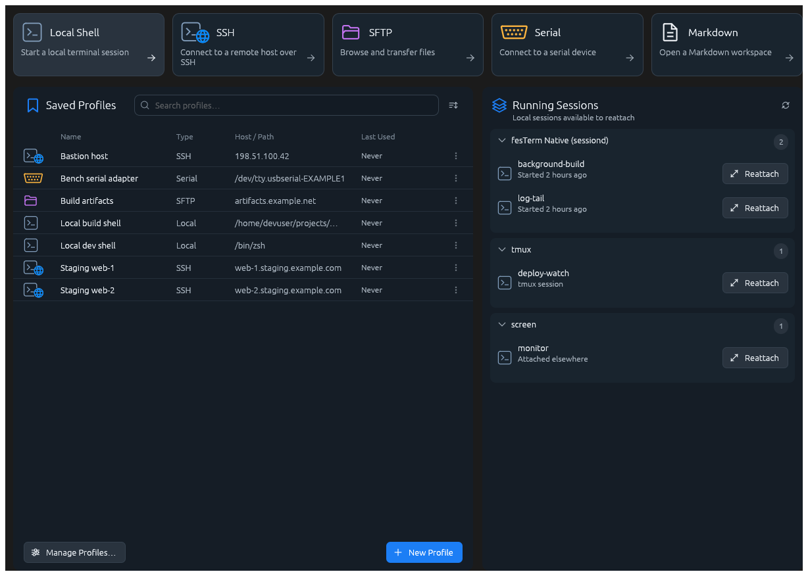

### New Session on first run, before any profile exists

The empty/first-run state: only the fixed launch cards, with no saved profiles or resumable sessions panels to show yet.

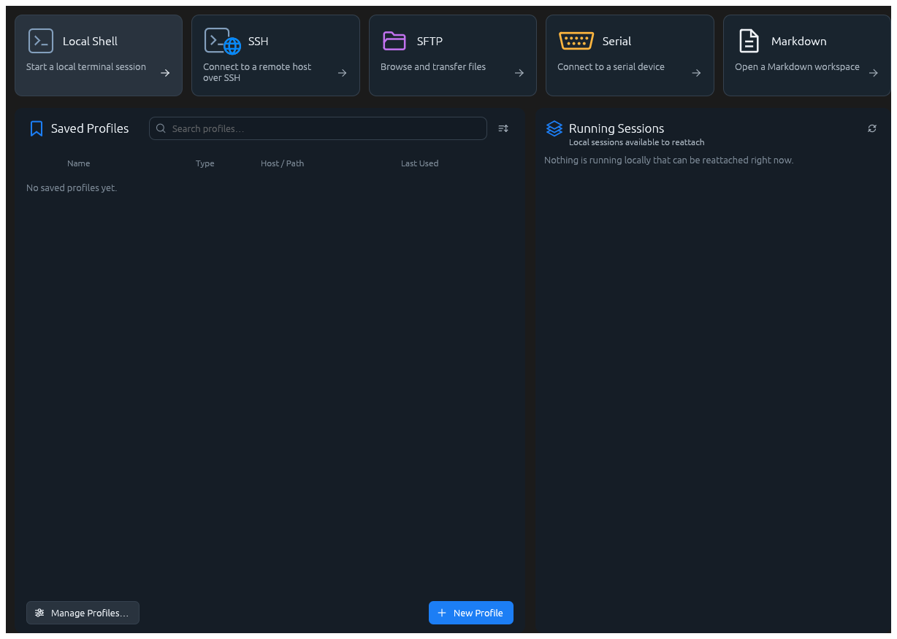

### New Session at a narrow, responsive width

The same populated launcher reflowing at a narrow window: cards and panels stack instead of sitting side by side.

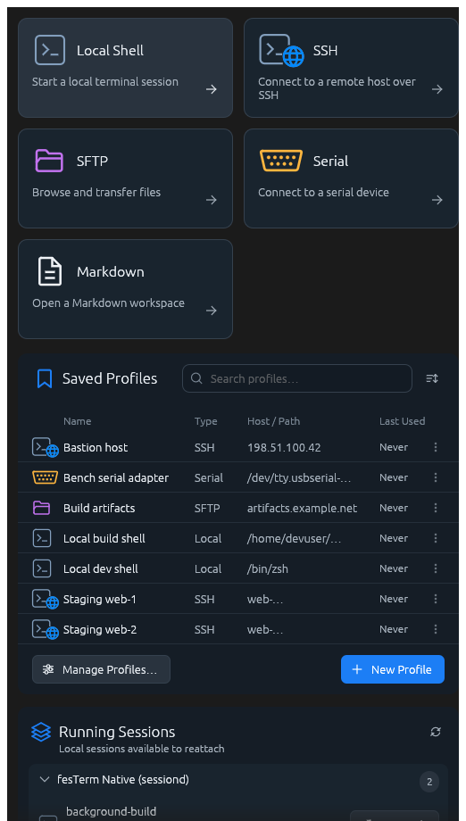

### New Session with saved profiles and running sessions

Launch cards sit above saved profiles of every kind plus resumable local, tmux, and screen sessions, at a normal desktop width.

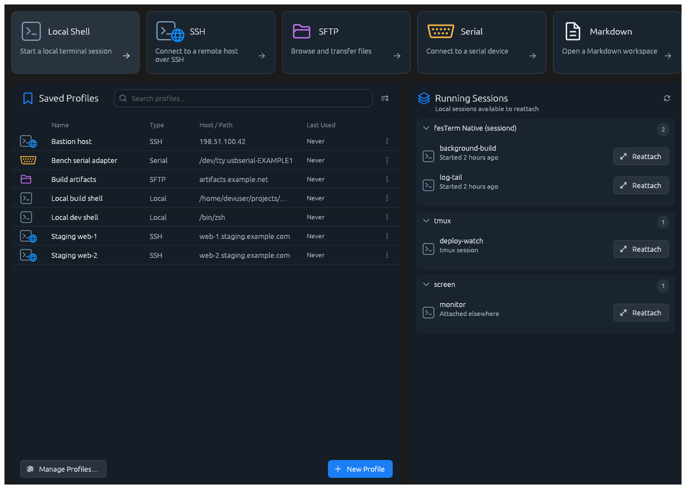

## Connecting

Each transport has its own form, and they share a deliberate shape: the
minimum needed to connect is visible immediately, and everything else is
behind *Show advanced settings*. A first-time SSH connection needs a
username and a host; durable sessions, port forwards and the choice between
password, private-key and certificate authentication are all available but
never in the way.

Two details worth noticing in review. Saving a password requires a saved
profile, and the form says so at the point of decision rather than failing
later. And the durable-session toggle explains what it will do — attach to a
named remote tmux or screen session, creating it when needed — because the
difference between a durable and an ordinary remote session is otherwise
invisible until something disconnects.

### Serial connect form

Serial launches ask only for a device path and line settings; there is no host/credential concept for a local serial device.

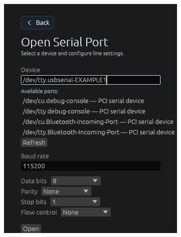

### SFTP connect form

The SFTP launch surface defaults to opening the graphical two-pane file manager once connected.

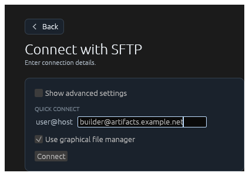

### SSH connect form with advanced settings shown

Revealing 'Show advanced settings' exposes durable-session, port forwarding, and authentication-method controls.

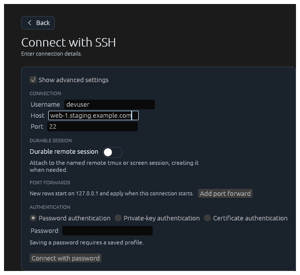

### SSH connect form, Quick Connect

The default SSH launch surface: host/username/password only, with advanced settings collapsed.

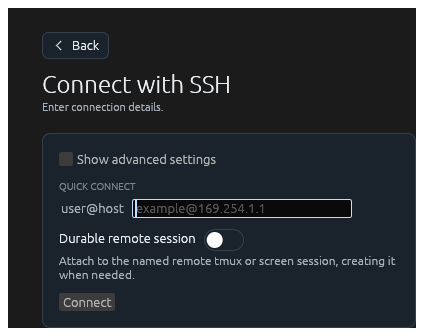

## Settings

Settings is a single scrolling column of cards, each grouping one concern:
Interface, Scrolling, Terminal typography, Quick switch, SFTP and Keyboard
bindings. Every row carries a one-line explanation of what the setting
actually does, on the principle that a preference nobody can predict the
effect of is worse than no preference.

The cards are uniform width and the page owns the only scrollbar. This
matters more than it sounds: an earlier revision nested a scroll area inside
the page, which left the keyboard list showing three of thirty-five rows
inside a page that also scrolled.

### Settings: Interface and Scrolling

The top of Settings: chip layout, session-detail, and workspace-restore toggles, followed by scrollback limit and scroll-speed controls.

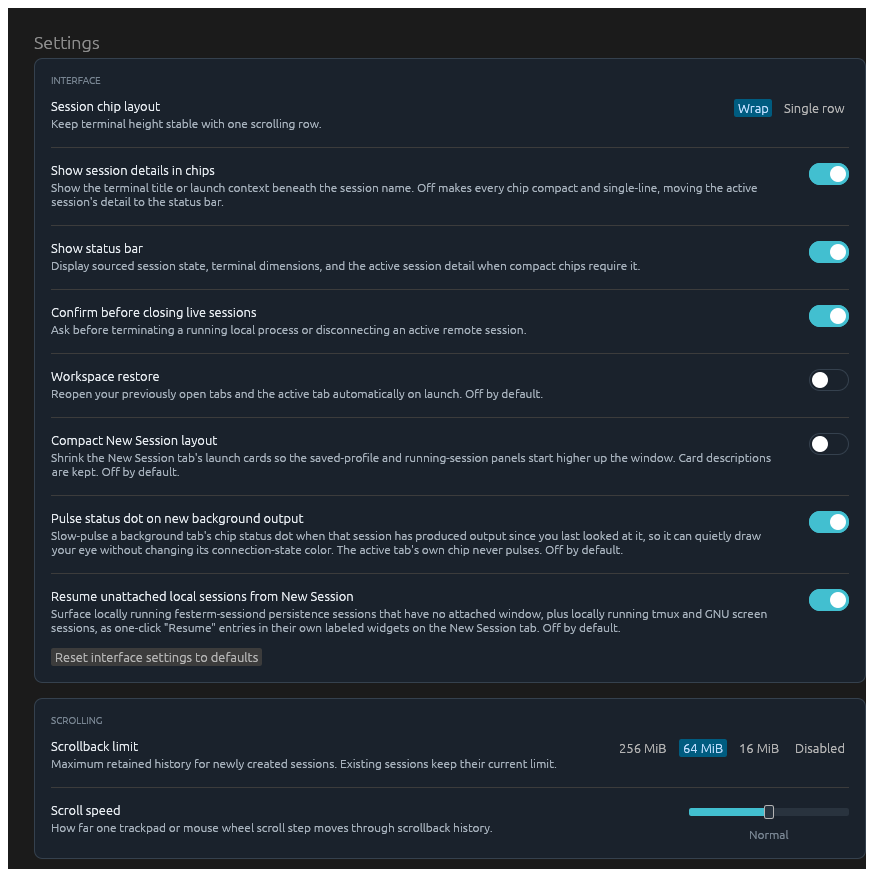

### Settings: Quick switch

The single toggle controlling whether held quick-switch modifiers overlay chip numbers.

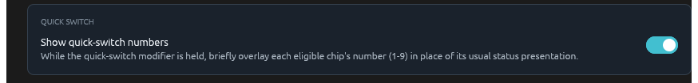

### Settings: SFTP

Pane order and the default local directory used when opening new SFTP tabs.

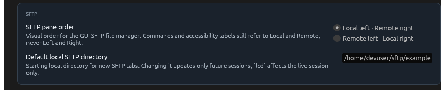

### Settings: Terminal typography

Font family, programming ligatures, and emoji presentation, all scoped to terminal cell rendering only.

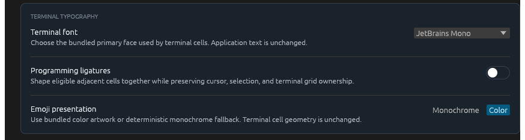

## Keyboard bindings

The keyboard editor is the most information-dense surface in the product and
had the most iteration, so it is worth reviewing closely.

Actions are grouped by the scope they apply in — global, terminal, Markdown,
document — because scope is what determines whether a chord reaches fesTerm
or the terminal underneath. Each action carries a one-line description, and
search matches both the title and that description. The *Show* filter narrows
to a single scope, or to just the customized or just the unbound actions.

Chords render as keycaps in columns anchored on the **right**, so the key
itself always lands in the same column and each chord stays contiguous. The
alternative — one fixed column per modifier — forces every row to reserve
space for modifiers it does not use and splits short chords across a gap. The
reasoning is the same as right-aligning numbers.

Selecting an action expands its editor inline beneath its own row, and
clicking the row again closes it. A binding is assigned by pressing
**Press keys** and then pressing the combination; capture takes the frame's
key events before the shortcut dispatcher sees them, so binding a shortcut
does not also fire it. Recorded modifiers are normalised to the portable
`Primary` spelling, which is Command on macOS and Ctrl elsewhere, so a chord
captured on one platform still validates on another.

Both resets are always present and disabled — with an explanation on hover —
when they would do nothing. This deliberately departs from the house rule
that a reset appears only for a non-default value, because applied literally
that rule answered "is there a way to undo this?" with silence.

### Keyboard bindings editor, collapsed

Actions grouped by scope, each showing its current chord as keycaps; one customized action carries a 'Customized' badge.

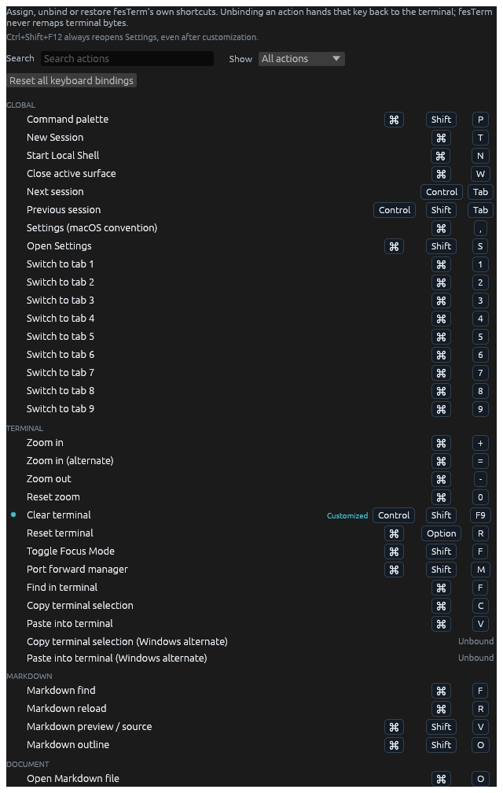

### Keyboard bindings editor filtered by search

Typing into Search narrows the list to matching actions and hides scope groups with no match.

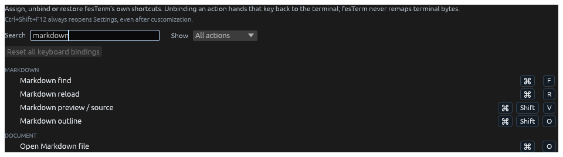

### Keyboard bindings editor capturing a chord

'Press keys' arms live chord capture; the editor waits for a chord instead of dispatching whatever is pressed next.

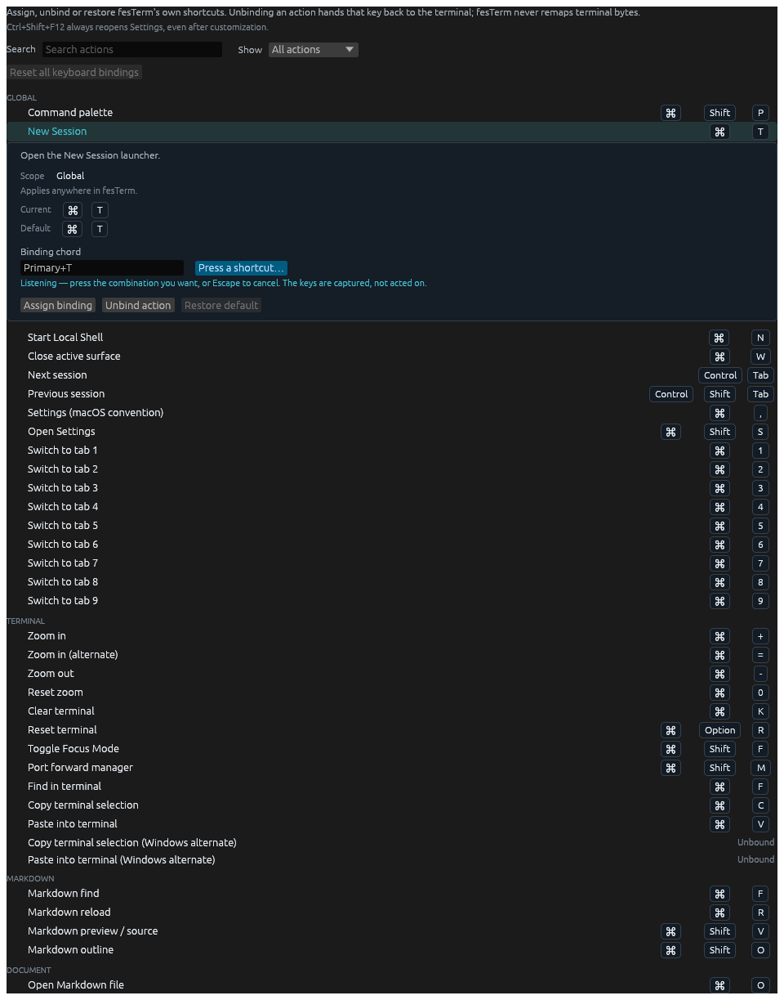

### Keyboard bindings editor with an action selected

Selecting an action expands its inline editor directly under its own row, showing scope, default, and current chord as read-only context.

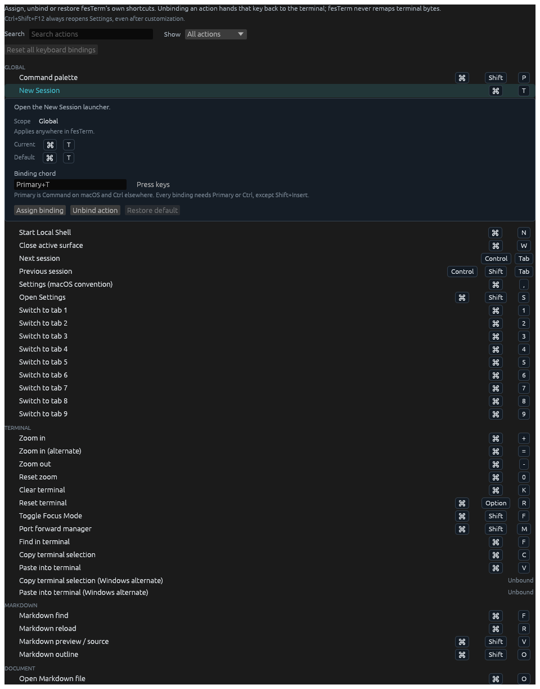

## Profiles

Profiles are the saved form of everything the connection forms can express,
and the editor is per-transport for the same reason the forms are: a serial
adapter and an SSH bastion have almost nothing in common to configure.

The review question here is less about the individual fields than about the
round trip — whether what a user builds in a connection form can be saved
without re-entering it, and whether a saved profile makes clear what it will
do before it is launched.

### Profiles list

Every saved local, SSH, SFTP, and serial profile in one reorderable list.

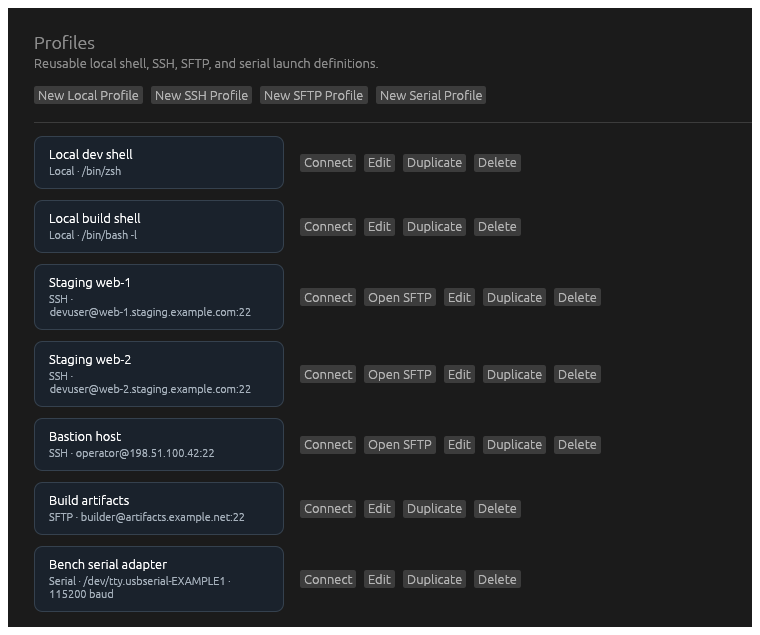

### Serial profile editor

Device path and line settings (baud, data bits, parity, stop bits, flow control) for a saved serial profile.

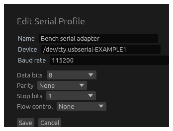

### SFTP profile editor

The same SSH-family editor in SFTP mode, offering the graphical file-manager toggle instead of a terminal type.

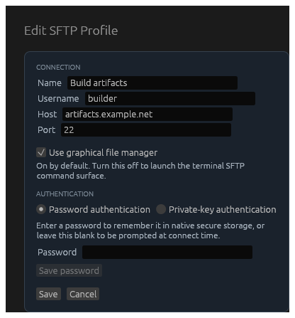

### SSH profile editor

Editing an existing SSH profile's connection metadata and durable- session settings.

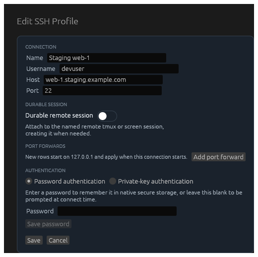
