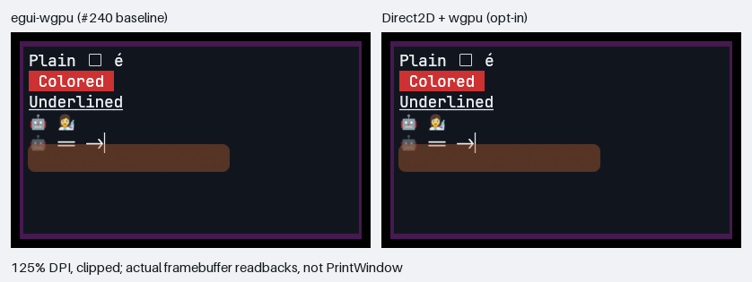

# Direct2D investigation

Investigation for [#241](https://github.com/fes/fesTerm/issues/241).
This directory contains the isolated Windows render-stage experiment and
controlled-output qualification fixtures for the bounded supported-path
application prototype. It is not a complete egui backend.

The broader active-TUI corpus and isolated Windows Terminal comparison are
documented in [`../terminal-performance/README.md`](../terminal-performance/README.md).

## Recommendation

**Go for a bounded Windows terminal-only implementation that defaults on only
for the supported Windows x64 WARP path.** Keep egui-wgpu for window
composition, chrome, other platforms, hardware adapters, unsupported surfaces,
and failure recovery. `FESTERM_EXPERIMENTAL_DIRECT2D=0` remains the ordinary
egui-wgpu baseline, and `1` remains a compatibility request for the same
supported path. A full egui-backend replacement is not justified by this
experiment.

The implementation below adds immutable shared-surface composition and
end-to-end measurements. Native resize, device-loss recovery and hardware
qualification remain open under CP-18 and issue #244.

## Current implementation

The application now includes an experimental root-terminal painter:

```powershell
# Supported default path
Remove-Item Env:FESTERM_EXPERIMENTAL_DIRECT2D -ErrorAction SilentlyContinue
cargo run --release -p festerm
```

It is eligible only on Windows x64, a DX12 CPU adapter, and an 8-bit gamma
framebuffer. It reuses existing egui layout and glyph/emoji pixels, draws into
a fresh native committed resource, releases it to shader-resource state, and
imports it into wgpu as already initialized. The surface covers only visible
primitive bounds, so a short line does not require a full-window bitmap
composition. There is no framebuffer readback/upload in this path.

The renderer now retains one immutable frame with bounded horizontal-region
snapshots. Unchanged frames reuse that image; localized changes redraw damaged
regions and copy them into a fresh frame. Full/large changes keep full native
drawing. Old callbacks' textures are never overwritten. egui-wgpu still owns
window composition, so this is not a partial-present backend. Native frame
counters count updated images; unchanged-image reuse is logged separately.

The SDK implementation in `crates/festerm-windows-direct2d/native/renderer.cpp`
is shared with the replay probe. Rust owns resource publication, budgets, and
the application boundary. An older published surface is never overwritten by
a later paint. Integrated pixel tests exercise the actual callback/composition
path, verify it really ran, and separately verify same-frame ordinary painting
when the native palette budget is exceeded.

The environment variable is not persisted. Unset now selects Direct2D only on
that supported path. `0` explicitly keeps ordinary egui-wgpu. `1` requests the
same supported path but cannot force hardware adapters, unsupported formats, or
unsupported platforms. Invalid or non-Unicode override values warn and retain
ordinary egui-wgpu. Automatic unset mode quietly keeps ordinary egui-wgpu on
unsupported adapters, platforms, or formats; explicit `1` still reports why
selection was ineligible. Unsupported content logs a per-frame refusal
transition, preserves ordinary pixels, and invalidates retained native pixels;
the installed painter resumes when supported content returns. Real native,
device, allocation and submission failures still disable the painter until
restart. HRESULTs alone do not distinguish these cases. Strict native CPU
qualification rejects either refusal or permanent failure rather than
accepting mixed-path measurements. Secondary viewports, translucent/transformed painters,
hardware adapters and unsupported backends/formats retain the current
renderer. This remains **experimental**, under proposed ADR-0039 and CP-18.

## Actual application measurements

**Current policy note (2026-09-26):** On supported Windows x64 WARP hosts, the
candidate path now defaults on when `FESTERM_EXPERIMENTAL_DIRECT2D` is unset.
`FESTERM_EXPERIMENTAL_DIRECT2D=1` remains a compatibility request for the same
bounded path, and `0` is the ordinary egui-wgpu baseline. The measurements
below predate that default-selection amendment and should be read as
`0`-baseline versus `1`-candidate runs on the same supported host, not as
native qualification of hardware adapters, unsupported platforms, or the still
open issue #244 native evidence.

**Historical qualification caveat (#242):** The first tables below predate
explicit application-window selection. `Process.MainWindowHandle` can select
winit's visible event-target tool window instead of the fesTerm UI, so those
observations alone do not prove maximized-window qualification. Their recorded
numbers are retained, not silently replaced. The window-verified follow-up is
reported separately below. Offscreen framebuffer comparisons and isolated replay
measurements do not use this HWND lookup and are unaffected.

The staged release application was measured sequentially with
`FESTERM_EXPERIMENTAL_DIRECT2D=0` (ordinary egui-wgpu baseline) and
`FESTERM_EXPERIMENTAL_DIRECT2D=1` (the historical candidate, equivalent to the
current supported unset/`1` path), on the same 16-logical-processor Windows
x64 WARP host and driver listed below. Each isolated window was maximized and
settled for 15 seconds after maximizing, then sampled for ten seconds. No
concurrent builds ran during measurement. Both modes include #239 and #240.
The final dense repeat recorded matching 3548 x 2150 physical client areas at
192 DPI (200%).

| Controlled foreground workload | Total-machine CPU, env=0 baseline -> Direct2D candidate | GUI frames/s, env=0 baseline -> Direct2D candidate |
|---|---:|---:|
| One changing line, requested 10 Hz | 23.924% -> 23.314% | 13.093 -> 13.379 |
| 79 columns x 24 rows, requested 10 Hz, first run | 57.581% -> 24.531% | 5.797 -> 11.586 |
| Same dense workload, instrumented repeat | 58.186% -> 24.227% | 5.467 -> 10.795 |

The dense candidate passed the unchanged 30% CPU ceiling and five-GUI-frame/s
floor; the ordinary egui-wgpu dense baseline failed the CPU ceiling. The probe
verified a real shell child, logged native frame production, and no native
failure/fallback. The sparse full-application difference is not material.
GUI frame construction is **not** physical presentation rate or latency.
Unlike the replay below, these CPU measurements include terminal parsing,
layout and window composition, but exclude the separate PowerShell producer.

The instrumented repeat built 10.795 native surfaces/s during the sample,
matching its GUI frame count. End-of-sample working set was 269.52 MiB for
the ordinary egui-wgpu baseline and 204.58 MiB for the Direct2D candidate,
while private bytes increased from 424.68 MiB to 476.07 MiB. These are process
snapshots, not peaks or a memory-saving claim; the extra native device/cache
has a cost. Both modes' idle cases passed in this repeat, without resolving
the earlier failures.

Idle results were intermittent in the default-renderer baseline, including
an 86.360% background-tab failure in the dense comparison. Other repeats were
below 0.1%. The Direct2D candidate's idle cases passed, but its terminal hook
does not paint the Launcher. Do not attribute the idle difference to Direct2D.
The unresolved defect and failed samples are tracked separately in
[#242](https://github.com/fes/fesTerm/issues/242).

These single-host observations justify continuing the bounded experiment, not a
general speed guarantee or completion of native qualification.

### Window-verified follow-up

The #242 follow-up used release code at `0a31e88` and the corrected probe on
the same host/driver, with the real `Window Class` HWND verified by PID, owner,
visibility and extended styles. Its client was 3548 x 2150 pixels at 192 DPI
and remained foreground and responsive. The fixed 15-second warmup and
5% idle / 30% output / five-GUI-frame/s budgets were not increased.

| Observation | Result |
|---|---|
| Unchanged #240 (`6b526fb`), 30-second idle samples | Launcher 0.003%, background unread 0.013%; zero GUI frames in both |
| Current main, guarded ten-second samples | Launcher 0.010%, background unread 0.010%; zero GUI frames, no warmup/sample input |
| Current main, sparse output | 23.535% CPU, 13.394 GUI frames/s |
| Current main, dense output, env=0 baseline -> Direct2D candidate | 55.402% -> 23.720% CPU; 5.557 -> 11.790 GUI frames/s |
| Direct2D-enabled background-idle failure | **10.638% CPU**, zero new GUI frames, no input during sampling |

The dense native sample produced 11.790 native surfaces/s and passed its
output budget; the env=0 ordinary baseline failed the CPU ceiling.
End-of-sample working set was 273.14 -> 250.64 MiB and private bytes
426.81 -> 519.41 MiB. These are snapshots, not memory-saving or peak claims.

The native-enabled **run as a whole failed** because of the background-idle
case. The captured post-sample stacks were already waiting, not hot, and the
cause remains open in #242. That intermediate run recorded input during
sampling but not during warmup; the final guard now records both. Do not
retroactively assume either input contamination or a startup GPU backlog.
Three subsequent early-capture attempts stayed quiet and are not a fix.

A later pre-publication run measured Launcher 0.010% and background unread
0.029%, both input-free with zero GUI frames. Its sparse-output case detected
input during warmup and was correctly marked `invalid-input`: the whole run
failed qualification. Its 24.508% / 12.388-GUI-frame/s observation is retained
but is not counted as a passing controlled measurement.

The final probe records one-second CPU/GUI-frame intervals, rejects
input-contaminated runs, and optionally invokes an explicitly supplied CDB
via `-DebuggerPath` after a failed budget, before terminating the isolated
process. A deliberately injected warmup-input negative check correctly failed
the run with `invalid-input`. The shared window selector has a deterministic
native Win32 regression in Windows CI. These changes correct the evidence
harness, not the production rendering policy.

The subsequent [WARP rasterization follow-up](../windows-warp/README.md)
captured hot pixel-shader work and reduced the cost of the two large Launcher
panel fills with a separate textureless pipeline. It does not enable Direct2D
or replace #239/#240. Its new evidence is kept separate from the historical
samples above.

## Review of the earlier CPU fixes

**Keep #239 and #240; neither is superseded.** #239 bounds discovery-driven
repaints and unread-indicator motion independently of terminal painting. Those
repaints still cost CPU with either renderer and on Launcher-only screens.
#240's ordinary background callback runs before the new capture scope and
clears the full terminal rectangle, including pixels outside the cropped
Direct2D surface and content erased since the previous frame. It also remains
the default and fallback path, including eligible secondary windows.

No earlier scheduling, background pipeline, adapter policy, regression tests,
or CP-16/CP-17 evidence is removed. The new hook composes with those changes
rather than replacing them.

## Controlled comparison

The Rust probe renders the real `TerminalView`, including the CPU-adapter
background optimization from #240. It exports the same tessellated geometry,
clip rectangles, colors, and actual egui-managed texture pixels to the SDK
Direct2D probe. Both clear and redraw the complete target. Neither uses retained
pixels, damage tracking, scroll-copy optimization, a replacement font, or
DirectWrite shaping.

Each renderer alternates two prepared frames at a requested 10 Hz. Frames are
completed sequentially; slow rendering lowers the achieved rate rather than
discarding a requested frame. Measurements include command recording/submission
and a GPU-completion wait. They exclude terminal parsing, layout/tessellation,
scene conversion, font/texture preparation, capture, and presentation.
The production wgpu buffer-update path still runs for each replay frame;
Direct2D retains its converted drawing commands. This is a render-stage
comparison, not an API-only comparison or a whole-application benchmark.

The initial optimized run used Windows x64, 16 logical processors, Microsoft
Basic Render Driver/WARP `10.0.26100.9278`, a 1920 x 1080 physical-pixel BGRA8
UNORM target, 100% scale, bundled JetBrains Mono at the view's default 14-point
size, and a 226 x 59 grid. Rust used the release profile; C++ used `/O2 /MD`.
Each scenario ran for at least ten seconds after warm-up. The shipping baseline
was upstream `6b526fb7e76d903959c92cdac6d45ae6fcd708ec`, including #240.
These are historical feasibility numbers from before the native implementation
was shared with the application and its factory became multithread-capable;
they are not measurements of the final composed implementation.

| Workload | wgpu mean completion ms | Direct2D mean completion ms | CPU ms/frame, wgpu -> D2D | Completed Hz, wgpu -> D2D |
|---|---:|---:|---:|---:|
| Sparse changing line | 1.89 | 0.82 | 6.72 -> 2.03 | 9.97 -> 9.97 |
| Dense ASCII | 407.40 | 92.09 | 970.63 -> 277.97 | 2.45 -> 9.96 |
| Scrolled dense viewport | 402.24 | 89.77 | 999.38 -> 263.91 | 2.49 -> 9.96 |
| Explicit colored backgrounds | 1555.60 | 469.01 | 3069.20 -> 1068.18 | 0.64 -> 2.13 |

CPU time sums all threads in the renderer process. CPU percentage divides that
time by wall time and all 16 logical processors. **Lower CPU per completed
frame does not necessarily mean lower process CPU percentage:** dense output
rose from 14.89% to 17.31% while completing roughly four times as many frames.
Neither renderer sustained 10 Hz for the colored-background workload.

The harnesses record working set and private bytes, but their absolute process
footprints are not directly comparable: the C++ replay process does not host
Rust, terminal state, egui, or the application. A composed implementation adds
resources to the existing application; these measurements do not establish an
application memory reduction.

These are single-host observations. The VM exposes no accelerated GPU.
Hardware-GPU benchmarks and physical presentation/input-to-display latency
remain unmeasured.

## Visual evidence and implementation lessons



This side-by-side image comes from the integrated composition test at 125%
scale with clipping enabled. It is documentation evidence, not a golden-test
baseline; the test regenerates and compares both actual framebuffers.

Fifteen framebuffer pairs cover five scenes at 100%, 125%, and 200% scale.
Every pixel is compared, including alpha; a single pixel exceeding two levels
in any 8-bit channel fails. Current pairs have maximum channel differences of
one for the sparse, dense, scrolling, and colored scenes, and two for the
Unicode/ligature/emoji/cursor/underline/rounded-alpha-overlay/clipping scene.
Capture reads the actual render targets, not `PrintWindow`.

The source harness asserts non-background fixture output. Comparator tests
ensure that a missing foreground pixel cannot disappear inside a large
background percentage. The wide-CJK example currently displays the same
missing-glyph box in the baseline; this is **not** evidence of CJK font
coverage.

Two initially incorrect approaches were corrected:

- Direct2D's native linear-gradient brush filtered a one-pixel alpha ramp:
  an endpoint expected to be 255 read back as 223. That changed egui's
  feathered backgrounds and decorations. A shared A8 bitmap ramp, a shared
  unit-triangle geometry, and bounded clamped color brushes preserve the
  interpolated vertex alpha without that filtering. Sharing also avoids the
  excessive memory of per-triangle gradient resources.
- Fractional-DPI conversion produced nominally integral glyph coordinates
  such as `1314.000122`. That caused Direct2D to resample nominally 1:1
  bitmaps. Normalizing geometry to Direct3D's 8-bit subpixel raster grid
  fixed the 125% differences while preserving fractional cell boundaries.

The shared implementation rejects unsupported nonrectangular textured meshes, independently
colored triangle vertices, tinted color bitmaps, and more than 256 feathered
colors. It is not a general egui renderer. The application validates the frame
before replacing ordinary painting and retains an explicit, observable fallback.

## Integration assessment

eframe 0.36.1 exposes wgpu and glow, not a Direct2D renderer. A complete backend
would need arbitrary egui meshes, textures, blending, clipping, native
callbacks, windows, and platform integration. The probe's terminal subset is
not sufficient to replace it.

A terminal-only surface can reuse existing egui shaping, fonts, glyph atlases,
and input handling. This avoids introducing a second text-layout stack and
preserves terminal protocol ownership. Native child windows are unattractive
because of overlay ordering, input routing, transparency, and capture.

[D3D11-on-12](https://learn.microsoft.com/en-us/windows/win32/direct3d12/d2d-using-d3d11on12)
provides the supported Direct2D/Direct3D 12 interoperability route.
wgpu 30 exposes native device/resource access and
`CommandEncoder::transition_resources` for native interoperability. Native
access is unsafe and requires explicit resource-state, queue-ordering, and
lifetime discipline; it is not permission to mutate wgpu resources arbitrarily.

An egui-wgpu `paint` callback runs inside an active render pass, so it cannot
simply invoke Direct2D in that pass. Render into an owned shared surface
beforehand, release/flush the D3D11 wrapped resource, import its initialized
shader-resource state, and compose at the original terminal paint position.
The implementation must include composition costs and must not perform a
per-frame CPU readback/upload.

The current selection policy is default-on only for Windows x64, DX12 CPU
adapters, and supported 8-bit gamma surfaces when
`FESTERM_EXPERIMENTAL_DIRECT2D` is unset or `1`; `0` explicitly keeps the
ordinary egui-wgpu path. Keep the ordinary path for hardware GPUs, other
platforms/backends/formats, unsupported primitives, and failed initialization
or rendering. Do not change clear colors, terminal semantics, frame
scheduling, output consumption, or queue bounds.

[Windows Terminal's selection](https://github.com/microsoft/terminal/blob/fda72a070905570cd44e022658c7b9d1ee89322a/src/renderer/atlas/AtlasEngine.r.cpp#L171-L298)
uses Direct2D automatically for WARP and certain limited hardware capabilities,
and its custom D3D11 backend otherwise. Its source cites better testing for
WARP, not guaranteed speed. Direct2D's internal batching versus egui's
per-cell clipping/draws is part of this experiment; a specialized wgpu terminal
batcher remains an unmeasured alternative.

## Reproduce

Prerequisites: Windows x64 with WARP, Visual Studio C++ tools/Windows SDK,
the repository's Rust toolchain, and Python with the isolated probe requirements:

```powershell
python -m pip install -r validation\direct2d\requirements.txt
$env:FESTERM_RUN_OPTIONAL_VALIDATION = '1'
.\validation\direct2d\run.ps1 -ResultDirectory C:\temp\festerm-d2d
```

Use a quiet host; do not run builds or other benchmarks during measurement.
The runner builds both optimized probes before measuring them sequentially.
It uses an explicit process wait because the release Rust test binary inherits
the application's Windows GUI subsystem.

For framebuffer-only qualification:

```powershell
.\validation\direct2d\run.ps1 -ResultDirectory C:\temp\festerm-d2d-125 -PixelsPerPoint 1.25 -CaptureOnly
```

`-SelfTestOnly` builds the C++ probe and device-free quad allocation tests and
runs native structural checks and Python comparator checks without GPU
measurement. `-QuadSelfTestOnly` builds/runs only the device-free quad tests,
without creating a graphics device, timing work or requiring Python packages.
`-Python` selects an
existing Python/virtual-environment executable. The runner does not install
dependencies or change system settings.

For the actual application comparison, first build/stage the release executable
with `scripts\stage-conpty.ps1 -Configuration Release`, then run each mode
sequentially on a quiet desktop:

```powershell
$env:FESTERM_RUN_OPTIONAL_VALIDATION = '1'
$env:FESTERM_EXPERIMENTAL_DIRECT2D = '0'
.\scripts\check-windows-idle-rendering.ps1 -Executable target\release\festerm.exe `
  -IncludeSustainedOutput -DenseOutput -RequireSoftwareRenderer `
  -ResultPath target\direct2d-app-default.json
Remove-Item Env:FESTERM_EXPERIMENTAL_DIRECT2D -ErrorAction SilentlyContinue
.\scripts\check-windows-idle-rendering.ps1 -Executable target\release\festerm.exe `
  -IncludeSustainedOutput -DenseOutput -RequireSoftwareRenderer -RequireDirect2D `
  -ResultPath target\direct2d-app-native.json
```

Preserve failing baseline results; do not relax budgets or retry until green.
Omit `-DenseOutput` for the existing sparse-line fixture. `-RequireDirect2D`
requires native frame production during the measurement interval and rejects
native initialization/render failures, so a Launcher or silently fallen-back
run cannot stand in for a native terminal measurement. On a known eligible
Windows x64 WARP host, use `-RequireDirect2D` with the variable unset to
validate the automatic/default selection path; explicit `1` remains the
retained compatibility request and should be equivalent on that same host,
while `0` or invalid values are rejected. Results also record end-of-sample
process working set and private bytes, not peak memory. The aggregate optional
Windows runner keeps this dense/native-required application check explicitly
gated behind `FESTERM_EXPERIMENTAL_DIRECT2D=1`, so unsupported hardware or
ARM64 machines still run their ordinary optional suite. Set
`FESTERM_RUN_DIRECT2D_PROBE=1` as well to include the isolated replay.

Windows CI also runs the deterministic Python test
`test_default_and_explicit_selection_reach_executable_validation`, which
exercises the probe's executable validation path without opening a GUI. That
guard now accepts the supported unset default as well as explicit `1`, and
rejects `0` or invalid overrides.

Remaining evidence: broader composed application workloads; hardware GPU routing
and performance; native resize/device-loss recovery; selection/input workflows;
mixed-DPI monitor transitions; multiple and transparent windows; actual
presentation latency; memory characterization; and representative hardware
qualification under issue #244. Passing this replay experiment does not mark
those acceptance criteria complete.

## Native quad scratch allocation control

The production `prepare_group` path recognizes adjacent triangles as a native
glyph/solid/bitmap quad through `quad`. Its former shared-corner vector allocated
twice per accepted quad (capacities one then two vertices on the tested MSVC
toolchain), even on warm unchanged frames: the retained renderer prepares before
testing previous-image reuse. Fixed storage now borrows at most **two corner
pointers** plus a count: 24 bytes of logical stack scratch on Windows x64, zero
heap allocations and zero retained bytes. It neither batches native draws nor caches geometry.
All other frame/texture/scratch budgets and preparation/draw counts are unchanged.

`native/quad_tests.cpp` includes the actual production implementation and a
frozen pre-change predicate. Its scoped allocation counter is linked only into
this unit-test executable, never the application or timed replay probe.
It compares complete prepared `Draw` operations and refusal types, including
32 cold/warm/mutation cases at four scales, all 4,096 corner topologies, seven
malformed mappings, and the real boundary's capability/native/allocation
failure classification. The dense three-frame 120x40 fixture constructs all
14,400 glyph operations in both versions: **28,800 -> 0** scratch allocations,
**864,000 -> 0** cumulative allocated bytes (not retained/peak process memory).
Solid quads, mask alpha, color bitmaps and recovery after tinted-bitmap refusal
retain exact geometry, UVs, colors/alpha, transforms and resource references.
Texture content/epoch handling, clipping, native damage/culling, immutable
published images, teardown and ordinary fallback code are untouched.

For the smallest deterministic check (also included in Windows CI's existing
`-SelfTestOnly` gate):

```powershell
$env:FESTERM_RUN_OPTIONAL_VALIDATION = '1'
.\validation\direct2d\run.ps1 -ResultDirectory target\quad-scratch-unit -QuadSelfTestOnly
```

This builds only an unoptimized C++ unit test with the installed SDK. It does
not initialize Direct2D/WARP or run a performance probe. Allocation counts and
identical prepared operations are the current evidence; no whole-app/native
CPU, process-memory or latency gain is claimed, and #297 is not attributed.

### Coordinator-only measurement protocol

After baseline (`b6e69f76`) and candidate binaries are built in an assigned slot,
use the existing residual-CPU probe with only
`FESTERM_TUI_PROFILE_CASES=localized-all`, `FESTERM_TUI_PROFILE_SCENE=terminal`,
`FESTERM_RUN_OPTIONAL_VALIDATION=1`, and a fresh
`FESTERM_TUI_PROFILE_OUT=target\quad-scratch-profile-<source>-<repeat>` for each
attempt:

```powershell
cargo test --release -p festerm profile_terminal_residual_cpu -- --ignored --nocapture --test-threads=1
```

Do not start a concurrent build during measurement. Keep host-copy and test
copy experiments off. Run baseline/candidate in ABBA order on the same WARP
host with unchanged synthetic grid, font, physical size and requested 10 Hz /
100 updates. This case includes UI construction, atlas capture, the native
`prepare`/quad stage and completed drawing/composition; the old standalone
replay pre-prepares geometry and cannot measure this allocation fix. Record
source/binary identities, all attempts, completed updates/cadence,
CPU-ms/frame and shared-host variability without promising a percentage.
Before interpreting timings, run the existing
`shared_surfaces_preserve_pixels_and_previous_frame_ownership`,
`texture_identity_and_equal_replacement_preserve_uploads_and_pixels`,
`narrow_retained_updates_match_full_pixels_with_overlap_erasure_and_dpi` and
`scattered_retained_damage_prepares_full_geometry_only_once` renderer tests
as the native pixel/lifetime/mutation/damage oracle. None was run in this
device-free allocation investigation; the coordinator owns native slots.
Native-window presentation, sustained resources, physical latency and #297
degraded-process attribution remain CP-18 work.

## Native font atlas snapshot control

Issue #298 and [ADR 0043](../../docs/adr/0043-immutable-native-font-atlas-snapshots.md)
cover immutable font snapshot reuse. The accepted decision covers source
ownership and pinned vendoring only, not native performance/resource/latency
qualification. The source/provenance patch is documented in
`vendor/epaint/FESTERM-PATCH.md`; its independently excluded tests and formatting
are explicit CI gates. The recorded offscreen receipt remains pinned to its
historical source/binary; cleaning PR history does not turn it into evidence
for a new candidate build.

With `FESTERM_RUN_OPTIONAL_VALIDATION=1`, set
`FESTERM_FONT_ATLAS_PROFILE_OUT` to a **new** directory and run:

```powershell
cargo test --release -p festerm profile_native_font_atlas_capture -- --ignored --nocapture --test-threads=1
```

The aggregate `scripts/run-optional-validation.ps1` includes this check when
`FESTERM_RUN_FONT_ATLAS_PROFILE=1`. Build before measuring and use a quiet host.
The controlled fixture uses small and at-least-8-MiB grown atlases, cached and
cache-disabled capture, two reversed-order repetitions, and 200 completed
updates per case at 20 Hz. It requires stable atlas bytes, the exact requested
native capture count, zero steady-state texture uploads, no missed deadlines,
and equal final pixels within the existing renderer tolerance. All attempts
remain in distinct directories; an invalid sample is written before rejection.
The 256 x 128 target and 30 x 6 grid contain all three synthetic output lines.
This bounds unrelated WARP composition cost without lowering cadence or dropping
updates; it does not represent full-size native-window performance.

`results.json` separates atlas capture milliseconds/bytes from whole-process
CPU per completed frame. `FESTERM_DIRECT2D_TIMINGS` now also records
`font_atlas_capture_ms`, `font_atlas_bytes`, `font_atlas_cloned_bytes` and
`font_atlas_reused`; existing callback `total_ms` still excludes capture.
Ordinary captures retain no more than one 64-MiB image; oversized images use
uncached temporary capture and the same existing renderer capability checks.

This is a **cache-disabled mechanism control in the candidate pipeline**, not
a historical shipping-binary A/B, native application-window measurement,
presentation/input latency, sustained memory acceptance or #297 attribution.
The supported adapter/default policy and experimental host-copy default are
unchanged. CP-18 and broader #244/#282 gates remain open.

The [2026-10-03 control receipt](font-atlas-cache-control-2026-10-03.json)
binds the clean measured source and optimized binary. All eight copy/upload,
pixel and cadence checks passed: each 200-frame disabled control copied
200 MiB with the 1-MiB atlas or 1,600 MiB with the 8-MiB atlas; cached controls
copied zero bytes after warm-up. **Process-CPU improvement is not qualified**:
44 of 82 monitored intervals exceeded the unchanged 5% external CPU guard.
Raw timing/capture/monitor attempts are retained in development evidence;
no rejected attempt is pooled into a CPU claim. Earlier idle, missed-deadline
and fixture-lifecycle failures are preserved separately. Repeat the frozen
control on an exclusively quiet host before making a CPU improvement claim.
