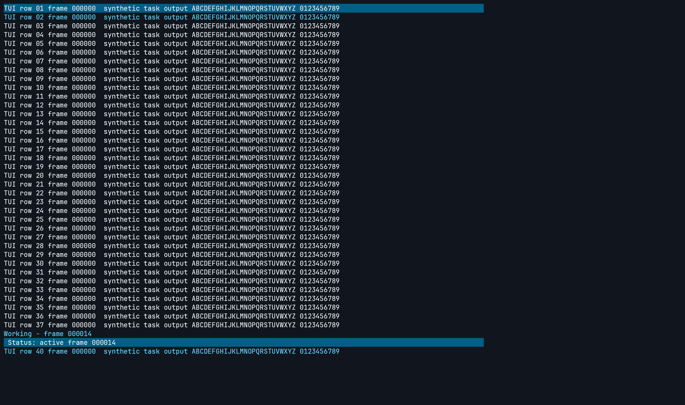

# Terminal TUI performance

This validation separates a genuinely quiet populated terminal from an active
TUI. A working Copilot session with status updates is not an idle workload.
It does not change production rendering or impose a frame-rate cap.

## Editor, Markdown and SFTP UI construction

The cross-platform `profile_interactive_surfaces` probe isolates non-terminal
UI construction from tessellation. Run it in release mode with a fresh,
absolute output directory:

```powershell
$env:FESTERM_RUN_OPTIONAL_VALIDATION = '1'
$env:FESTERM_SURFACE_PROFILE_OUT = 'C:\evidence\interactive-surfaces'
cargo test --release -p festerm profile_interactive_surfaces -- --ignored --nocapture --test-threads=1
```

Set `FESTERM_RUN_SURFACE_PROFILE=1` as well to include it in either aggregate
optional-validation runner. It renders production widgets from synthetic local
documents and directory snapshots, without an SSH connection or user
configuration. Each scene has eight warmup frames and 40 measured, forced
unchanged frames at 1180x760 points and one pixel per point. `profile.json`
records UI/tessellation median and p95 wall times separately, fixture sizes,
and final shape/vertex counts. It also retains every warmup UI/tessellation
time and `preparation_ms` for instrumented scenes (`null` when not measured).
Preparation excludes writing synthetic input files; egui context setup is
outside both preparation and frame timings. The editor and SFTP controls run
before Markdown, with separate full-model fenced loading and warm Rust
syntax-constructor diagnostics after the UI scenes. It uses default egui fonts and the production
dark theme, not the native application's bundled-font installation. It
measures neither GPU completion nor native
idle CPU, input latency, presentation, file transfer throughput or accessibility.
There is no timing threshold in ordinary CI.

The v0.7.1 follow-up used the same Windows x64, 16-logical-processor EPYC host.
An original/candidate/candidate/original sequence, with each process explicitly
waited for and no overlapping benchmark/build, produced these ranges of the
two per-build **UI construction medians**, in milliseconds per frame:

| Scene | Original | Candidate |
| --- | ---: | ---: |
| Editor, 2,000 Rust lines | 0.88-2.60 | 0.32-0.36 |
| Editor, Find capped at 2,000 matches | 7.32-12.77 | 0.89-0.91 |
| Markdown Preview, 400 sections | 13.32-13.92 | 13.50-14.84 |
| Markdown Source, 4,800 lines | 9.36-9.46 | 5.26-5.68 |
| SFTP, 100 entries per pane | 2.78-2.80 | 0.72-0.73 |
| SFTP, 5,000 entries per pane | 166.31-166.77 | 0.76-0.88 |

Original test executable SHA256:
`06C71C54F4396AFF3396BB25CFCE05920A64E3DAD9F2ADCF6C8DA1A2ED240521`;
candidate:
`E65340C35EB591FDCD93960463281B06E4D8A671EFEBA5EE978C4585C0F29B8E`.
The original is v0.7.1 plus this test-only probe and its module registration,
not an older product version. To reproduce a baseline, add only those two
test-harness changes to the tag. Keep the same probe and release settings
on both sides; warm caches and host scheduling visibly affect these results.

SFTP now shares an immutable cached listing rather than cloning all names and
paths every frame. Only the fixed-height rows around the viewport are built;
Open File and Save As use the same approach. Selection, sorting, filtering,
activation and transfers still use the entire listing. The large scene emits
680 shapes instead of 100,300; final vertex counts are unchanged in all six
scenes. The editor avoids offscreen gutter galleys and repeated scans of ordered
syntax/Find spans. Markdown Source locates each line's spans by index, and its
snapshot-owned syntax cache also fixes UTF-8 boundary panics and stale colors
after same-length middle-of-document replacements.

Regression coverage includes last-row scrolling and activation in both
pickers, whole-list selection/filtering, shared-cache invalidation, wrapped
line numbering, UTF-8 syntax/Find equivalence, successful reload invalidation
and failed reload retention. The existing production-UI gallery is captured
to separate directories with `FESTERM_UI_GALLERY_OUT`, never over the committed
gallery. Of 46 original/candidate PNGs, 43 are byte-identical; the remaining
three differ only in generated temporary-directory PID digits, verified by
pixel difference bounds and inspection. These checks are not native usability
or latency qualification.

**Remaining work:** the unchanged Preview scene shows no improvement. Its
variable-height blocks, selectable text, tables and resource-dependent layout
still need a separate investigation; fixed-row virtualization is not valid
there. These non-terminal results do not close the Windows Terminal gap.
A fresh valid localized native pair on v0.7.1 measured about 8.69% system CPU
for fesTerm and 0.49% for Windows Terminal at the same 10 Hz producer cadence.
Quiet and streaming comparison attempts were rejected when the last-input
tick changed, without foreground or geometry changes. Those failures remain
excluded rather than weakening the measurement guards.

### Reusing compiled queries during document preparation

`DocumentSyntax::prepare` previously compiled the same immutable bundled
tree-sitter query for every document and every Markdown fence. A 400-section
fixture therefore compiled the Rust query 400 times per Markdown load. The
editor's Preview parses lazily in its first UI call; the legacy viewer parses
while its tab is constructed. Recording only steady-state frames hid both
stalls.

The engine now uses eleven named per-language `OnceLock` results. Only
immutable compiled queries (or their compile errors) survive for the process
lifetime. Parsers, trees, source text, revisions and spans remain independent;
query execution still owns its cursor. The 1 MiB / 20,000-line bounds and
40ms parse budget are unchanged. A failed compiled query still gives each
affected document `ParseFailed`. First use of each language still compiles
its query, and used queries remain allocated after the last document closes.

The independent source baseline is merged #275,
`207d806f82cf5edd44c048d90778148ace7ea7cd`, plus only the final instrumented
probe. Candidate and baseline use the same probe, release settings and scene
order; neither includes the separately proposed Markdown Find/table changes.
On the same Windows x64, 16-logical-processor EPYC host, with no overlapping
build/probe, a completed baseline/candidate/candidate/baseline sequence
recorded these ranges over **two processes per build**:

| Measurement | Baseline ms | Candidate ms |
| --- | ---: | ---: |
| First Preview UI call, 400 Rust fences | 9,575.37-9,638.84 | 74.85-76.96 |
| Viewer preparation before Source UI | 9,451.10-9,674.31 | 13.12-17.06 |
| Warm Rust syntax construction, median of 40 | 23.31-23.92 | 0.0005-0.0007 |

Mean first-Preview construction fell from 9,607.10 to 75.90ms (99.2% lower);
mean viewer preparation fell from 9,562.71 to 15.09ms (99.8% lower).
Preparation and the first UI call are **one observation per process**, not
40-frame medians. The constructor diagnostic follows the widget scenes and
eight warmups, and excludes source parsing. Its candidate values are near
timer overhead, not a precise throughput or speedup estimate.

**Scope:** the Rust editor initializes Rust before Markdown. This is not a
cold-process, first-ever-language or native open-latency measurement. First
editor preparation still costs 40.22-43.80ms versus 36.27-36.29ms here; the
earlier series below overlapped at 37.0-42.5ms versus 37.3-46.9ms.
No steady-state improvement is claimed. The completed final sequence's
forced UI-construction medians include adverse/variable controls:

| Scene | Baseline ms/frame | Candidate ms/frame |
| --- | ---: | ---: |
| Editor, 2,000 Rust lines | 0.311-0.351 | 0.316-0.439 |
| Editor Find, 2,000 capped matches | 0.875-1.049 | 0.848-0.910 |
| SFTP, 100 entries per pane | 0.764-0.816 | 0.740-0.744 |
| SFTP, 5,000 entries per pane | 0.723-0.731 | 0.684-0.694 |
| Markdown Preview, 400 sections | 13.379-14.434 | 13.461-13.608 |
| Markdown Source, 4,800 lines | 4.913-5.087 | 4.918-5.333 |

The first Source UI call itself was also slower: 72.99-76.03ms versus
81.29-81.37ms; it is separate from the large preparation saving.
All six scenes retained fixture-item, final shape and vertex counts.
The subsequent reversed-order sequence **aborted in its first candidate
process**: the editor fixture reported `ParseFailed`, triggering the explicit
highlighted-status guard. It produced no complete profile and was not retried
or pooled. The guard remains fatal; no parse-budget increase or successful
plain-text fallback is used to improve the measurements. The failure's cause
was not separately timed, so scheduling is not asserted as its explanation.

An earlier complete ABBA/BAAB series used the old order, with Markdown before
SFTP, and is retained separately rather than pooled. Its four processes per
build measured first Preview at 9,505.96-10,729.00ms versus 71.29-75.79ms and
viewer preparation at 9,384.41-10,315.89ms versus 12.71-13.02ms. It also had an
adverse SFTP-100 candidate median of 1.070ms (baseline range 0.678-0.730ms).
Moving the controls earlier is not proof of a cause for that variability.

Final ordered baseline executable SHA256:
`61E182FF8C8938B21C0B315CAEADCBDE7A627A097080406E34B356326E5A0493`;
candidate:
`2A2098F202AF4B874F2C59A150693E5F000503D563F3BDC62419331A67DA438D`.
Earlier-series baseline/candidate SHA256:
`5895DD7DA46893C550275B0E42770F1F31247994E2535DD21CBFFC78EAD126BF` /
`2201B0A74428C7BDAEA6950F2A8EAB581EB5D563871AED4B1B1C0FDC481F86D2`.
Evidence under `target/perf-campaign` includes `syntax-setup-ordered-abba-*`,
the aborted `syntax-setup-ordered-baab-01-candidate` logs,
`syntax-setup-ordered-summary.json`, the earlier `syntax-setup-{abba,baab}-*`
and `syntax-setup-summary.json`. Reports retain all warmup timings, not just
the first call.

Deterministic regressions compare spans with independently compiled queries
for every language and clipped Unicode ranges, check query identity across
documents/threads, and keep document revisions, size failures and fenced-block
state independent. Final executable galleries are retained under
`syntax-setup-ordered-gallery-*`: 43 of 46 PNGs are byte- and pixel-identical.
The remaining three differ only in generated PID digits (33176 to 19988) and
the Save As fixture's modification minute (11:50 to 11:51), verified using
RGB difference bounds and inspected crops; alpha is identical throughout.
These checks do not qualify native latency, cold-language startup,
representative-hardware smoothness, GPU performance or Windows Terminal parity.

### Projecting large fenced blocks without repeated full-span scans

After query sharing, `highlight_code` still scanned every syntax span for
every code line. The line projection now advances past completed spans and
stops at the end of the current line, retaining captures that cross newlines.
The resulting owned pieces, roles, plain gaps and original source are
unchanged. No parsing, cancellation or size/time bound changes.

The same optional probe adds `fenced_loading` diagnostics for single JSON
fences with 200, 2,000 and 4,000 entries. Each full `MarkdownLoader::load` starts
from already-built synthetic in-memory bytes; source construction, disk,
result destruction, correctness assertions and UI work are outside the
recorded interval. Each case has eight recorded warmups and 40 measured
loads. Every entry must retain both string and number roles; fallback aborts
the process, not just the sample. Reports include source bytes, code lines
and per-line piece counts (including plain gaps).

This experiment's baseline is `98c1085a04b687a4809a4a42e335c45b8d68de6f`
(query sharing already enabled) plus the matching expanded probe. On the same
Windows x64 EPYC host, with no overlapping build or measurement, **all eight**
ABBA/BAAB processes completed with identical source/line/piece counts and
unchanged UI fixture/shape/vertex counts. Ranges below are over four per-build
medians, each from 40 full loads:

| JSON entries | Baseline median ms | Candidate median ms | Reduction in mean medians |
| --- | ---: | ---: | ---: |
| 200 | 1.063-1.145 | 0.999-1.018 | 7.8% |
| 2,000 | 16.588-17.406 | 10.696-11.423 | 35.3% |
| 4,000 | 45.296-47.174 | 23.392-24.470 | 48.7% |

All three improve in both orders. The 4,000-entry means are
46.387 to 23.778ms; p95 ranges are 52.619-63.234 versus 27.229-29.541ms.
This is full model loading, not an isolated mapping-loop speedup. It is not
native open latency, a 60fps guarantee, or a cold-language benchmark.
Unchanged forced UI-construction controls remain variable:

| Scene | Baseline median ms/frame | Candidate median ms/frame |
| --- | ---: | ---: |
| Editor syntax | 0.317-0.333 | 0.324-0.341 |
| Editor Find | 0.851-1.032 | 0.833-0.959 |
| SFTP, 100 entries per pane | 0.749-0.876 | 0.719-0.757 |
| SFTP, 5,000 entries per pane | 0.712-0.765 | 0.695-0.945 |
| Mixed Markdown Preview | 13.818-14.497 | 12.764-14.445 |
| Markdown Source | 4.542-5.254 | 4.780-5.545 |

No steady-state improvement or absence of regression is inferred from these
controls. In particular, the large SFTP and Source candidate means are higher.

**Retained stress evidence:** an earlier 8,000-entry ABBA completed at
114.97-115.43ms versus 50.31-51.85ms, but the first reverse-order candidate
aborted when an entry lost highlighting. It was not retried or pooled with
the final 4,000-entry series. A separate diagnostic called
`DocumentSyntax::spans` directly, without Markdown or either line mapper:
of 128 fresh 8,000-entry attempts, two returned `ParseFailed` and zero spans
after 40.95/40.20ms; all 128 2,000-entry attempts stayed highlighted. Thus
parse-budget fallback was independently reproduced without the sweep, not
silently counted as an improvement. This does not establish the cause of the
original failed iteration or eliminate the larger case's limitation.
The final probe uses 4,000 entries with the same mandatory highlight guard;
the production 40ms budget and accepted size bounds are unchanged.

Final baseline executable SHA256:
`981F14844E0BEE2C6DB7C7C921B87D7285B1E094547BF8E0E6F29290E86EEB5A`;
candidate:
`999691D55A1CAB988EA88C75E781CEED6C209BCA1235080C42F3C473A9A5A2A0`.
Earlier 8,000-entry baseline/candidate SHA256:
`66EDF96967BBC6DD94901A6B0AE5F660A6515515F59B103AEDBC62A93D3F762A` /
`02D3D5FB439F3DF9F86B0F94B2DF409C1BEF93CA04A2AF45EB24643894633E86`.
Evidence is retained under `target/perf-campaign/fence-span-bounded-*`, with
`fence-span-bounded-summary.json`, earlier `fence-span-{abba,baab}-*` logs and
`fence-span-syntax-budget.csv`. Different harnesses are not pooled.

Full-scan equivalence covers empty/plain lines, Unicode, CRLF, missing final
newlines, adjacent and spanning captures, and real grammar output. Final
galleries retain 43/46 byte- and pixel-identical PNGs; the other three differ
only in generated PID digits (34364 to 26156) and the Save As fixture's
modification minute (12:21 to 12:22), confirmed by inspected RGB-difference
crops. All alpha channels match. These remain separate from native latency,
accessibility, representative-hardware and Windows Terminal qualification.

### Markdown Find follow-up

The next comparison uses `207d806` (the merged UI-construction improvement)
plus the same extended test harness on both sides. It adds the viewer's Source
and Preview with 4,800 literal matches, and separately times an 80,000-byte
single Unicode line containing 20,000 matches. The latter measures Find query
and source-position construction only, not parsing or UI; its counts and
median/p95 times are recorded in `find_model`. All matches are retained.

The highlighting path now binary-searches the first overlapping match and
visits only the relevant ordered range, without allocating a per-run match
list. The model retains its source index and counts forward from the previous
position on the same line instead of recounting each Unicode prefix. Other
line/backwards lookups still use indexed line starts.

On the same Windows x64 EPYC host, both original/candidate/candidate/original
and candidate/original/original/candidate release sequences completed without
overlapping builds or probes. These are ranges of **four per-build medians**
across those eight processes, not confidence intervals:

| Measurement | Original ms | Candidate ms |
| --- | ---: | ---: |
| Editor, 2,000 Rust lines, per frame | 0.32-0.43 | 0.32-0.33 |
| Editor Find, capped at 2,000 matches, per frame | 0.84-0.90 | 0.84-0.88 |
| SFTP, 100 entries per pane, per frame | 0.73-0.77 | 0.73-0.76 |
| SFTP, 5,000 entries per pane, per frame | 0.70-0.79 | 0.68-0.80 |
| Plain Markdown Preview, 400 sections, per frame | 13.90-15.64 | 12.88-14.37 |
| Plain Markdown Source, 4,800 lines, per frame | 5.13-5.88 | 4.76-5.84 |
| Viewer Source Find, 4,800 matches, per frame | 23.63-25.43 | 6.42-7.01 |
| Viewer Preview Find, 4,800 matches, per frame | 38.17-39.49 | 15.96-16.41 |
| Unicode-line Find query, 20,000 matches | 142.62-145.55 | 1.35-1.37 |

Means of the repeated medians fell by 72.9% for Source Find, 58.3% for Preview
Find and 99.1% for the Unicode-line query. Plain Preview/Source ranges overlap,
so this slice does not claim an ordinary-rendering improvement. All eight
scenes kept identical final shape and vertex counts; Find counts and source
bytes were also checked in every process.

An earlier exploratory ordering put the long query probe before SFTP and
produced markedly different timings for unchanged SFTP controls. The final
shared harness runs editor/SFTP controls before any Markdown work and leaves
the query probe until last. Repeating both alternating orders with that
harness removed the SFTP discrepancy; the earlier data remains separate
rather than being pooled into the table. Host scheduling, warmup and preceding
work can materially affect these sub-millisecond controls.

Original test executable SHA256:
`3221FF01F1D82E02D203A1F2AB8361D7D2307833EE916D5B310CC3289CE9059C`;
candidate:
`4561B1CAF7EDAC1EB6794A8CFE34EE054B61DB7ECB2761A14ACDC660C7A8F5C0`.
Local raw evidence uses the `markdown-find-ordered-abba-` and
`markdown-find-ordered-baab-` prefixes under `target/perf-campaign`.
To reconstruct the original, apply only the updated
`surface_performance.rs` and test-only `set_find_query_for_test` helper to
`207d806`, not the highlighting or source-index changes.

Deterministic tests compare complete highlighted layout jobs with a full-scan
oracle across current-match indices, styles, Unicode, multiline queries,
clipping and skipped leading spaces. Source-position tests check independent
byte/scalar/line/column oracles and retain every hit in the 20,000-match case.
Separately captured original/candidate production galleries are pixel-identical
in 43 of 46 scenes; the remaining three contain only changing fixture PID
digits, verified by difference bounds and side-by-side inspection. This is
UI/model evidence, not GPU completion, native input latency or `CP-06`
readability/accessibility qualification.

### Plain Preview table-layout follow-up

This separate comparison starts from `b3c4715`, which already contains the
Find improvement above. Both executables have the same extended twelve-scene
harness: the existing eight scenes, then 400 headings, prose blocks, code
blocks or tables rendered through the production `MarkdownPreviewPane`.
Editor/SFTP controls still run before Markdown, and the long-line query model
runs last. Do not pool these samples with the preceding eight-scene series.

The table renderer keeps the unwrapped galley used to measure each cell.
When it fits the final column constraint, it is also the displayed galley;
only cells requiring wrapping clone the layout job and call the text layout
cache again. The fit decision uses the same integral wrap-width normalization
as epaint. Column measurement, alignment, every selectable cell, source
identity and Find styling remain unchanged. There is no cross-frame cache,
font/theme invalidation change or document virtualization.

On the same Windows x64, 16-logical-processor EPYC host, both ABBA and BAAB
orders completed without overlapping builds or probes. The original A and
candidate B ran in separate, explicitly waited-for processes. These are
ranges of **four per-build UI-construction medians**, not confidence intervals:

| Scene | Original ms | Candidate ms |
| --- | ---: | ---: |
| Editor, 2,000 Rust lines | 0.18-0.34 | 0.32-0.33 |
| Editor Find, capped at 2,000 matches | 0.52-0.95 | 0.85-0.95 |
| SFTP, 100 entries per pane | 0.72-0.77 | 0.71-0.74 |
| SFTP, 5,000 entries per pane | 0.69-0.74 | 0.70-0.75 |
| Plain Markdown Preview, 400 mixed sections | 14.10-15.65 | 12.48-13.75 |
| Plain Markdown Source, 4,800 lines | 4.47-5.04 | 4.64-5.63 |
| Source Find, 4,800 matches | 6.24-6.93 | 6.19-7.31 |
| Preview Find, 4,800 matches | 15.62-16.00 | 14.51-15.23 |
| Isolated Preview headings | 0.37-0.51 | 0.37-0.39 |
| Isolated Preview prose | 1.79-2.73 | 1.77-1.99 |
| Isolated Preview code | 3.79-4.26 | 3.91-4.47 |
| Isolated Preview tables | 4.55-4.85 | 3.62-4.85 |

Mixed Preview improved in both orders: means of the per-process medians were
14.27 to 13.12 ms in ABBA and 14.91 to 12.67 ms in BAAB. Across all processes
that is 14.59 to 12.89 ms, **11.6% lower**. Preview Find similarly improved in
both orders, with an overall mean of 15.80 to 14.86 ms, **5.9% lower**. These
are separate incremental observations, not percentages to add to or combine
with the preceding Find experiment.

The isolated tables improved in ABBA but were essentially unchanged in BAAB
(4.7003 versus 4.7008 ms). Their ranges overlap; no repeatable isolated-table
speedup is claimed. Unchanged editor, Source, headings, prose and code controls
also varied, sometimes adversely; this experiment does not establish their
speedup or a cause for that variability. Mixed Preview p95 ranges overlap too:
17.35-21.10 ms originally and 15.21-20.82 ms with reuse. This is not a
tail-latency, process-CPU, opening/parsing-time or GPU-presentation result.

All twelve scenes retain their final shape/vertex and fixture-item counts in
all eight processes. The separate Unicode query still retains all 20,000
matches over 80,000 bytes. A complete-galley regression checks reuse and
constrained-layout equivalence at fractional wrap boundaries and six scales
from 0.75 to 3 pixels per point, including empty cells, Unicode, emphasis,
inline code, links, strikethrough and Find. Only the unused wrap-limit metadata
is normalized for that comparison. Separate production galleries match every
pixel in 43 of 46 scenes; the other three differ only in fixture PID digits,
verified in focused difference crops.

Original executable SHA256:
`4D467D3138CB0F7226602DF1FD3B84AC1D5F278F9B24C744A2BB0E4871A7B4F3`;
candidate:
`B91CE8822FB30D55D1F1921110C9A613AB5DDBD6A1BE37CEEB3E3392EA79102F`.
Reconstruct the original by applying only the extended
`surface_performance.rs` to `b3c4715`. Local evidence is under
`target/perf-campaign/markdown-preview-table-{abba,baab}-*`, with validated raw
summaries in `markdown-preview-table-summary.json` and separate
`markdown-preview-table-gallery-*` captures. Native scrolling, accessibility,
input latency and the Windows Terminal comparison remain outside this probe.

## Completed-render replay

On Windows x64 with DX12 WARP:

```powershell
$env:FESTERM_RUN_OPTIONAL_VALIDATION = '1'
$env:FESTERM_TUI_RENDER_OUT = 'target\terminal-tui-replay'
cargo test --release -p festerm replay_terminal_tui_workloads -- --ignored --nocapture --test-threads=1
```

The test uses production-equivalent `Context::run_ui`, not an extra filled
harness wrapper. It renders at 2880x1704 physical pixels and 200% scaling.
Real Copilot, Vim, htop and tmux captures are ingested once. Four shared 120x40
synthetic cases exercise quiet content, two changing status rows, streaming
primary-screen output and complete alternate-screen redraws. Each path gets
five warmup frames and ten measured frames. Final ordinary/Direct2D images must
agree within the existing maximum two-level per-channel tolerance; fallback
cannot silently pass as a native result.

`timings.json` separates parsing, UI/native submission and completed
drawing/readback. Add the latter two when comparing total frame work. Quiet
and captured-state cases force repaint and therefore measure per-frame cost,
not application idle CPU. Readback is not physical presentation latency.
Set `FESTERM_RUN_TUI_RENDER_PROBE=1` and the output variable above to include
this test in `scripts\run-optional-validation.ps1`.

## Residual process-CPU decomposition

Use a fresh directory and an otherwise unloaded build machine:

```powershell
$env:FESTERM_RUN_OPTIONAL_VALIDATION = '1'
$env:FESTERM_TUI_PROFILE_SCENE = 'application'
$env:FESTERM_TUI_PROFILE_OUT = 'target\terminal-cpu-profile'
cargo test --release -p festerm profile_terminal_residual_cpu -- --ignored --nocapture --test-threads=1
```

The scene is `terminal` by default; `application` adds the actual app chrome and
session controller around a deterministic fake transport. Both use 120x40,
2058x1658 physical pixels and 200% scaling. Every case gets five warmup draws,
then 100 draws requested at 10 Hz without dropping frames. `GetProcessTimes`
counts kernel/user CPU across all process threads, including WARP workers.
Submissions complete before each sleep and measurement boundary. The offscreen
target is retained: there is no per-frame image allocation or screenshot
readback in the measured final-composition pass. CPU-counter granularity is
visible in very small results; a reported zero is not proof of zero work.

`profile.json` records actual cadence, CPU-ms/frame, whole-machine CPU percentage,
completed-draw wall time and primitive identities. Individual cases include
clear/sleep controls, frozen whole-frame and single-primitive composition,
ordinary egui meshes, localized updates, and updates without final composition.
Costs need not add exactly: batching, scheduling and worker behavior change
between isolated and combined draws. Frozen-frame repeats bracket variability.
These are not native presentation or input-latency measurements.

`without-solid-mesh-fills` deliberately removes pixels to locate expensive work;
it is **not a valid rendering optimization**. `FESTERM_TUI_PROFILE_SAMPLER=1`
also measures a test-only nearest-sampling alternative. That alternative matched
every pixel but regressed severely on this WARP driver (about 3,928 CPU-ms/frame
and only 2.64 frames/s versus about 47 CPU-ms/frame for frozen terminal-only
integer-load composition); production retains `textureLoad`.

Set `FESTERM_TUI_PROFILE_REFERENCE` to a previous `original.png` to require
exact full-frame equality. Set `FESTERM_RUN_TUI_CPU_PROFILE=1` to include this
probe in the optional Windows runner.

For a shorter, bounded question, set `FESTERM_TUI_PROFILE_CASES` to comma-separated
exact case names. Unknown/empty names fail, and selection preserves the probe's
defined order, not the order in the variable. `retained-validation-only` requires
`localized-ui-only` so it can consume that case's captured frame. Additional
diagnostic cases distinguish:

- `native-copy-only` and `native-allocate-copy`: full immutable image copying,
  with and without allocating the destination each frame.
- `native-solid-patch`: fresh native surfaces with a full-width, 128-pixel-high
  solid rectangle, without glyphs, UI construction or final composition.
- `localized-ui-only`: ordinary UI construction/capture with intentionally frozen
  native pixels; **not a valid production optimization**.
- `retained-validation-only`: repeated validation/reuse of that unchanged frame.
- `interpolated-load-frozen`, `interpolated-load-native`, and
  `interpolated-load-frozen-repeat`: test-only interpolated texel coordinates
  instead of the production position-minus-origin integer load.

Set `FESTERM_TUI_PROFILE_COPY=1` to use a **test-only BGRA target** and add
`copy-frozen-all` / `localized-copy-all`. These replace the last native-image
shader draw with a texture copy after rendering the preceding UI. The probe
rejects a clipped/non-final native callback, mismatched formats or out-of-bounds
copies. Initial and final localized images must match ordinary composition
exactly; BGRA readbacks are explicitly converted to RGBA outside timing.
The earlier RGBA mode remains the default. Compare copying against the shader
**in the same BGRA run**, not against unrelated RGBA measurements. This probe
owns its final target, unlike an ordinary app callback, and uses an additional
submission/completion boundary; it is not a production compositor or a native
presentation measurement.

```powershell
$env:FESTERM_TUI_PROFILE_COPY = '1'
$env:FESTERM_TUI_PROFILE_CASES = 'frozen-all,copy-frozen-all,localized-all,localized-copy-all,frozen-all-repeat'
```

Both new controls flow through the existing optional CPU-profile runner.
`terminal_damage` records the last changed/total native pixel counts only for
live localized-native cases; unrelated diagnostic cases report null.

### Default-off final-target host-copy prototype

**Applicability: Windows x64 DX12 WARP / DevBox only.** The owner authorized
vendoring pinned egui-wgpu 0.36.1 to test the real application. Proposed
[ADR-0040](../../docs/adr/0040-opt-in-final-target-terminal-copy.md) describes
the narrow final-target seam; [the vendor note](../../vendor/egui-wgpu/FESTERM-PATCH.md)
records provenance and the local patch. The shared dependency compiles on all
platforms, but the app requests copies only for the existing eligible native
Direct2D path and a BGRA gamma target. Hardware GPUs retain their existing path.

Unset or `FESTERM_EXPERIMENTAL_HOST_COPY=0` uses existing shader composition.
`1` requests host copying; invalid values warn and remain disabled.
`FESTERM_EXPERIMENTAL_DIRECT2D=0` also prevents host copying. There is no
settings migration or changed default.

Unlike the earlier test-owned direct-copy diagnostic, this path executes in
the actual eframe host: prepare callbacks normally, draw the preceding UI,
end the pass, copy the final terminal image, and use the existing submission
and presentation. There is no additional submit/completion wait. It requires
a compatible opaque root surface with COPY_DST support and no MSAA/depth.
Any overlay after the terminal, incompatible format, usage, clip or geometry
keeps the original callback paint in the same frame. It still clears/draws the
surrounding UI, copies the whole immutable terminal image, and presents
normally; it is not partial presentation.

#### Guarded real-application results

Same release executable, Windows x64, 16 logical processors, DX12 Microsoft
Basic Render Driver/WARP `10.0.26100.9278`. Every case used 120x40 cells,
2058x1658 physical client pixels, 192 DPI, and a 10-second sample after warmup.
The monitor work area was 4480x2424. The order was off/all four, on/all four,
on/localized, off/localized. No build ran during measurement.

| Workload | Host copy off CPU | Host copy on CPU | Relative reduction | GUI frames/s off / on |
| --- | ---: | ---: | ---: | --- |
| Quiet | 0.000% | 0.000% | Counter-rounded | 0 / 0 |
| Localized, first pair | 8.25341% | 4.93487% | 40.2% | 10.042 / 10.047 |
| Localized, reverse-order pair | 8.64188% | 5.38178% | 37.7% | 10.065 / 10.065 |
| Streaming | 5.24597% | 3.51977% | 32.9% | 10.664 / 10.554 |
| Full redraw | 11.80544% | 9.15175% | 22.5% | 10.049 / 10.037 |

Localized averages are **8.44765% versus 5.15833%, 38.9% lower CPU**.
Both localized orders improved; streaming/full-redraw have only one pair,
not repeated qualification. In enabled active samples, actual host-copy
counts matched GUI cadence. Native changed-frame cadence matched localized
and full-redraw GUI cadence; streaming was 10.166/s off and 10.255/s on.
Quiet native/copy counters remained zero.

All ten samples passed input, foreground, geometry and responsiveness guards.
Each producer completed 200 scheduled ticks at 100ms; emitted bytes matched
between modes: quiet 3,990, localized 23,790, streaming 28,182, full redraw
796,990. Producer CPU counter-rounded to zero. GUI/copy counts and completed
writes do not prove individual displayed updates or presentation latency.
Private-byte snapshots ranged from 418,226,176 to 522,792,960 off and
414,486,528 to 552,013,824 on; these are snapshots, not a leak or memory-budget
qualification. All ten test-owned processes required forced PID-scoped cleanup
after the existing four-second close timeout. Graceful shutdown is unqualified.

An earlier off/quiet attempt was rejected because `InputChanged=true`
(`ForegroundChanged=false`, `GeometryChanged=false`). It stopped the campaign;
the successful run above followed a separately approved quiet-desktop interval.
The invalid measurement remains preserved, not included in the table.

Native performance executable SHA256:
`B26A37A08D392116B14BCF21AB805E25BCD25EA7CF701BD508622DDD1F046D0D`.
Producer SHA256:
`C0FE2C1D796FE3919966CB8F33DC4AC70351A9FFB51470558F4831F5FE2A6A41`.
The source base is merged #268 (`a994b96d6a40cafc69211e777757003ee8e5fa83`)
plus this prototype. A subsequent capture-format correction rebuilds the
screenshot pipeline when formats change; CPU sampling does not request captures.
Evidence directories are `terminal-host-native-qualified-1-0` through
`terminal-host-native-qualified-4-0`; the rejected attempt is
`terminal-host-native-initial-0`.

The final candidate also passed the existing isolated
`FESTERM_NATIVE_WINDOW_SMOKE=1` with host copying off and on: native focus,
four resize generations, PTY output continuity (75 to 118 bytes), and a
recognized CSI 6n reply. Both self-smoke processes exited normally without
forced cleanup. Enabled logs show actual copies across changed target sizes;
disabled logs show none. This is distinct from the forced cleanup of the CPU
workload windows above, not a general shutdown qualification. Final native
smoke executable SHA256:
`1D005051276039A49930562BE322F47081BD69F239FED42EC683BDFD6601FB22`.
Artifacts: `terminal-host-native-resize-0` and `terminal-host-native-resize-1`.
These self-driven checks do not replace OS-keyboard or screenshot review.

#### Completed-work and visual controls

The application-scene BGRA ABBA profile used 100 completed localized frames
per run at requested 10Hz, after five warmups, with readback outside timing.
Every run matched the original full-application reference exactly; enabled
localized cases require actual host-copy selection rather than silent fallback.

| Sequence | Mode | CPU-ms/frame | System CPU | Frames/s | Completed draw ms/frame |
| --- | --- | ---: | ---: | ---: | ---: |
| 1 | Off | 131.40625 | 8.21255% | 9.99958 | 56.04414 |
| 2 | On | 97.34375 | 6.08377% | 9.99965 | 58.56631 |
| 3 | On | 93.43750 | 5.83981% | 9.99994 | 59.42096 |
| 4 | Off | 124.84375 | 7.80086% | 9.99760 | 56.03078 |

Average CPU work fell from 128.125 to 95.390625 CPU-ms/frame (25.5%).
Completed-draw wall time was slightly higher with copying: **no latency
improvement is claimed**. Last localized native damage remained
258,432 / 2,982,063 pixels. Frozen initial/ending controls varied too:
91.094/84.688, 56.406/49.531, 41.094/57.188, 70.156/75.781 CPU-ms/frame
in the same sequence; retain the range rather than selecting the best run.

Deterministic tests require identical shader/copy pixels across 100%, 125%,
200%, then 100% DPI, resize, live Unicode/emoji updates, fractional clipping,
translucent overlays and disabled opacity. They also verify older callbacks
after later frames, capture COPY_DST transitions and fallback pixels,
capture size/format recreation, MSAA/depth rejection and wrong clip/format/
usage/target-size rejection. These are framebuffer and policy evidence, not
native monitor-transition, device-loss or presentation evidence.

#### Reproduction and remaining boundary

Build the release application and producer, and stage ConPTY using the
existing staging script if needed. Reserve a quiet desktop; each invocation
creates only its isolated test-owned instances:

```powershell
$env:FESTERM_RUN_OPTIONAL_VALIDATION='1'
$env:FESTERM_EXPERIMENTAL_HOST_COPY='0'
.\validation\terminal-performance\compare-windows.ps1 -FesTermOnly `
  -ResultDirectory '<fresh-off-directory>'
$env:FESTERM_EXPERIMENTAL_HOST_COPY='1'
.\validation\terminal-performance\compare-windows.ps1 -FesTermOnly `
  -ResultDirectory '<fresh-on-directory>'
```

Repeat localized in reverse order using `-Workloads localized`. JSON includes
`HostCopyRequested` and `HostCopyFramesPerSecond`; enabled active workloads
must execute copies. Do not retry invalid guarded samples automatically.
For the optional completed-work profile, use
`FESTERM_EXPERIMENTAL_HOST_COPY=1` instead of `FESTERM_TUI_PROFILE_COPY=1`;
the two modes cannot be combined. Use the earlier BGRA shader cases with
host copying off as the same-format control.

**Stopping point for this prototype:** it demonstrates a real native CPU
improvement with preserved deterministic pixels, not near parity or exhausted
egui headroom. The earlier Windows Terminal localized reference was 0.446%;
it is not a fresh matched pair against this candidate. Native glyph work,
whole-image composition and presentation remain meaningful costs. Further
partial/retained presentation is a separate design, not added implicitly here.
ADR-0040 remains Proposed and the feature remains off pending review. Mixed
monitor DPI, multiwindow/transparent surfaces, graphics recovery, hardware
negative-routing, native screenshot/overlay review, latency and full CP-18
qualification remain open in #267/#244; dragging remains separate in #263.

### Default-off retained-window prefix prototype

The owner separately authorized Proposed
[ADR-0041](../../docs/adr/0041-opt-in-retained-window-prefix.md), extending the
host-copy experiment without enabling either option by default. Set both
`FESTERM_EXPERIMENTAL_HOST_COPY=1` and
`FESTERM_EXPERIMENTAL_RETAINED_COMPOSITION=1` on the supported Windows x64
DX12 WARP/BGRA path. Compare retention off/on while keeping host-copy on in
both modes; comparing against shader composition would conflate two changes.

The host retains only the complete UI prefix before the final terminal copy.
Each frame still constructs the UI, prepares every callback, copies the
prefix into the actual target, copies the current terminal image and presents
normally. A miss renders a fresh private image, never overwriting pixels
referenced by older queued copies. Retention does not preserve a swap-chain
backbuffer, contain old terminal pixels, skip output or introduce another
queue submission/completion wait.

The cache owns at most one 16,777,216-pixel image (64 MiB) and 1 MiB of exact
paint-signature data. Ordered mesh and callback inputs, clips, screen/clear/
format state and managed-texture identity must match exactly. Unknown
callbacks, external textures, overlays and incompatible targets retain the
existing path; lifecycle changes discard the cache. Candidate signatures,
rebuild images and recorded/in-flight GPU resource lifetimes are additional,
so these are not peak-allocation or total-process memory bounds.

#### Completed-work comparison on the refreshed terminal baseline

Eight release processes completed ABBA (off/on/on/off), then BAAB
(on/off/off/on), on main `8721b0bfc7d414123a53e25bae4740f8c5097283` plus the
prototype. This base includes the reviewed narrow-damage preparation fix.
Each process used the application scene, 120x40 cells, 2058x1658 physical
pixels, 200% scale, DX12 Microsoft Basic Render Driver/WARP
`10.0.26100.9278`, 16 logical processors, five warmups and 100 completed
frames per case at requested 10 Hz. No build or other benchmark overlapped.

| Case | Retention off mean CPU-ms/frame | Retention on mean CPU-ms/frame | Change |
| --- | ---: | ---: | ---: |
| Frozen complete composition, first | 41.796875 | 9.179688 | -78.0% |
| Localized, including composition | 59.453125 | 29.648438 | -50.1% |
| UI/native update, excluding composition | 12.226563 | 13.789063 | +12.8% |
| Frozen complete composition, repeated | 44.453125 | 9.257813 | -79.2% |

Localized off samples ranged from 48.438 to 68.750 CPU-ms/frame, versus
27.500 to 31.719 on. Frozen controls also varied: first off 25.469-55.938,
on 8.438-10.313; ending off 30.156-58.594, on 8.438-10.313.
The no-composition control was adverse and remains visible: off
9.844-13.438, on 12.031-15.625. It performs no prefix reuse, so the table
does not establish a benefit for native drawing or UI construction alone.

Every case completed 100 frames at 9.9976-9.9999 Hz. Each enabled localized
sample reused 93 prefixes and rebuilt seven; both frozen cases reused all
100. The measured cache held 13,648,656 texture bytes and 37,000 signature
bytes. All eight initial PNG byte streams and primitive metadata match,
and the probe requires exact initial and final ordinary-composition pixels.
Mean completed-draw wall times were 33.078 to 25.623 ms/frame for localized,
18.101 to 9.626 for initial frozen, and 18.945 to 9.829 for ending frozen.
These are completed offscreen rendering observations, not native presentation,
input latency, hardware-GPU benefit or Windows Terminal parity.

The earlier complete series on `207d806f82cf5edd44c048d90778148ace7ea7cd`
is preserved separately, not pooled with this refreshed baseline. Its
localized mean was 95.625 to 57.578125 CPU-ms/frame (-39.8%); initial/ending
frozen means were 40.273438 to 8.671875 and 35.507813 to 7.968750.
No-composition means were 43.750 to 40.937500. Both orders completed with
exact initial pixels, the same reuse counts and approximately 10 Hz cadence.

| Measured artifact | SHA256 |
| --- | --- |
| Refreshed application | `EFA9E09C528C5616F576AB3AD5A90B016001462ED66CEA07F4575EA45C3D3E65` |
| Refreshed offscreen probe | `CA601DC905DD9B263EA641649C4FD04173D3FEC6A7940B94455CC7273CB4A778` |
| Earlier-base offscreen probe | `B50230ED3017EADF9FC7832679FC0626CE1C2C8FADFA0F07E138C0F3FEFD8CA4` |
| Native workload producer | `F4A3E5C56BBFC8576255A38CC3E8665624753572CA52C70FB5F252FFC7BF9899` |

Raw offscreen evidence is under
`target\perf-campaign\retained-prefix-872-{abba,baab}-*`;
`retained-prefix-872-offscreen-summary.json` validates all eight processes,
hashes, metadata, image bytes, bounds and cadence.
`retained-prefix-pre-872-summary.json` describes the older-base series.

#### Additional completed-work comparison after context-menu and Markdown merges

A separate release rebuild on main
`d86850973e79c68e199cda988e548c5bf894c7f4` plus the prototype includes the
merged context-menu and Markdown Find/table fixes and the final lifetime,
budget and callback-preparation regressions. Another complete ABBA then BAAB
series used the same scene, dimensions, WARP adapter, five warmups, 100 frames
per case and 100 ms interval. Host-copy remained on in both modes. No campaign
build or other probe overlapped.

| Case | Retention off mean CPU-ms/frame | Retention on mean CPU-ms/frame | Change |
| --- | ---: | ---: | ---: |
| Frozen complete composition, first | 40.664063 | 9.843750 | -75.8% |
| Localized, including composition | 63.398438 | 30.039063 | -52.6% |
| UI/native update, excluding composition | 14.921875 | 13.046875 | -12.6% |
| Frozen complete composition, repeated | 48.281250 | 8.398438 | -82.6% |

In ABBA/BAAB chronological order within each mode, localized off samples were
64.531250, 59.687500, 59.218750 and 70.156250 CPU-ms/frame; on samples were
30.312500, 30.312500, 28.437500 and 31.093750. Initial frozen off ranged
33.906-52.188, on 9.531-10.156; ending frozen off 39.531-52.656, on
7.500-9.531. No-composition off ranged 13.438-15.625, on 11.875-13.594.
That control performs no prefix reuse, and its direction differs from the
adverse +12.8% result on `8721b0b`; neither series establishes an independent
UI-construction or native-drawing improvement.

All 32 cases completed 100 frames at 9.9961-10.0000 Hz. Each enabled localized
case again reused 93 prefixes and rebuilt seven, while frozen cases reused
all 100. The current cache again held 13,648,656 texture bytes and 37,000
signature bytes. Initial PNG bytes and primitive metadata match across all
eight processes, with exact initial/final ordinary pixels enforced by the
probe. Mean completed-draw wall times were 34.079 to 27.513 ms/frame for
localized, 18.671 to 9.919 for initial frozen, and 18.034 to 10.071 for ending
frozen. These remain offscreen observations, not native presentation or input
latency measurements.

| Artifact built from `d868509` plus the prototype | SHA256 |
| --- | --- |
| Application build, not native-qualified | `67A8AE07F91F5F851855B3DA068F0F957485AC01E96C9A6108E9CF8CF5F6ECD0` |
| Measured offscreen probe | `DBED5CBDAC540A789A2BBAF25E841237258C9F7C15A3F61BAE38E190804674F2` |
| Initial PNG, identical across all eight processes | `4becf04f9181a36ec7ef17b8d4b40568c561fedc2ad1ace738a7afd6aad54944` |

Raw evidence is under `target\perf-campaign\retained-prefix-d868-{abba,baab}-*`;
`retained-prefix-d868-offscreen-summary.json` validates process results,
executable hashes, source metadata, exact images, frame counts, timings,
bounds and reuse. This series predates the subsequent syntax/fenced-loading
merge in #280 and must not be relabelled as a measurement of that later
source. All three source baselines remain separate.

#### Guarded native attempts remain incomplete

The first native attempt, `retained-prefix-872-native-abba-01-off`, failed
foreground activation before sampling. Its failure, logs and PID-scoped
forced cleanup are retained; no result from that attempt is a native CPU
measurement. The application and its controlled producer both terminated.

After a separately authorized quiet-desktop interval, the fresh
`retained-prefix-872-native-qualified-abba-01-off` invocation completed all
four off-mode workloads with valid guards: quiet 0.03876%, localized 3.35713%,
streaming 4.00932%, full redraw 8.45378% process CPU normalized across 16
logical processors. All used the same 2058x1658 client, 192 DPI and 120x40
grid. The following `-abba-02-on` invocation stopped at quiet because
`InputChanged=true`; foreground and geometry guards remained unchanged.
There are **no matched active native off/on samples**, and no native CPU
improvement is claimed. All five test windows required PID-scoped forced
cleanup. The invalid sample and four valid off-only samples remain in
`retained-prefix-872-native-incomplete-summary.json`, not in an improvement
aggregate. No automatic retry or weakened guard was used.

#### Correctness, reproduction and remaining boundary

Native framebuffer regressions compare hits, misses and ordinary fallback
across 100%, 125% and 200% scale, new UI frames, panel changes, terminal
movement, clear color, fractional clips, overlays, disabled opacity and
screenshot-target usage. Texture tests cover full/partial updates, samplers,
removal, renderer replacement, actual managed-texture exports and external
bindings. A queued-copy regression submits an old copy only after rebuilding
and destroying the cache, requiring its original pixels. An oversized
signature must fall back with identical ordinary pixels and recover on the
next eligible frame. Both callback preparation phases execute even on hits;
unkeyed callbacks must still paint. Pure tests cover inclusive size/signature
thresholds, arithmetic overflow and exact namespace identity.

For the completed-work probe, enable optional validation, keep host-copy on,
select the application scene and
`frozen-all,localized-all,localized-without-composition,frozen-all-repeat`,
then run `profile_terminal_residual_cpu` in balanced off/on orders with fresh
evidence directories and the first `original.png` as the subsequent reference.
Leave the separate diagnostic-copy and sampler overrides unset.
For the guarded desktop driver:

```powershell
$env:FESTERM_RUN_OPTIONAL_VALIDATION='1'
$env:FESTERM_EXPERIMENTAL_HOST_COPY='1'
$env:FESTERM_EXPERIMENTAL_RETAINED_COMPOSITION='0'
.\validation\terminal-performance\compare-windows.ps1 -FesTermOnly `
  -ResultDirectory '<fresh-retention-off-directory>'
$env:FESTERM_EXPERIMENTAL_RETAINED_COMPOSITION='1'
.\validation\terminal-performance\compare-windows.ps1 -FesTermOnly `
  -ResultDirectory '<fresh-retention-on-directory>'
```

Repeat all four workloads in both ABBA and BAAB order on an unlocked, unused
desktop. `RetainedCompositionRequested`, `RetainedUiFramesPerSecond` and
`RetainedUiRebuildsPerSecond` distinguish requested retention from actual
reuse; active enabled samples require reuse. Do not automatically retry a
failed desktop guard or substitute these counters for displayed-frame evidence.
Mixed-monitor DPI, device recovery, transparent/secondary windows, hardware
negative routing, memory growth, native screenshot/overlay review and physical
latency remain separate CP-18 obligations. ADR-0041 stays Proposed and
architectural review remains required before merge.

### Prior remaining-gap investigation and renderer-host boundary

**Applicability: Windows x64 DX12 WARP / DevBox, not hardware-GPU or
cross-platform performance evidence.** This follow-up uses the PR #266 runtime
at `110f485ff2665f0abcc4123a5204e840329df823`; no further runtime optimization
was accepted. Its executable and producer hashes are listed below in the
chrome-fix qualification.

A fresh native campaign obtained the following guarded results. All successful
cases had no input/foreground/geometry contamination, responsive isolated
windows, 120x40 PTYs and 200 producer ticks at 100ms intervals.

| Native workload | fesTerm CPU | Windows Terminal CPU | fesTerm GUI frames/s |
| --- | ---: | ---: | ---: |
| Quiet populated terminal | 0.000% | 0.000% | 0 |
| Localized TUI | 8.60218% | 0.44561% | 10.08396 |
| Streaming | 5.96094% | Not qualified | 12.40651 |
| Full redraw | Not qualified | Not qualified | Not qualified |

The localized pair wrote 23,790 bytes and 200 updates each; last writes completed
at 20,000.725ms and 20,003.024ms respectively. The whole clients still differ
because of chrome (fesTerm 2058x1658; WT 2106x1593), at 192 DPI. Zero CPU is a
counter-granularity result, not proof of zero work.

The campaign then aborted at Windows Terminal streaming startup with
`Foreground activation unavailable`. Its isolated process closed cleanly.
The three fesTerm samples passed their measurement guards but needed the
driver's PID-scoped forced cleanup after the four-second close timeout; these
samples do not qualify graceful shutdown.
Earlier attempts also failed input/foreground or startup guards; these failures
were retained, not retried automatically or converted to passing samples.
The full-redraw pair and WT force-full-repaint control were not reached.
The localized pair is about **19.3x**, not parity. The agreed target is within
`max(10% of WT CPU, 0.2 system CPU percentage points)` for each workload, with
repeated qualified pairs; that target is not met.

Completed offscreen work further narrowed the cost. A 10Hz RGBA run measured
133.281 CPU-ms/frame for complete localized updates, 46.563 without final
composition, 2.969 for image copy alone, 3.125 for allocate-and-copy, 2.500 for
UI/capture only and 0.469 for unchanged native validation. A separate run
measured a glyph-free solid native patch at 0.156 CPU-ms/frame versus 49.375
for localized native work without composition. These are separate diagnostic
paths, not additive subsystem accounting. A late localized frame changed
258,432 of 2,982,063 native pixels (8.7%), confirming partial retention was
active rather than silently redrawing the whole terminal.

| BGRA direct-copy experiment, second run | CPU-ms/frame | Actual frames/s |
| --- | ---: | ---: |
| Frozen full app, shader | 89.375 | 10.000 |
| Frozen full app, direct copy | 32.031 | 10.000 |
| Localized full app, shader | 138.281 | 10.000 |
| Localized full app, direct copy | 102.656 | 10.000 |
| Frozen full app, shader ending repeat | 77.344 | 10.000 |

Copying preserved every initial and final comparison pixel and reduced
localized CPU by 25.8% in this run, but even the offscreen copy path used
6.416% system CPU. The first run had severe wall-time variability: the shader
localized case fell to 5.03fps while copying sustained 9.72fps. Its lower
shader CPU percentage was therefore **not an improvement**. That run's
frozen shader/copy costs were 86.094/28.906 CPU-ms/frame; localized costs were
107.344/85.313. Keep both runs rather than selecting a favorable percentage.
A final selected-case run exercised the final diagnostic code and damage schema:
localized shader/copy costs were 134.219/91.719 CPU-ms/frame at 10Hz, with exact
reference and final-copy pixels. Frozen shader and native-copy-only costs were
66.406 and 0.156 respectively, further illustrating isolated-case variability.
This shorter run does not replace the full controls or native qualification.

Rejected experiments: interpolated shader coordinates preserved pixels but did
not show a consistent CPU win. Batching contiguous A8 masks into bounded
256-sprite Direct2D batches changed 13,113 full-app pixels by one channel level
and showed no useful native-work reduction (49.219 CPU-ms/frame versus the
46.563 baseline). It was reverted, with no context-version requirement left
behind. Instrumentation found all 11,420 captured textured vertices had integer
source coordinates, so widespread fractional-source ineligibility did not
explain that result.

**Stopping boundary:** the current app callback cannot perform the measured
direct-to-target copy or control partial presentation. In pinned
[egui-wgpu 0.36.1 `Painter`](https://github.com/emilk/egui/blob/0.36.1/crates/egui-wgpu/src/winit.rs),
callback preparation runs before acquiring the surface; the host then opens a
full-clear render pass and presents it. The
[`CallbackTrait`](https://github.com/emilk/egui/blob/0.36.1/crates/egui-wgpu/src/renderer.rs)
paint phase receives a render pass, not the final texture/encoder; surface
configuration requests `RENDER_ATTACHMENT`, not `COPY_DST`.
This is a concrete host/API constraint, **not an inherent Rust limitation**.

[Windows Terminal v1.23.20211.0](https://github.com/microsoft/terminal/tree/d14747ff2db6935e04828bff19160daead11f486/src/renderer/atlas)
owns its native backend/swap chain, selects Direct2D for WARP and can submit
`Present1` dirty/scroll rectangles. Its Direct2D text backend still traverses
rows; dirty presentation does not prove that it avoids all native rasterization.
Without the missing full-repaint control, do not assign the entire gap to
`Present1`.

Further work needs a reviewed surface-aware/retained compositor integration
and continued investigation of native glyph drawing, with immutable published
textures, paint ordering, overlays, clipping, resize/DPI, device loss and
ordinary-renderer fallback preserved. That is a renderer-host design/ADR
decision, not another safe shader substitution inside the present callback.
It was not implemented implicitly by this profiling PR. Neither diminishing
returns nor near parity is claimed; native dragging remains separate in #263.
The focused renderer-host review and qualification follow-up is #267.

### Residual-cost finding and chrome fix

Using the retained-renderer/single-wake fix as the baseline, the full-app replay
reproduced the native localized workload's remaining CPU load. Two ordinary
egui meshes contained the chrome band and status-bar background. Even their
flat colors went through egui's textured shader on WARP.

| Completed offscreen case, 10 Hz | Baseline CPU | Textureless chrome CPU |
| --- | ---: | ---: |
| Localized updates, complete app | 17.43% | 6.32% |
| Frozen complete app | 14.36% | 5.62% |
| Frozen complete app, ending repeat | 14.78% | 4.56% |
| App chrome meshes alone | 10.39% | 2.34% |
| Localized preparation/native drawing, no final composition | 2.61% | 2.49% |

The production change routes only those fills through the existing textureless
panel renderer, retaining egui's exact geometry, feathering, colors, clipping,
opacity fallback and full-width status-bar layout. The complete 2058x1658
candidate frame matched **every baseline pixel**. A separate automated regression
covers 100%, 125% and 200% scaling, fractional clipping and translucent painters.
Hardware adapters and unsupported formats retain ordinary painting; no output
or frame-rate throttling was added. These figures are offscreen process CPU;
the separately qualified native result follows.

### Native chrome-fix qualification

A fresh quiet-desktop interval compared the retained-renderer/single-wake
baseline from PR #265 with the chrome-fill candidate, using `-FesTermOnly`.
Both clients were 2058x1658 at 192 DPI, fully within the 2880x1704 work area,
with a 120x40 grid and bundled JetBrains Mono NL. All four runs passed
foreground, geometry, responsiveness and input guards, and needed zero forced
setup redraws. CPU percentages use all 16 logical processors.

| Native workload | Baseline CPU | Candidate CPU | Baseline GUI frames/s | Candidate GUI frames/s |
| --- | ---: | ---: | ---: | ---: |
| Quiet populated terminal | 0.01935% | 0.00966% | 0 | 0 |
| Localized TUI updates | 17.52952% | 8.51299% | 10.02196 | 9.93991 |

That is a **51.4% localized-update CPU reduction** on top of PR #265. Both
localized producers wrote 200 updates and exactly 23,790 bytes at the same
requested 100ms interval; their final writes were at 20,000.686ms and
20,000.760ms. Changed native-frame rates matched the GUI rates. Sample-window
boundary differences are not evidence of an output/frame-rate cap.

The localized working-set/private-byte snapshots were 230.32/501.61 MiB before
and 247.28/505.73 MiB after. These are snapshots, not peak or long-run memory
qualification; this change does not claim a memory reduction. Native streaming,
full-redraw, dragging, presentation latency, device loss and hardware
qualification are not established by this pair. The remaining 8.5% is still
above Windows Terminal; offscreen native preparation and whole-frame composition
both remain measurable. Do not assign the difference between offscreen and
native results to a particular subsystem without another controlled measurement.

Measured executable SHA256:

- Baseline: `F0107FFD538EF330A5A695D0A33F2E655DEC7BB4D9AEE907A15095F6A66F6E34`
- Candidate: `DDAE5EF048D83D2E7003BD61C9F30E480C8EF96029F54195BD4BFDF2C27E9E6E`
- Shared producer: `C0FE2C1D796FE3919966CB8F33DC4AC70351A9FFB51470558F4831F5FE2A6A41`

The first implementation omitted the status-bar frame's full-width stretch.
Pixel comparison and the required native-paint count rejected it; restoring the
width passed both gates before the qualified native run. The installed app and
existing user sessions were not replaced or driven.

## Native Windows Terminal comparison

Prepare a separate, verified unpackaged Windows Terminal ZIP and create its
[`.portable` marker](https://learn.microsoft.com/windows/terminal/distributions).
Use a fresh portable settings directory, not an installed/user terminal.
Build before requesting a quiet desktop interval:

```powershell
scripts\stage-conpty.ps1 -Configuration Release
$env:FESTERM_RUN_OPTIONAL_VALIDATION = '1'
validation\terminal-performance\compare-windows.ps1 `
    -WindowsTerminal 'C:\bench\terminal\WindowsTerminal.exe' `
    -ResultDirectory 'C:\bench\results-001' -RegisterBundledFont
```

The font switch explicitly permits temporary registration of the four bundled
JetBrains Mono NL faces. The driver unregisters them in cleanup; it makes no
permanent font registry changes. fesTerm uses its bundled NL face with ligatures
disabled; Windows Terminal requests 10.5 typographic points, corresponding to
fesTerm's 14 DIPs, and its UI Automation FontName is checked before sampling.
Windows Terminal 1.23 accepts fractional sizes (`MTSM_FONT_SETTINGS` uses
`float`). Both applications use software rendering; Windows Terminal keeps its
normal incremental repaint policy. `-IncludeFullRepaintControl` adds a separately
labeled localized-update run with its force-full-repaint diagnostic enabled.

Each application runs the same repository-owned producer executable and bytes.
A controlled readiness line identifies the terminal's UI Automation text range
separately from chrome/search controls. A marker gates startup while a live
PTY-size report guides window sizing to 120x40. If the PTY has not caught up,
resize setup issues a delayed redraw; this is counted in the result and stays
outside warmup/measurement. It does not continuously repaint the quiet fixture.
Five seconds of ready-window
warmup precede the producer, then five
seconds of populated-workload warmup precede a ten-second CPU sample. The
producer delivers 200 scheduled ticks at 100ms intervals, records actual write
completion times/backpressure, and stays alive without further output.
Quiet ticks emit no updates. Producer CPU is reported separately from terminal
CPU; percentages are normalized to all logical processors.

The driver verifies an owned PID/HWND, foreground, responsiveness, unchanged
window position/size/DPI/monitor work area and no desktop input. Windows must
settle fully inside their monitor work area before measurement. Failed runs remain evidence and
are not automatically retried. Different client/chrome sizes and font
rasterizers are recorded rather than called pixel-identical. Result status
means measurement guards passed, not performance parity, displayed-frame
delivery, or a latency budget. Review pacing and geometry alongside CPU.
Native screenshots/interaction and repeated controlled comparisons remain
necessary before claiming a visual/performance regression is resolved.

Do not use the desktop during the approximately five-minute default run.
Existing user terminals are not driven or closed. Only newly launched owned
processes receive cleanup. Aggregate optional execution requires
`FESTERM_RUN_TUI_NATIVE_COMPARISON=1`, `FESTERM_WINDOWS_TERMINAL_PORTABLE`,
`FESTERM_TUI_NATIVE_OUT`, and `FESTERM_REGISTER_TUI_FONT=1`.

### Before/after fesTerm binaries

Use `-FesTermOnly` to compare preserved baseline and candidate binaries without
starting Windows Terminal, loading its settings or registering fonts:

```powershell
validation\terminal-performance\compare-windows.ps1 -FesTermOnly `
    -FesTerm 'target\release\festerm-before.exe' -ResultDirectory 'C:\bench\before'
validation\terminal-performance\compare-windows.ps1 -FesTermOnly `
    -FesTerm 'target\release\festerm.exe' -ResultDirectory 'C:\bench\after'
```

Build both first and reserve quiet desktop time for the sequential runs.
The unchanged workload cadence, actual geometry/DPI, output bytes and guards
remain required. Results include logical CPU count, working-set/private-byte
snapshots and forced geometry-redraw counts. Memory snapshots are not peaks.

## Initial single-host observations

Release fesTerm based on `166ad57`, Windows Terminal 1.23.20211.0,
16 logical processors, Windows x64 WARP 10.0.26100.9278, 192 DPI.
These are diagnostic samples, not a portable performance guarantee.

| Native workload | fesTerm CPU | Windows Terminal CPU | fesTerm GUI frames/s |
| --- | ---: | ---: | ---: |
| Quiet populated 120x40 | 0.010% | 0.010% | 0 |
| Two status rows, requested 10 Hz | 24.614% | 1.547% | 10.597 |
| Streaming, requested 10 Hz | 26.530% | Not measured | 17.351 |

The localized pair delivered exactly 200 updates / 23,790 bytes in each
application, with the last producer write at approximately 20,001ms.
Producer CPU rounded to zero. Actual client areas were 2058x1658 (fesTerm)
and 2106x1593 (Windows Terminal), with the same 120x40 grid, font face and
nominal font scale, not identical application chrome or rasterizer metrics.
Windows Terminal used its normal incremental rendering policy. No completed
native force-full-repaint control or full-redraw comparison is claimed.
The initial campaign predates the explicit on-monitor guard: the recorded
quiet Windows Terminal rectangle extended below the 2880x1704 work area.
That quiet CPU reading is not full-visibility qualification. The localized
pair's recorded rectangles fit that work area; repeating the complete campaign
with the strengthened guard remains outstanding.

The native campaign did not pass as a whole: earlier setup attempts stopped
on resize/font/foreground guards; a later Windows Terminal streaming startup
failed foreground activation; a separate fesTerm streaming repeat failed the
input/window guard and is excluded. Per-case valid samples above are retained
separately from those failures. No presentation-rate or latency inference is
made from producer writes, UI Automation, or fesTerm GUI frame counters.

The completed-render replay, with the same terminal grid in a 2880x1704
offscreen viewport, found:

| Case | Ordinary UI + draw/readback ms | Direct2D UI/native + draw/readback ms |
| --- | ---: | ---: |
| Copilot capture | 194.363 | 161.621 |
| Vim capture | 119.601 | 111.324 |
| htop capture | 132.231 | 123.512 |
| tmux capture | 106.774 | 104.481 |
| Quiet content, forced repaint | 286.349 | 152.642 |
| Localized updates | 283.928 | 140.233 |
| Streaming | 203.067 | 120.476 |
| Full redraw | 295.339 | 156.757 |

All eight native/reference image pairs passed the existing two-level
per-channel tolerance. Localized parsing was approximately 0.02ms per update.
Small updates still incur almost the full populated-screen rendering cost:
the current native painter captures and redraws the visible primitive bounds,
not only damaged cells, and egui-wgpu still composes the window. The data
supports investigating incremental rendering; it is not evidence of an idle
repaint loop. These are the benchmark-only PR #264 measurements, before the
retained renderer.

## Retained-rendering regression coverage

The native renderer now compares exact bounded region snapshots and texture
pixels, redraws small damaged regions, and copies them into a fresh immutable
frame. It does not mutate previously published images or change the output rate.
Changes affecting at least half the regions retain full native rendering.
Normal egui-wgpu composition still runs; GUI counters are not presentation rates.

`retained_terminal_updates_preserve_pixels_across_dpi_and_clipping` compares
every frame in a changing terminal sequence at 100%, 125% and 200%, including
fractional clipping, text erasure/recolor, underline, cursor, emoji, disabled
painting and overlays. The optional TUI replay also asserts that settled
localized updates redraw less than one quarter of the terminal surface.
Native before/after CPU results must be recorded separately from these pixel
and damage-area assertions.

## Narrow damage and native draw culling

The next optimization keeps the supported Windows x64 WARP path and its
existing frame policy. Within each changed strip, it compares whole triangle
prefixes/suffixes and bounds both removed and replacement geometry. A one-pixel
margin protects edge coverage. Changed primitive structure, clips or texture
identity retain conservative strip damage; texture, scale and surface changes
still invalidate retention.

The patch replays original primitives in their original order and raster
coordinates. Merely shrinking the old strip render target changed low-order
mask pixels, and splitting a resampled glyph across strip clips also differed
from full rendering. Both approaches were rejected. The final path preserves
the full frame's raster origin, clips painting to the damage, and skips native
quad draws outside that clip only **after complete frame validation**.
Published images remain immutable. Temporary images include origin padding;
their aggregate pixel area cannot exceed one full surface. Otherwise the
original full draw runs. The preparation-reuse follow-up below removes the
extra clearing primitive and its geometry-headroom requirement; complete
original-frame geometry limits remain enforced.
`updated_pixels` measures replacements in the result, not padding cleared in
those temporary images.

### Guarded native results

These native and completed-work results describe the initial narrow-damage
implementation submitted as `f9c6b9b`, before the preparation-reuse follow-up.
The release original/candidate/candidate/original sequence used all four
workloads in each run: 16 valid samples, with no concurrent build or probe.
Windows x64, 16 logical processors, Microsoft Basic Render Driver/WARP
`10.0.26100.9278`, 2058x1658 physical fesTerm clients, 192 DPI, 120x40 cells
and bundled JetBrains Mono NL were unchanged. Host copying was explicitly
disabled with `FESTERM_EXPERIMENTAL_HOST_COPY=0`.

| Workload | Original CPU range | Candidate CPU range | Original / candidate GUI frames/s |
| --- | ---: | ---: | --- |
| Quiet | 0.048-0.068% | 0.000-0.019% | 0 / 0 |
| Localized | 8.943-9.469% | 5.955-6.546% | 10.034-10.043 / 10.014-10.047 |
| Streaming | 5.749-6.593% | 5.567-6.458% | 11.217-11.434 / 11.242-11.717 |
| Full redraw | 7.914-12.978% | 10.860-11.213% | 10.024-10.031 / 10.019-10.032 |

Localized mean CPU fell from **9.206% to 6.250%, a 32.1% reduction**.
Streaming/full-redraw results overlap and are variable; no improvement is
claimed for either. In particular, full-redraw mean CPU was 5.7% higher in
this sequence, within the much wider original range. Quiet counter-level
differences are not a useful relative speedup.

Each producer completed 200 ticks at 100ms, with identical bytes per workload:
3,990 quiet, 23,790 localized, 28,182 streaming and 796,990 full redraw.
Final writes ranged from 20,000.265 to 20,001.070ms. Input, foreground,
responsiveness, geometry and native-renderer guards passed. Localized
working-set snapshots changed from 225.89-235.28 to 182.38-186.73 MiB;
private bytes from 496.75-505.68 to 452.07-456.00 MiB. These are snapshots,
not peaks or long-run memory qualification. All 16 fesTerm processes required
the existing PID-scoped forced cleanup after the close timeout; this does not
qualify shutdown.

### Completed-work and pixel evidence

The application-scene offscreen ABBA profile used five warmups and 100 completed
draws at requested 10Hz for each case. All four initial application images
matched exactly. Ranges below include both observations, in CPU-ms/frame:

| Case | Original CPU | Candidate CPU | Original / candidate completed wall ms/frame |
| --- | ---: | ---: | --- |
| Localized, including final composition | 115.16-117.03 | 75.94-85.00 | 51.37-51.42 / 32.13-34.79 |
| UI/native update, excluding final composition | 41.25-44.53 | 13.59-13.91 | 32.38-32.53 / 13.12-13.80 |

Mean complete-frame CPU fell 30.7%; the UI/native stage fell 67.9%.
Completed offscreen wall time fell 34.9%, **not a native input/presentation
latency claim**. Frozen-composition controls ranged from 53.44 to 94.84
CPU-ms/frame across the same runs: scheduling/worker variability remains
substantial, and isolated costs must not be subtracted as an exact breakdown.
Last localized replacements fell from 258,432 to 21,105 of 2,982,063 pixels
(8.7% to 0.7%); this does not count temporary-image padding or final composition.

New deterministic regressions require exact native/full-frame equality at
100%, 125%, 150% and 200%, including moved/deleted glyphs, resampling,
translucent overlap, feathered triangles, fractional coordinates, clip changes,
texture replacement, resize and older-frame ownership. They cover removed
triangles, changed corners, conservative metadata fallback and both geometry
and aggregate scratch-area limits. Existing invalid-unused-vertex validation
and the ordinary/native terminal comparisons keep their original checks.
The eight-workload replay still requires the existing maximum two-level
native/ordinary per-channel tolerance, not a relaxed oracle.

### Preparation reuse after review

Owner review found that the scratch-pixel budget did not bound geometry work:
each separated patch cloned the original primitives and prepared the entire
terminal-wide mesh again. A deterministic four-patch regression reproduced
**five native geometry preparations**, including the initial full prepare.

The correction reuses that initial prepared frame for every damage clip.
Only the clip and padded target size vary; original raster coordinates,
unsplit glyphs, draw order and the complete texture set stay fixed. Prepared
dimensions are stored separately from each scratch target's dimensions, so
later patches can extend beyond an earlier smaller target. Native clearing
already erases the opaque scratch surface; an extra clearing quad is unnecessary.
Published images and the aggregate scratch-area bound remain unchanged.

`scattered_retained_damage_prepares_full_geometry_only_once` covers 4 separated
changes at 1024 pixels high, 8 at 4096 pixels, and 31 narrow left-side changes
at 4096 pixels. All require exactly one actual native preparation, original
vertex/index counts, small retained damage, exact full-render pixels and
unchanged older images. The revised budget regression admits a valid input at
the primitive limit without adding geometry, while still requiring a full
redraw when aggregate padded scratch area exceeds one surface. This bounds
preparation work, not the number of patch draws/submissions or final composition.

The reviewed `f9c6b9b` build, with preparation-count instrumentation only, was
compared with the reuse build in both ABBA and BAAB order. All 32 native samples
passed the existing guards, without concurrent builds or probes. Clients stayed
2058x1658 at 192 DPI, with 120x40 cells, 16 logical processors, the same WARP
driver and a 4480x2424 monitor work area. Host copying stayed explicitly off.
These are fresh comparisons against the reviewed implementation, not additional
samples of the earlier v0.7.1 comparison.

| Workload | Reviewed CPU, ABBA | Reuse CPU, ABBA | Reviewed CPU, BAAB | Reuse CPU, BAAB |
| --- | ---: | ---: | ---: | ---: |
| Quiet | 0.010-0.039% | 0.010-0.029% | 0.010-0.029% | 0.010-0.019% |
| Localized | 6.148-8.087% | 6.856-7.490% | 5.722-6.710% | 6.930-7.434% |
| Streaming | 4.317-5.291% | 5.842-6.661% | 4.442-6.525% | 4.332-6.441% |
| Full redraw | 11.879-12.458% | 11.157-12.098% | 11.465-12.975% | 11.004-11.465% |

**No additional whole-application CPU improvement is claimed.** Across both
orders, localized mean CPU increased 7.7% and streaming increased 13.1%, while
full redraw decreased 6.3%. Streaming's direction reversed between orders.
The unchanged frozen-composition controls below also varied substantially.
These observations do not identify the source of that variation or exclude a
whole-application regression; the preparation-count bound must not be used to
explain away the higher process CPU measurements.

Each producer still completed 200 ticks at 100ms and the same bytes per workload
as above; final writes were 20,000.172-20,001.219ms. Localized GUI construction
was 9.941-10.128 frames/s for the reviewed build and 10.025-10.150 for reuse.
All 32 primary samples needed PID-scoped forced cleanup.

The eight corresponding offscreen processes retained exact initial application
pixels and 21,105 replaced pixels out of 2,982,063 for localized work. Each case
used five warmups and 100 completed draws at requested 10Hz:

| Case | Reviewed CPU ms/frame | Reuse CPU ms/frame | Reviewed / reuse completed wall ms/frame |
| --- | ---: | ---: | --- |
| Frozen composition, first | 58.44-89.84 | 89.22-116.88 | 15.64-17.03 / 15.14-18.62 |
| Localized, including composition | 96.72-136.41 | 72.81-123.28 | 32.95-35.60 / 30.19-34.73 |
| UI/native update, excluding composition | 13.59-14.38 | 11.72-18.13 | 12.95-13.97 / 12.42-13.64 |
| Frozen composition, repeated | 70.31-103.91 | 70.94-103.13 | 15.75-16.56 / 16.21-17.27 |

A separate diagnostic pair enabled `FESTERM_DIRECT2D_TIMINGS=1`; its process CPU
is not pooled with the primary samples. All 101 sampled localized frames in
each build recorded the same 13,340 input vertices and two damaged regions.
Native preparations fell from two to one, geometry-preparation median elapsed
time from 2.256 to 1.116ms, and total native-painter median from 9.948 to 7.506ms.
Streaming already used one preparation in both builds, with preparation medians
of 0.316 and 0.317ms. These are CPU-side elapsed times through native
allocation/submission, not completed GPU work, process-wide CPU or presentation
latency. They support the specific preparation correction, not a new parity claim.
The updated candidate also passed all eight ordinary/native workload replays
with the unchanged per-channel tolerance and localized-damage-area gate.

| Follow-up artifact | SHA256 |
| --- | --- |
| Reviewed application with counter | `F496BA2E9F0059CF93923A36136797D46C52D110EEBB3F626D3E86D8A7B3422F` |
| Reuse application | `6B15A8B69EA445F4D6578C9B50F5EBFD5426C50AF08B5ACD08B9CF8E079F9976` |
| Reviewed test/probe with counter | `DCA090B6767108983506AA7D87C032D87FB4C319BCF363A0EFF31EA5F26312D6` |
| Reuse test/probe | `7CED90DB0A0A3951D8A143532A759B89AB143279CFEB0E155D91FE0640EF4AF1` |

The producer hash is unchanged. Follow-up evidence is retained separately in
`target\perf-campaign\terminal-prepared2-*`, `terminal-prepared-reverse-*`,
`terminal-prepared-timings-*`, `terminal-prepared-summary.json` and
`terminal-prepared-timing-summary.json`; the final candidate replay is in
`terminal-prepared-replay`. The initial `terminal-prepared-profile-*`
invocation failed option validation before sampling because the diagnostic copy
flag was set to `0` rather than left unset; its logs remain separate. Native
samples were not automatically retried or admitted with weakened guards.

### Remaining Windows Terminal gap

A separate guarded comparison of the initial narrow-damage implementation
completed all four workloads and the requested Windows Terminal full-repaint
control with the same producer, font and grid.
These are individual pairs, not repeated parity qualification:

| Workload | fesTerm candidate CPU | Windows Terminal 1.23.20211.0 CPU |
| --- | ---: | ---: |
| Quiet | 0.010% | 0.000% |
| Localized | 5.227% | 0.165% |
| Streaming | 5.143% | 0.291% |
| Full redraw | 12.383% | 1.155% |

The Windows Terminal localized force-full-repaint control measured 0.640%.
All nine samples passed guards; all four fesTerm instances again required
forced cleanup. Earlier retained candidate runs had different reference
costs (0.864% localized and 0.302% requested full repaint), so these controls
do not establish a universal partial/full-repaint ratio.
The active-workload parity target is still missed by a wide margin. Final
shader composition remains, host copying stays default-off, and hardware,
mixed-monitor, device-loss, dragging and physical-latency evidence under
CP-18/#244/#263/#267 remains open.

### Initial comparison: reproduction and artifact identity

The source baseline is v0.7.1, `1310a2be0f2bc3b36b0ed282932747ca4e5a0278`.
Use the existing staging script, `compare-windows.ps1 -FesTermOnly`, and fresh
directories in original/candidate/candidate/original order. Leave host copying
off. For the shorter offscreen sequence, select
`frozen-all,localized-all,localized-without-composition,frozen-all-repeat` in
`FESTERM_TUI_PROFILE_CASES` and pass the first `original.png` through
`FESTERM_TUI_PROFILE_REFERENCE`. Explicitly wait for each executable to exit;
do not overlap GUI-subsystem executables or run builds during sampling.

| Artifact | SHA256 |
| --- | --- |
| Original native application | `2336943EC113BCC03D6CCABD08E0665F01DCFA442DD9B415C3A60DD1C2968322` |
| Candidate native application | `BA444FB42500177E439F196445D188043B6234D3E1F68ADE4C821D5F4DF45055` |
| Original test/probe executable | `06C71C54F4396AFF3396BB25CFCE05920A64E3DAD9F2ADCF6C8DA1A2ED240521` |
| Candidate test/probe executable | `670D06EB7E99553804810BC15E36D99122A7B6DB2D0595F0481AB7CE98BEE654` |
| Shared producer | `F4A3E5C56BBFC8576255A38CC3E8665624753572CA52C70FB5F252FFC7BF9899` |
| Windows Terminal executable | `5BE86C25DA23D4C6F0042EF4CD836DECC1E1AF0E476724D6FC9270F3C5F6CB68` |

Local evidence is retained under `target\perf-campaign\terminal-bounded-native-*`,
`terminal-bounded-profile-*` and `terminal-bounded-windows-terminal`.
Earlier full-canvas and uncapped intermediate candidates remain separately in
`terminal-native-abba-*`, `terminal-damage-abba-*`, `terminal-final-native-*`
and `terminal-final-profile-*`; their numbers are not substituted for the
final bounded candidate above.

## Native retained-rendering and wakeup results

The next implementation preserves the frame-rate/input/output policy but
removes two redundant repaint requests: the application no longer requests a
second frame for output already pumped before painting, and its session
notifier uses egui's single-pass repaint API. In egui 0.36.1, exactly zero
requests two widget-settling frames; a nonzero one-nanosecond request avoids
that extra frame and is adjusted to immediate by egui's predicted-frame-time
subtraction. It is not a timer-based frame cap. Regression coverage checks
an immediate wake, no gratuitous settling frame, and a following wake when
output arrives during a frame.

Release baseline SHA256
`487FBCB0127E42BBA45DD35FC71FAF54A7AC5E91CE88631B58B58D8926469726`
versus candidate
`F0107FFD538EF330A5A695D0A33F2E655DEC7BB4D9AEE907A15095F6A66F6E34`,
on the same 16-logical-processor WARP host/driver as above:

| Native workload | Baseline CPU | Candidate CPU | Baseline / candidate GUI frames/s |
| --- | ---: | ---: | ---: |
| Quiet populated terminal | 0.010% | 0.000% | 0 / 0 |
| Localized updates, 10 Hz | 24.161% | 16.578% | 11.876 / 10.021 |
| Full redraw, 10 Hz | 25.166% | 20.646% | 11.908 / 10.105 |

The localized CPU reduction is **31.4%**; full redraw is **18.0%**. Both builds
used exactly 2058x1658 physical clients fully inside a 2880x1704 monitor work
area, 192 DPI, JetBrains Mono NL and 120x40 PTYs. All listed samples passed
input/foreground/position/geometry guards. Each pair delivered the same 200
updates on the same 100ms producer schedule: 23,790 localized bytes and
796,990 full-redraw bytes, final writes approximately 20,001ms. Lower GUI
counts remove redundant unchanged paints, not producer updates. They still
do not establish physical presentation rate or input-to-display latency.

Working-set/private-byte snapshots during localized output changed from
271.55/581.43 MiB to 200.05/471.86 MiB, and full redraw from 293.79/605.04
MiB to 211.88/517.64 MiB. These are process snapshots, not peaks or long-run
memory qualification. The new retained cache itself adds one bounded image and
region snapshots. Quiet geometry setup required one forced redraw with the
baseline and none with the candidate; resize-deadline rearming fixes an early
scheduled frame losing the pending resize.

**Retained failures:** The first retained-rendering candidate without the
single-pass notifier used **31.058% CPU** for localized updates, worse than the
baseline, while building 18.813 GUI frames/s but only 10.001 changed native
frames/s. This rejected result exposed the duplicate egui wakeup. Later native
streaming samples detected desktop input and are excluded; no native streaming
improvement is claimed. Foreground setup failures are also retained separately.
The campaign is therefore partial, not an all-workload pass.

All eight completed-render replay pairs still pass pixel equivalence. Settled
localized updates redraw 258,432 of 2,982,063 native pixels (8.7%), rather than
the whole populated terminal. Animated pixel tests additionally verify clipping,
texture/scale/bounds invalidation, erasure, overlays and old-frame immutability.
The latest replay measured 72.216ms localized UI/native plus completed draw/
readback, but host load changed between replay runs; the guarded native
before/after CPU pair above is the performance claim. Normal full-window
composition remains a cost, and these changes do **not** establish parity with
Windows Terminal's 1.547% localized sample or resolve issue #263 dragging.

### Visual regression evidence

These are losslessly encoded **offscreen replay images**, not native-window
screenshots or latency evidence. They show the same synthetic state after
14 localized updates. The complete image pair passed the existing maximum
two-level per-channel native/reference tolerance.

| Ordinary egui reference | Retained Direct2D candidate |
| --- | --- |
|  |  |
